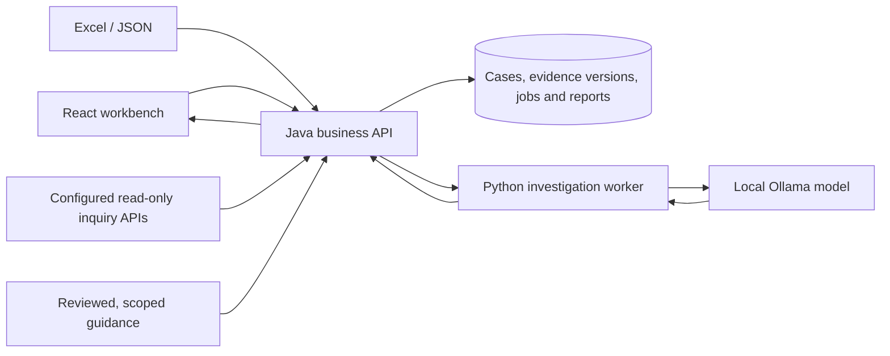

# Payment Operations Investigator

Source ZIPs use the [release privacy checks](docs/RELEASE_PRIVACY.md): reviewed Git files only, private runtime exclusions and independent archive verification.

A local workbench for finding payment records, collecting supporting evidence, asking cited investigation questions, and recording a human review. Built with Java/Spring Boot, React/TypeScript, and a Python investigation worker using local Ollama models.

The current workflow is **Find payment → Open case → Collect evidence → Investigate → Review and export**. The application supports configurable read-only inquiry APIs and file imports. It never initiates payments or changes bank transaction records.

This repository contains application source, tests, and original synthetic fixtures. Bank endpoints, credentials, source exports, private guidance, embeddings, saved cases, generated answers, and model files are local configuration/data and are not included.

See [Source privacy](docs/SOURCE_PRIVACY.md) for the publication boundary and checks before sharing changes.

## What you can do

- **Find a payment:** search an exact reference/UTR, search by date and authorized scope through the configured inquiry API, or import a transaction list from Excel.
- **Open a case:** retain the selected transaction and investigation reason, then locate it using a short daily case number. Search saved cases and browse ten records per page.
- **Collect evidence:** fetch four inquiry result groups, upload four Excel files, or enter/upload JSON. Saving creates a separate evidence version with its source provenance.
- **Investigate:** select an evidence version and suggested or custom question. The local model returns an answer with source citations; the saved job retains its question, evidence, source documents and timing.
- **Manage and review:** assign an owner, change priority, add notes, track evidence requests, and record an independent reviewer conclusion for selected evidence and questions. Archive/restore cases; permanent removal is restricted to administrators and requires an archived case and explicit confirmation.
- **Export PDF:** preview a compact case summary or detailed report. The report retains the selected scope and matching reviewer conclusion; later case changes do not silently alter an existing report preview.
- **Inspect knowledge:** the Knowledge library exposes the same applicable guidance and status definitions available to payment-case retrieval, including source versions and configured embedding freshness.

Saving evidence does not run an investigation. A model answer does not automatically resolve a case, certify a payment outcome, or establish beneficiary credit. Review field values and conclusions against the cited records.

## Architecture



Java enforces session, tenant, role and case-scope checks. It binds questions and citations to saved evidence. The Python service uses LangChain/LangGraph components and a separate payment-case answer path. Optional local embeddings select applicable knowledge alongside required interpretation safeguards and exact field definitions. RAG updates source context; it does not fine-tune model weights. Embeddings and GPU acceleration do not guarantee answer correctness or faster responses on every request.

The earlier synthetic replay/OBPM implementation remains in source and tests for regression coverage. It is not a separate tab in the current payment-case workflow.

## Start from a clean checkout

Docker with Linux containers is the simplest source-checkout path. Run from this repository's root. These commands explicitly select the base Compose file so a private machine override does not change the documented ports.

```sh
docker compose -f compose.yaml up -d --build postgres investigator mock-inquiry api web
```

Open [the workbench](http://127.0.0.1:5178/cases). Local identities are `analyst`, `reviewer`, `viewer`, `admin`, and `other`; the default development password is `demo-pass-local`. `other` belongs to a separate synthetic tenant. The administrator's lifecycle permissions do not grant analyst/reviewer write privileges.

The public defaults use synthetic discovery and local test fixtures. They contain no configured bank service. Create a saved payment case from discovery or an Excel transaction list, then attach source evidence through that case. New databases do not contain the private saved cases used during development.

For local model answers, start Ollama and download the default model:

```sh
docker compose -f compose.yaml --profile ai up -d ollama
docker compose -f compose.yaml exec -T ollama ollama pull qwen3:4b-instruct
```

If you change `OLLAMA_MODEL`, install that configured model instead. Downloads require network access and sufficient disk/memory. Starting the website does not prove model readiness. Optional embedding/knowledge configuration is described in [Case knowledge](docs/CASE_KNOWLEDGE.md); it is not enabled merely by starting Ollama.

For overrides, copy `.env.example` to an ignored `.env` only if one does not already exist. The example credentials are local development defaults. Keep real endpoints and secrets in private configuration. Configure both inquiry adapters and their permitted scope using [the integration guide](docs/FLEXCUBE_INTEGRATION.md); normal TLS verification remains required.

```sh
docker compose -f compose.yaml ps
docker compose -f compose.yaml logs --tail 80 api investigator web
docker compose -f compose.yaml down
```

The final command stops this Compose stack and preserves its named volumes. It does not erase saved cases.

### Prepared native GPU installation

The Windows `tools/start.ps1` launcher defaults to the separately prepared native GPU stack. It expects an installed local Ollama runtime/model, built frontend, packaged Java API, Python environment and private configuration under ignored runtime directories. Those artifacts are intentionally absent from Git; the launcher is not a clean-checkout installer. Use the container path above for the public checkout. Native setup and historical hardware measurements are described in [Native GPU setup](docs/NATIVE_GPU_SETUP.md).

## Develop and verify

| Path | Purpose |
| --- | --- |
| `apps/web/src` | Payment workspace, evidence review and report UI |
| `services/api/src` | Java API, persistence, inquiry adapters, permissions and PDF rendering |
| `services/investigator/investigator` | Local-model requests, source retrieval and answer validation |
| `data` | Original synthetic fixtures, legacy test guidance and isolated evaluation labels |
| `tools` | Setup, validation and optional private knowledge-index helpers |

Run frontend checks from `apps/web` with Node and npm:

```sh
npm ci
npm test
npm run build
```

Run `mvn -B -ntp verify` from `services/api` with Java 17 and Maven. With a Python 3.12+ environment and `services/investigator/requirements.txt` installed, run `python -m pytest services/investigator/tests` from the repository root. `python tools/generate_data.py --check` verifies the committed synthetic fixtures without rewriting them. See each service README for configuration details.

Tests use isolated data and controlled transports where appropriate. Historical validation receipts identify the revision, environment and limits of each run; they are not a claim that a fresh checkout has already been validated on your machine. Do not run mutation-oriented acceptance scripts against private working cases.

## Documentation

The current workflow improvements are documented in [Case resolution and reopening](docs/CASE_WORKFLOW.md), [Draft protection](docs/DRAFT_PROTECTION.md), [Evidence follow-ups](docs/CASE_WORK_QUEUE.md), [Saved report history](docs/REPORT_HISTORY.md), and [Payment-case browser tests](docs/PAYMENT_BROWSER_TESTS.md).

| Guide | Covers |
| --- | --- |
| [Payment discovery](docs/PAYMENT_DISCOVERY.md) | Reference/date lookup, Excel input and saved cases |
| [Evidence versions](docs/CASE_EVIDENCE.md) | API, Excel and manual/JSON acquisition |
| [Case investigations](docs/CASE_INVESTIGATION.md) | Version-bound questions, saved answers and failures |
| [Evidence library](docs/EVIDENCE_LIBRARY.md) and [Evidence Q&A](docs/EVIDENCE_QA.md) | Selecting a case and evidence version |
| [Case management](docs/CASE_MANAGEMENT.md) and [Lifecycle](docs/CASE_LIFECYCLE.md) | Ownership, notes, reviewer conclusions and archive/removal |
| [PDF reports](docs/PAYMENT_CASE_REPORTS.md) | Summary/detail selection, preview and preserved scope |
| [Knowledge](docs/CASE_KNOWLEDGE.md) and [RAG](docs/CASE_RAG.md) | Source applicability, retrieval, embeddings and limitations |
| [Inquiry integration](docs/FLEXCUBE_INTEGRATION.md) | Configurable request/response adapters |
| [Frontend design](docs/FRONTEND_DESIGN.md) | Shared styles and responsive workflow |
| [Security](docs/SECURITY.md) and [Validation](docs/validation/README.md) | Controls, recorded checks and remaining deployment work |

This is a local investigation project, not a certified banking product. Production identity integration, deployment hardening, operational retention, monitoring and bank-specific approval remain deployment responsibilities. Current model answers require factual review.
