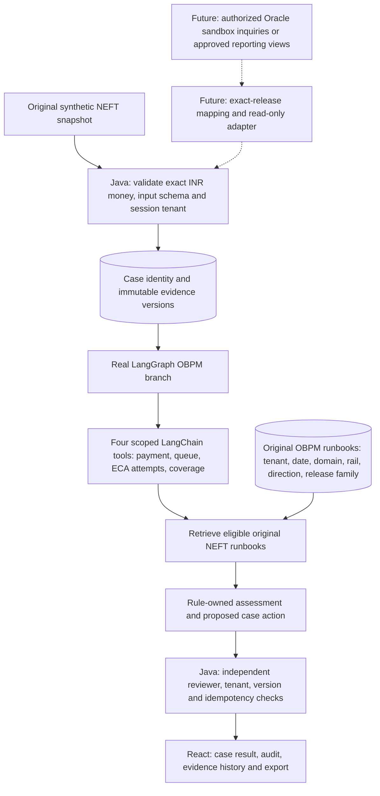
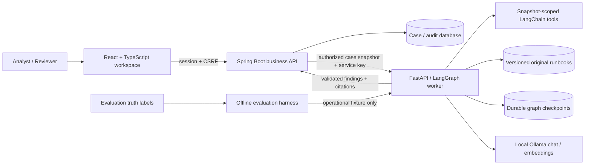
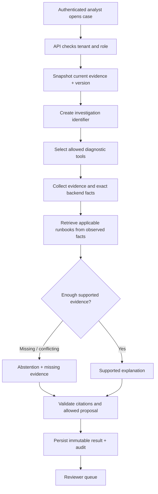
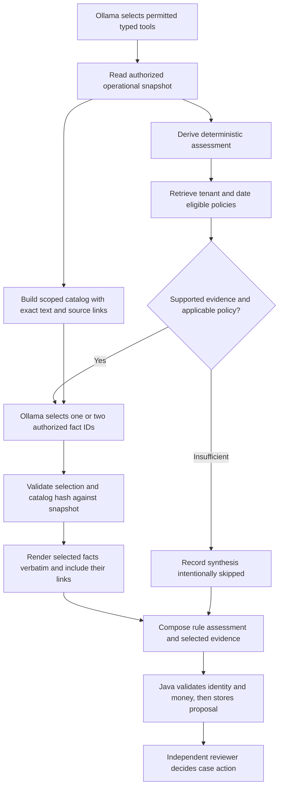
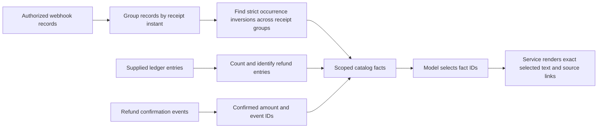
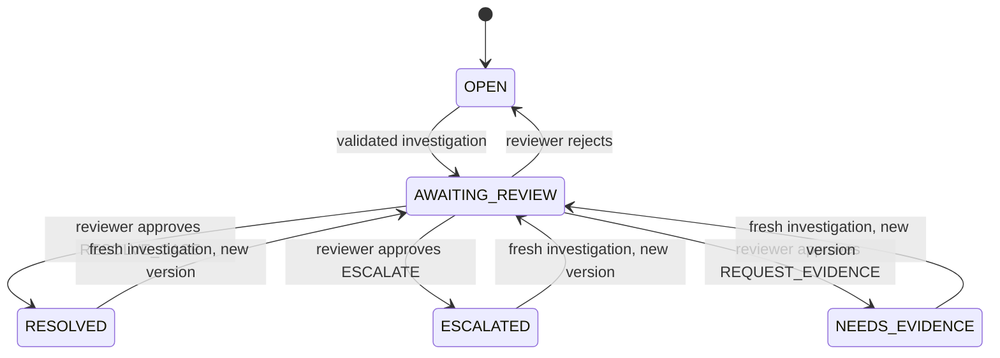
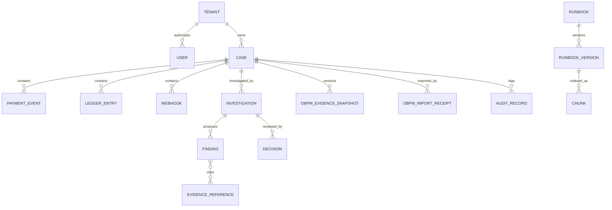
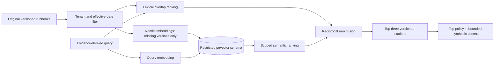

# Architecture and flows

## Deployed synthetic OBPM NEFT path

The OBPM extension is implemented and deployed locally. Validation includes 52 Java, 280 worker and 44 React tests; 14 actual HTTP Replay checks with zero model calls; 14 actual HTTP Ollama checks using three NEFT investigations/four chat calls in 46.845 seconds; and 17 generic regression checks. The browser workflow passed 16 checks, with a separate three-check label/bundle/state recheck. [Milestone evidence](validation/obpm-milestone.md) records the exact receipts and limitations, and [component correspondence](validation/obpm-components.json) ties selected source and tested/running artifacts together without claiming whole-image reproducibility.



Solid arrows describe the implemented synthetic path. Dashed arrows describe a future integration boundary; no Oracle database, inquiry service, payment network or proprietary product source is connected. The current importer accepts only the fixed original-demo source identity, `SYNTHETIC-OBPM` / `DEMO-HOST` / `DEMO-BRANCH`, with release family `14.7`. Actual source mappings and the exact maintenance release remain unverified.

Java assigns tenant identity from the session, validates exact decimal-to-paise conversion and derives the stable case identity from tenant plus source/payment identity. Duplicate evidence is unchanged. Changed evidence with a later extraction cutoff appends an immutable snapshot, increments the case version and reopens the case. Each investigation retains its original case snapshot. A refresh during investigation or before review prevents that older proposal from changing the updated case.

The four tools are `inspect_obpm_payment`, `inspect_obpm_queue`, `inspect_obpm_eca_requests` and `inspect_obpm_coverage`. They read only the supplied snapshot. Replay executes them deterministically. In OBPM Ollama mode, the actual model plans a typed permutation containing all four names exactly once; the service validates the permutation, fixes the authorized case ID and runs the tools in that order. It cannot omit or silently autocomplete required evidence. This is constrained execution-order planning, not a model choice about whether to inspect a source.

One uniquely current `EC` / `T` queue record, a matching ECA request, consistent times and complete queue coverage establish a **recorded ECA timeout only**. A pending current attempt cannot inherit a historical timeout. Missing, unknown or conflicting records lead to specific evidence requests. Amount blocks, accounting, beneficiary credit and settlement remain unknown unless a future typed contract supplies the required evidence; this slice rejects nonempty message and accounting collections.

The [live NEFT receipt](validation/obpm-http-ollama.json) contains one supported timeout with a second actual model call selecting `FACT-OBPM-ECA-TIMEOUT`, whose service-rendered text links the current queue and matching ECA attempt. Two insufficient cases each made one ordering call and skipped fact selection with no finding. The [initial failed planner](validation/obpm-ollama-initial-failure.json) omitted payment identity and safely abstained; it remains historical failure evidence. Neither the correction nor the small passing sample establishes independent diagnosis, model-written explanation quality or operational benefit.

Runbooks are filtered by tenant/effective date and by `OBPM_NEFT`, `NEFT`, `OUTBOUND` and release family `14.7`. The two original sidecar documents are excluded from generic-provider retrieval. The graph proposes `REQUEST_EVIDENCE`; permitted case escalation still requires review. Java prohibits `RESOLVE_CASE` for every OBPM case in this milestone. Review changes the app's case disposition only. Provider/capture/refund totals are null, and the interface shows native bank evidence and source coverage rather than simulated card reconciliation. Dashboard totals describe imported app cases, not a complete OBPM population.

The [walkthrough](OBPM_STEP_BY_STEP.md) gives the actual sample titles and current local case link. The [HTTP receipt](validation/obpm-http-replay.json) verifies importer permissions, exact money, cross-tenant isolation, Replay diagnosis, immutable refresh, stale review, independent decisions and export using separate original synthetic identities.

## System context



The worker never receives ground-truth labels or business-database privileges. Its optional vector database role is restricted to the knowledge schema. Snapshot identity, actor and tenant are derived by the API. Document access and effective dates are checked before model context construction.

## Investigation flow



The implemented graph is a bounded five-node workflow: select tools, collect evidence, retrieve policy, synthesize, validate. Replay selects the four tools defined for the case's domain deterministically. Generic Ollama investigations select typed tools; OBPM Ollama investigations order all four mandatory tools. Both use authorized fact IDs for sufficient-evidence synthesis, with the service supplying wording and links. Deterministic evidence checks determine the outcome and proposal. A model does not override monetary facts. There is no open-ended autonomous loop. Human review is a durable Java case workflow after graph completion. Checkpoints support resuming the same worker request identifier; a new synchronous Java request creates a new identifier, so automatic API retry/resume is not a demonstrated capability.

## Fact selection and authorship

V6 uses two actual model stages when evidence supports a conclusion: tool planning and typed fact selection. The second response contains one or two distinct IDs from a catalog built from the executed tools' authorized records. The service joins the selected catalog sentences verbatim and includes their complete evidence links and the supplied policy citation. It adds no unselected facts. Unknown IDs, duplicate IDs, extra output fields or incompatible saved provenance fail validation; no fallback or answer repair is performed. [Worker tests](validation/worker-tests.json) and [STATUS](STATUS.md) identify the tested and deployed revision separately from live execution evidence.

Rules supply the summary, outcome, categorical confidence, missing facts and entire proposed action. The public finding remains a text-and-links object; metrics identify `fact-selection`, `service-rendered-facts`, catalog version/hash, selected IDs and their source tools. The full catalog is retained in worker checkpoints. Java preserves this metadata but does not independently rebuild the catalog. The React label is **AI-selected evidence** and explains service wording when its origin is recorded.



For insufficient evidence, the actual model planner runs but fact selection is intentionally skipped; the result has no model finding and records one successful model stage. Replay remains explicitly deterministic with zero language-model calls. The graph still has five nodes: catalog construction and selection occur inside synthesis, and rendering occurs inside validation.

The question and retrieved policy guide selection but cannot change the catalog or tool permissions. Catalog sentences use controlled status values, validated timestamps, exact amounts and immutable snapshot membership. An absence statement is scoped to the supplied snapshot; a linked provider record alone does not establish ledger completeness. Selected-fact provenance identifies the full source-tool output used for such aggregate observations. Catalog correctness, source completeness and selection relevance remain review responsibilities.

Webhook timing facts state provider occurrence and local receipt separately. Equal receipt timestamps do not establish precedence. The v6 rule uses strict ordering between distinct receipt groups, with at most one earlier-receipt inversion witness per record; this also catches inversions separated by tied records. Refund confirmation and supplied refund ledger entries have separate counts and amounts. Provider `asOf` is explicitly a status observation time. The preserved [before-fix HTTP probe](validation/adversarial-tied-receipt-before-v6.json) documents the v5 tie bug; current verification is identified in [STATUS](STATUS.md).



If no supported exception is found and the current provider status is UNKNOWN or UNAVAILABLE, the rule-owned missing-evidence list requests an authoritative status and observation time. An empty ledger adds a completeness/cutoff check; an empty webhook list adds a delivery-history check. These requests do not assert that missing records must exist. The retrieval query, outcome, summary and action for insufficient evidence remain unchanged.

Historical model-written findings retain their original prose, metrics and **AI evidence explanation** label. Completed checkpoints return their saved result unchanged. An unfinished legacy synthesis checkpoint that lacks compatible provenance requires a new investigation identifier. Earlier generated-prose failures and reviews remain in [MODEL_RUNTIME](MODEL_RUNTIME.md); they are not reclassified as fact-selection results.

## Review and idempotency

```mermaid
sequenceDiagram
  actor Reviewer
  participant UI as React
  participant API as Spring API
  participant DB as Case database
  Reviewer->>UI: Review evidence and proposed case action
  UI->>API: Decision + expectedVersion + idempotency key + CSRF
  API->>API: Session role, tenant, different creator checks
  API->>DB: Lock case and check existing command key
  alt matching prior command
    DB-->>API: Original durable result
    API-->>UI: Same result, replayed=true
  else new valid command
    API->>DB: Verify version; apply stored proposal; append decision + audit
    DB-->>API: Commit exactly one workflow effect
    API-->>UI: Updated case version
  else stale or conflicting request
    API-->>UI: 409; refresh and review again
  end
```

## Case state

This common case workflow includes resolution for eligible generic-provider cases. `RESOLVE_CASE` is prohibited for OBPM cases. A changed, later OBPM evidence snapshot also returns the case to `OPEN` and invalidates earlier proposals, regardless of its previous disposition.



## Logical data model



## Local deployment
Dedicated ports: React 5178, Java 8088, Python 8091, PostgreSQL 5438, Ollama 11438. Bind host ports to loopback. Do not change the existing AutoPay Guard stack. Java 17 is the installed baseline; Spring Boot 3.5.x is selected for compatibility. React/Vite is explicitly required by the user.

The ER diagram is a logical domain view. Generic payment events, ledger entries and webhooks are separate from the OBPM snapshot structure. The physical schema stores operational case evidence and immutable investigation results as JSON text beside indexed identity, tenant, version and state columns; decisions and audit events use separate tables. `obpm_evidence_snapshot` stores versioned original snapshot bodies, and `obpm_import` stores import receipts. These are application tables, not claimed Oracle table names. Local development uses durable H2 files; deployed Compose selects PostgreSQL. Worker checkpoints use SQLite. Each short original runbook version is one retrieval document; arbitrary uploaded-document parsing and subdivision into chunks are outside this release.

Hybrid retrieval uses actual Ollama/Nomic embeddings and PostgreSQL/pgvector through the restricted `poi_vectors` role. The embedding store keys content and metadata, model identity and namespace; persistent vectors are reused by a new store instance. Tenant and effective-date filtering happens before embedding/context construction and again in vector search; the OBPM branch additionally enforces its domain/rail/direction/release-family scope. Lexical scores and semantic ranks combine through reciprocal rank fusion. Only the top policy is supplied to model synthesis, while up to three eligible retrieved versions remain visible in the result. The default lexical mode uses no embeddings. See [executed generic vector evidence](validation/hybrid-pgvector.json) and [role isolation evidence](validation/vector-role-isolation.json); these historical checks do not establish a completed live OBPM hybrid investigation.


