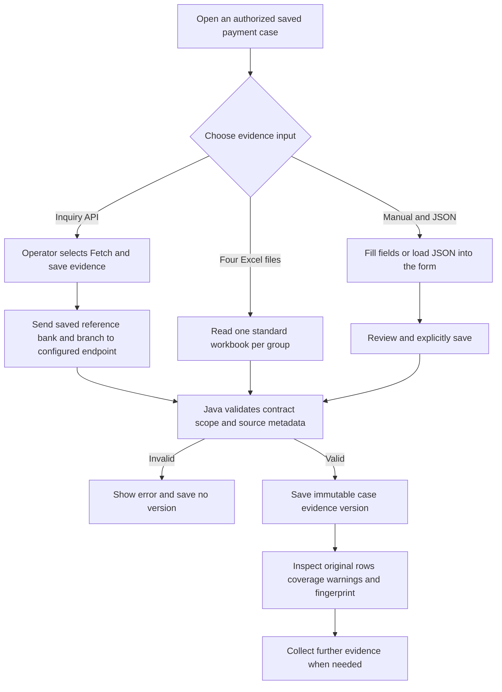

# Attach evidence to a saved payment case

Implementation handoff, 14 September 2026. A saved payment case now has a **Case evidence** panel with three input methods: **Inquiry API**, **Four Excel files**, and **Manual + JSON**. Each successful save creates an immutable version containing the four result groups. Opening a case or attaching evidence does not run a model or execute a payment.

This feature consumes the column interface of the four detailed FCR inquiry functions. The optional [FLEXCUBE adapter](FLEXCUBE_INTEGRATION.md) consumes PO02 `NEFTEvidenceInquiryService` with server-built `args0`/`args1` and four camelCase arrays. The earlier `CANONICAL` wrapper below remains the default wire format for compatibility. Local source review and validation do not establish deployed bank connectivity or complete source coverage; no bank response was fetched during this work. The discovery list/lookup API and the original synthetic OBPM/ECA mock use different contracts; neither is automatically reused as the detailed evidence endpoint.

## Start with the saved case

1. Open **Case queue** at `/cases` and open the saved payment. Use the saved-case search if needed.
2. In **Case evidence**, check the displayed payment reference, bank and branch. These come from the saved case and are the scope for every input method.
3. **Inquiry API** is selected initially for every role. An analyst or reviewer can choose any input method and explicitly save evidence. Viewers and administrators can inspect existing versions; their evidence input controls remain read-only. Selecting a tab does not fetch or save evidence.
4. After saving, select **Saved evidence versions** to inspect the version's groups, rows, source notes, row counts and warnings. A corrected submission creates another version; it does not edit an earlier one.



## Option 1: Inquiry API

If reading a saved version or refreshing the version list fails, use **Retry saved version** or **Retry saved versions**. These only repeat the failed read; they preserve the current input draft and selection and do not submit evidence. Starting a new save or opening another case cancels an older list refresh so it cannot replace newer results.

If the case becomes archived or the session loses evidence-writing permission, the form becomes read-only and releases its busy controls. The browser cancels file reading and stops waiting for an in-flight save. This does not roll back a request already accepted by the server; the backend enforces the lifecycle state at commit, and an unchanged retry keeps its original idempotency key.

1. Confirm the PO02 service is deployed and authorized, then choose `FLEXCUBE` wire format on our application. This integration does not modify upstream source. A separately implemented flat wrapper may continue to use the `CANONICAL` contract below.
2. Configure the detailed-evidence endpoint privately on the Java server. The tab can be viewed while the endpoint is disabled, but fetching is unavailable until the endpoint is explicitly enabled. Discovery configuration does not enable evidence acquisition.
3. Open the case and select **Inquiry API**, then **Fetch and save evidence**.
4. Java derives the request identity from the saved case, validates all four returned groups, and saves a version only after the entire response passes validation. Inspect the saved coverage and warnings.

The browser sends `{}` to the case-scoped application endpoint in either wire format. Java takes the reference, bank and branch from the saved case.

### FLEXCUBE PO02

With `poi.case-evidence.wire-format=FLEXCUBE`, Java builds the PO02 `args0` session context and `args1` payment identity and sends them to the fixed `NEFTEvidenceInquiryService/processRequest` endpoint. The server identity, channel and bank posting date are configured separately from the inquiry date. The FCR reference is limited to 40 characters. Both context and inquiry must use the saved authorized bank/branch. See [FLEXCUBE deployment settings](FLEXCUBE_INTEGRATION.md#deployment-settings) for the exact properties, TLS and activation steps.

All four camelCase result arrays must be present, including explicit empty arrays. Their rows map to the standard column groups without discarding repeated records. The response status, returned posting date and correlation are checked before saving. All four groups remain **UNVERIFIED** because PO02 does not report group fetch completion or truncation; the separate SQL queries do not establish an atomic snapshot. Service success and a native status label do not establish payment outcome.

The full immutable snapshot preserves `upstream: {schemaVersion, receivedAt, request, rawResponse, nullFields}`. New `flexcube-neft-evidence-v2` snapshots also include `omittedFields` because the deployed serializer omits optional nullable properties. These paths identify group, one-based row index and native column. Explicit null and missing fields use `""` only in the editable text projection; citations and timeline retain source nulls and absent properties. Both evidence views distinguish **Source null**, **Not supplied** and blank text. Required row identity/query metadata stays mandatory. The original parsed response and request are retained; gateway tokens are not included. The fingerprint binds this provenance when present, while older v1 normalization and fingerprints remain unchanged. Each wire response and normalized payload is bounded to 5 MiB and the combined stored snapshot to 10 MiB. List summaries exclude raw bodies.

### CANONICAL compatibility contract

With `poi.case-evidence.wire-format=CANONICAL`, the backend sends the following flat request to its configured bank endpoint. Values below are fictional placeholders for this compatibility contract, not a raw PO02 request:

```json
{
  "reference": "DEMO-NEFT-0001",
  "orgBank": "099",
  "orgBranch": "0100"
}
```

The bank response is the payload shown under **Shared payload**, with one additional top-level `acquisition` object. `acquisition` must contain exactly `PAYMENT`, `HOST`, `HISTORY`, and `STATUS`. Each group uses the following metadata shape, with its actual row count and observation time:

```json
{
  "reference": "DEMO-NEFT-0001",
  "orgBank": "099",
  "orgBranch": "0100",
  "returnCode": "0",
  "fetchCompleted": true,
  "observedAt": "2026-09-14T10:30:00+05:30",
  "rowCount": 0,
  "hasMore": false
}
```

Repeat this object under each of the four acquisition group keys; do not omit acquisition metadata when a group has zero rows. `returnCode` is a string; `fetchCompleted` and `hasMore` are booleans; `rowCount` is an integer. All three identity fields must equal the saved case. The CANONICAL adapter accepts only successful return code `"0"`, fully fetched, untruncated groups whose declared counts equal their supplied arrays. `observedAt` must contain a timezone offset.

The package returning zero establishes that its cursor opened. The wrapper must separately establish that fetching completed. The stored API coverage label `COMPLETE` means the response reported completion and passed these checks; it does not independently verify the source implementation, full-system coverage, or an atomic snapshot across the four SELECTs. An upstream error, timeout, malformed response or scope mismatch saves no evidence and does not fall back to sample data.

Private server settings:

| Property | Default and purpose |
| --- | --- |
| `poi.case-evidence.api-enabled` | `false`; explicit opt-in for detailed evidence HTTP calls |
| `poi.case-evidence.api-url` | Empty; fixed HTTPS endpoint, configured only on the server |
| `poi.case-evidence.wire-format` | `CANONICAL`; explicitly choose `FLEXCUBE` for PO02 |
| `poi.case-evidence.timeout-seconds` | `15`; permitted range 1–60 seconds |
| `poi.case-evidence.api-token` | Empty; optional server-held bearer token |

For the native Java runtime, these settings can live in ignored `runtime/native-ollama/private/application.properties`; restart the Java service after changing them. Preserve existing properties in that file. FLEXCUBE also requires the shared server context in [the integration guide](FLEXCUBE_INTEGRATION.md). The URL and token are not returned to the browser. Normal TLS validation and no redirects are enforced. Gateway authentication or mTLS requirements must be confirmed against the deployed service before enabling it. The prepared native profile leaves evidence acquisition disabled until activation.

## Option 2: Four Excel files

1. Select **Four Excel files**. Download the header template for each group if needed.
2. Export the corresponding function's result into one `.xlsx` file per group. Keep the exact standard column names and order in the first populated row. Each file should have one populated worksheet; additional worksheets must be empty.
3. Keep every source value as **Text**, including reference numbers, amounts, status codes and dates. Numeric Excel cells are rejected because formatting an already rounded number as text cannot restore its original value. The discovery payment-list reader's numeric/date conversions are not used here.
4. A leading display-ordinal column is permitted and ignored after validation. Do not add account/customer fields or other extra columns. For an empty result, upload a workbook containing the complete header row and no source rows; do not fabricate an empty-valued record.
5. Select all four files in their named upload controls. Keep **Excel source timezone** as `UNKNOWN` unless the source timezone is confirmed.
6. Select **Save new evidence version**. All four files are validated together. Review the saved rows and coverage.

The limits are 5 MiB per workbook, 500 source rows per group, and 4,000 characters per cell. The normalized combined payload must also fit 5 MiB. Formula, error, boolean and typed Excel date cells are rejected, along with unsupported headers, external workbook relationships, macros, invalid XML, corrupt archives and archive expansion beyond the parser bounds. A populated `SCOPE_ROW_COUNT`, when supplied, must equal the number of rows in that group.

Rows containing only a valid display ordinal do not consume the 500-source-row allowance. Ordinals are still validated, and the archive, XML-row and cell-count limits still apply. For example, 500 actual source rows plus an otherwise empty numbered row are accepted; a 501st source row is rejected. Upload errors identify the affected group, such as `HOST Excel file`, without echoing its source values.

The recorded source is `EXCEL`. Coverage remains `UNVERIFIED`, including a header-only group: the file itself does not provide the function return value or prove cursor-fetch completion.

## Option 3: Manual entry and JSON

1. Select **Manual + JSON**. Pick an evidence group and choose **Add ... row** only when a source record exists.
2. Fill the named standard fields. Repeat for additional rows using **Row to edit**. Remove unused rows and keep genuinely empty sections at zero rows.
3. Use a group's **source note** to explain where its records came from or what remains missing. Notes are operator input, not verified query metadata.
4. Alternatively, select **Download JSON template**. The browser template contains one blank row per group with case identity prefilled where applicable. Populate it from the source, remove unused rows, then choose **Upload JSON to fill the form**.
5. JSON upload fills the form without saving. Review the rows and explicitly choose **Save new evidence version**. Saving an unchanged JSON import records `JSON` provenance; editing its fields afterward records `MANUAL` provenance.
6. Review the resulting immutable version. Both manual and JSON sources retain `UNVERIFIED` query completion.

All field values and section notes must be strings. Preserve exact reference and amount text; use `""` for a missing source value rather than JSON `null`, a numeric value, or a guessed code. An existing row must include every standard column even when some values are blank. The reference/bank/branch fields that establish row identity must match the saved case. `sourceTimezone` is `UNKNOWN` or a valid timezone such as `Asia/Kolkata`; it does not cause date conversion.

### When a JSON file does not load

The importer preserves the existing form and reports the failing field or structure. Missing or unexpected columns include their group and row; non-text values are rejected instead of converted. Files must be valid UTF-8 JSON. Duplicate keys are rejected, including differently escaped keys that decode to the same name. A saved snapshot wrapper is distinguished from the evidence object inside its `payload` field.

A correctly formatted file can still belong to a different case. The error shows the file's reference, bank and branch beside those of the currently open case. It searches only the signed-in user's authorized saved cases and offers links whose three identifiers match exactly. Open the appropriate matching case and upload the same file again. When several cases match, choose the intended case; when none match, use **Case queue** to find the payment. The importer never changes identifiers to force a match and never opens or saves a case automatically.

```mermaid
flowchart TD
    U[Choose JSON file] --> V{Valid UTF-8 JSON and evidence fields?}
    V -->|No| E[Show field or format error and preserve the form]
    V -->|Yes| I{Reference bank and branch match the open case?}
    I -->|No| M[Show both identities and authorized matching case links]
    M --> O[Operator opens the intended case and uploads again]
    O --> U
    I -->|Yes| F[Fill form with exact source text]
    F --> R[Operator reviews and explicitly saves]
    R --> B[Java validates scope and saves an immutable version]
```



Selecting a corrected file again is supported. Long identifiers, decimal text including trailing zeros, blank strings, empty groups and source dates retain their supplied values. Loading a file does not imply successful source queries or an established payment outcome.

### After a save

Once the server confirms a version was saved, the case header and investigation workbench are notified immediately. Header refresh reads the authoritative evidence-availability indicator and updated timestamp without unmounting the intake form or workbench. The saved-version history refresh runs afterward; a slow history read does not delay that notification. Evidence configuration, history, version and matching-case reads time out after 30 seconds with a visible error. A failed header refresh can be retried without saving another version.

The Evidence library's **Find payment** link selects **Payment cases** at `/cases`, even if **Demo cases** was viewed earlier. Browser Back/Forward restores the recorded queue choice. The two queues remain separate.

## Shared payload and standard columns

Manual/JSON requests contain exactly the following shape. This valid empty template represents four empty supplied sections; replace arrays with source rows containing the appropriate full set of columns:

```json
{
  "schemaVersion": "fcr-case-evidence-v1",
  "payment": {
    "reference": "DEMO-NEFT-0001",
    "orgBank": "099",
    "orgBranch": "0100"
  },
  "sourceTimezone": "UNKNOWN",
  "sections": {
    "PAYMENT": { "note": "", "rows": [] },
    "HOST": { "note": "", "rows": [] },
    "HISTORY": { "note": "", "rows": [] },
    "STATUS": { "note": "", "rows": [] }
  }
}
```

The complete ordered column lists are the `COLUMNS` interface in [CaseEvidenceSchema.java](../services/api/src/main/java/dev/pratik/poi/CaseEvidenceSchema.java). The authenticated configuration endpoint returns those same lists, and each downloadable Excel template is generated from them.

| Group | Function | Column count | Source table |
| --- | --- | ---: | --- |
| `PAYMENT` | `AP_BA_NEFT_PAYMENT_INQ` | 29 | `PM_NEFT_TXN_LOG` |
| `HOST` | `AP_BA_NEFT_HOST_INQ` | 36 | `PM_TXN_LOG` |
| `HISTORY` | `AP_BA_NEFT_HISTORY_INQ` | 15 | `PM_TXN_LOG_HIST` |
| `STATUS` | `AP_BA_NEFT_STATUS_INQ` | 7 | `NEFTTXNCODSTATUS` |

All groups begin with `SOURCE_TABLE`, `QUERY_OBSERVED_AT`, and `SCOPE_ROW_COUNT`. A nonblank source-table field must match the group. PAYMENT's `REFTXNNUMBER` must match the case; HOST/HISTORY also carry `COD_ORG_BANK` and `COD_ORG_BRN`, which must match it. STATUS rows carry no transaction identity, so their `CODSTATUS`/`MSGSTATUS`/`ACCTSTATUS` tuple must match a supplied PAYMENT row. HISTORY does not carry a host subsequence; the application does not invent one.

PAYMENT amounts or UTRs that differ from the earlier discovery observation produce warnings; the original discovery values remain intact. Multiple matching PAYMENT rows are retained with a warning instead of selecting an authoritative row silently. Source date strings are preserved as supplied; source timezone is recorded separately. These consistency checks do not establish the payment's final outcome.

## Application endpoints and storage

All routes below use the prefix `/api/payment-cases/{caseId}/evidence` and require access to the saved case's tenant and bank/branch scope.

| Method and suffix | Request / result |
| --- | --- |
| GET `/config` | Schema version, API mode, limits, four column lists, and empty case-scoped payload template |
| GET base route | `{ "items": [...] }` summaries, newest version first |
| GET `/{snapshotId}` | Full immutable saved version including payload, coverage and warnings |
| GET `/template/{group}.xlsx` | Header-only template for the selected standard group |
| POST `/inquiry` | Empty JSON object; fetches using saved identity and saves validated API evidence |
| POST `/excel` | Exactly four multipart files named `PAYMENT`, `HOST`, `HISTORY`, `STATUS`, plus one `sourceTimezone` text field |
| POST `/manual` | Shared payload; records manual provenance |
| POST `/json` | Shared payload; records JSON-upload provenance |

Every POST additionally requires a writer role, the session CSRF token, and an `Idempotency-Key` of 8–200 letters, digits, dots, underscores, colons or hyphens. Retrying an uncertain submission with the same key returns the original version; changed evidence needs a new save attempt. Idempotency is scoped to tenant, actor and case.

Successful POSTs return the full snapshot: `id`, `caseId`, `version`, `sourceKind`, `dataClassification`, `createdAt`, `createdBy`, `payload`, `coverage`, `warnings`, and `evidenceHash`, plus `upstream` when a FLEXCUBE response was preserved. The classification is `PRIVATE_EVIDENCE`; it does not assert a source environment. Version numbers increase under a case-row lock. There are no update or delete endpoints for saved versions. The fingerprint covers source kind, payload, coverage and upstream provenance when present; it is a consistency fingerprint, not proof of source authenticity. List summaries omit payload and upstream bodies.

Saving at least one source row updates the case evidence indicator to `EVIDENCE_ATTACHED`. Saving four empty sections records `EMPTY_EVIDENCE_ATTACHED`. Neither changes the case to resolved, produces an AI assessment, or proves a debit, credit, settlement, retry or failure. The [case investigation workbench](CASE_INVESTIGATION.md) allows a separate explicit model question against a selected saved version. The separate **Export Q&A** tab at `/evidences/exports` and CPU/GPU model implementations are preserved.

## Validation scope

The focused workbook suite checks the exact four-group interface, text preservation, full-width HOST rows, generated templates, empty results, display ordinals, unsupported values, row/cell limits and archive safety. It runs alongside the original discovery workbook tests to protect the discovery import behavior. HTTP, persistence and browser checks for the complete feature are recorded separately in the milestone validation; no unit test establishes bank connectivity or payment outcome accuracy.

The [14 September upload consistency validation](validation/evidence-upload-consistency-2026-09-14.md) records the JSON diagnostics and mismatch recovery, source-row counting, case refresh and queue-navigation regressions, with automated results and a separate deployment-verification status.
