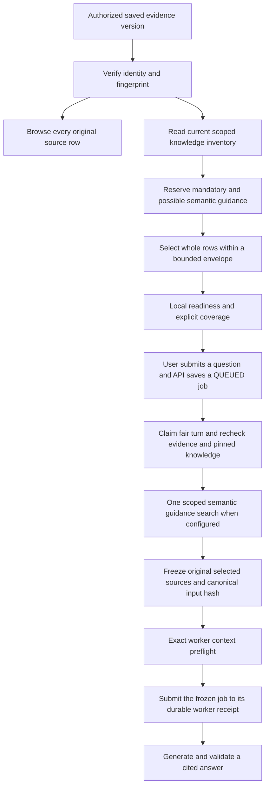

# Investigation capacity and source selection

Saved evidence and model context have separate limits. A saved version retains up to 500 rows in each of PAYMENT, HOST, HISTORY and STATUS, with the existing payload/storage byte bounds. Opening its source context does not apply the model's 100-document limit. Every original row remains available for inspection, with its original citation ID, source locator and exact field values.

A new question receives a deterministic selection of whole rows. The original case context, all four supplied-row coverage documents and required interpretation guidance remain mandatory. Explicit row IDs in the question must exist and fit; otherwise preparation fails with an actionable message. Selection keeps the first exported row of every nonempty group and the first and last exported HISTORY rows. These are source-order anchors, not a claim about event chronology. Remaining rows are ranked by question terms with stable source-order tie breaking. The selector preserves all rows when they fit and never shortens individual fields.

The `CASE-EVIDENCE-SELECTION` source document records `ALL` or `SELECTED`, the total/selected/omitted row counts, the original selected row IDs and counts for each group. Omitted rows may contain relevant or conflicting facts. Their omission is not evidence of absence or a verified payment outcome. The same selection metadata is available separately for the workbench. Each saved question freezes its selected original documents; existing evidence and historical answers are not rewritten.

Local readiness does not generate a query embedding, invoke a language model, contact the bank or write an index. It reports the current knowledge version, index state, source-selection capacity and selected/omitted coverage. It does not assert that Ollama is available or that the worker's complete prompt fits. The optional local readiness result is advisory: admission and dispatch recheck its source bindings. After selection is frozen in the saved job, exact worker preflight uses the same serializer, schema and conservative context accounting as generation. See [durable processing](CASE_JOBS.md) for the admission, freeze, submission and recovery order. Mandatory sources that cannot fit are rejected rather than clipped. The preliminary selection envelope is 20,000 serialized source bytes; the existing 100-document and 50,000-character model-input limits remain unchanged. The worker's configured context and output budgets are not increased.

With a unified index, the selector reserves mandatory/exact definitions, three largest possible additional semantic documents and a bounded retrieval receipt before requesting an embedding. New questions require current matching embeddings. Without that index, the application retains required scope/interpretation guides and chooses up to three additional general guides by deterministic question-term ranking; a separately configured status catalog retains its existing scoped selection. Knowledge-selection metadata distinguishes inventory counts from the documents actually supplied to the question. The readiness version binds the complete eligible source inventory, including unselected documents.

## Larger knowledge inventories

Inventory validation is independent of prompt validation: up to 1,000 eligible documents per tenant and 4 MiB of aggregate serialized source characters are accepted. General guidance files are bounded to 8 MiB. The vector index is bounded to 64 MiB, ten tenant scopes, 1,000 documents per tenant and 3,000 entries in total. Search accepts up to 1,000 vectors from one already authorized tenant. These are capacity limits, not an assertion that the current installation contains this many documents.

The `case-knowledge-index-v1` canonical document recipe, model/digest checks, dimensions and freshness checks remain unchanged. Existing compatible v1 indexes continue to work. Increasing the allowed inventory size does not itself require re-embedding unchanged sources. New or changed documents still need matching embeddings before a new indexed question can run. GET requests never rebuild an index. The offline builder rejects excessive inventories before provider access and reuses only compatible current vectors.

## Verification scope

Synthetic regression tests cover exact source preservation, large-row selection, all four coverage documents, source-order anchors, explicit row references, deterministic ties, malicious text treated as data, missing/tampered fingerprints, scoped inventory expansion, stale indexes and reuse of unchanged v1 vectors. Model-input limits remain independently enforced. Focused worker/index-builder tests use provider doubles; they do not measure payment-answer accuracy or actual model latency. Final integrated deployment results belong in the dated validation receipt and delivery status.
