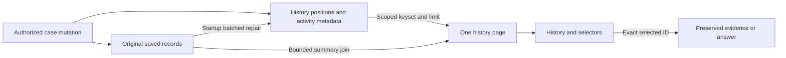

# Bounded payment-case histories

Saved evidence versions, investigation summaries and merged activity use server-side keyset pagination. The browser does not need to download a complete history to open a case. Reads require the same tenant, bank and branch access as the original case; archived cases remain readable and removed cases return not found. Browsing history never calls the bank or model.

## HTTP contract

All paths below are relative to `/api/payment-cases/{caseId}`. The persistent case number and the original internal ID both resolve to the same authorized case.

| GET path | Query parameters | Content |
| --- | --- | --- |
| `/evidence` | `limit`, `cursor` | Saved version summaries, newest version first |
| `/evidence/{evidenceId}/summary` | None | One selected version's summary, without raw source payloads |
| `/investigations` | `limit`, `cursor`, optional `evidenceId`, `status` | Saved question/job summaries, newest creation time first |
| `/activity` | `limit`, `cursor` | Merged case, evidence, investigation, management and lifecycle activity, newest occurrence first |

`limit` defaults to **10** and accepts integers **1–25**. Every parameter accepts one value. Unknown parameters, repeated values, unsupported filters and invalid limits return `400 INVALID_CASE_HISTORY_QUERY`. Investigation status accepts `QUEUED`, `RUNNING`, `COMPLETED`, `FAILED`, `CANCELLED`, or `ACTIVE` (queued and running). Filters are applied before paging. An evidence filter must identify evidence in the authorized case.

Pages have this shape:

```json
{
  "caseId": "FCR-SYNTHETIC-EXAMPLE",
  "items": [],
  "total": 0,
  "limit": 10,
  "nextCursor": null
}
```

`total` counts all currently matching entries. `nextCursor` is the final returned item's ID when an older page exists; otherwise it is null. Pass it unchanged with the same case and filters. The server resolves the cursor inside that scope. An unavailable or no-longer-matching position returns `409 CASE_HISTORY_CURSOR_CHANGED`; refresh the first page instead of guessing a replacement. Concurrent additions may change totals between requests, while keyset positions prevent a new head entry from shifting already-traversed pages. Each individual response uses one database snapshot, with bounded retries for serialization conflicts.

Evidence order uses the saved version. Job and activity ordering preserves the full source instant as epoch seconds plus nanoseconds, then stable ID descending. Equal timestamps and differing fractional precision therefore do not create ambiguous page boundaries.

## Initial workbench and selected records

`GET /workbench` retains the `evidence`, `investigations`, `audit`, `latestEvidenceId` and lifecycle/workflow fields. Its three arrays now contain the first 10 items. `evidencePage`, `investigationPage` and `activityPage` each provide `{total,limit,nextCursor}`. Callers must not interpret an item absent from the first page as deleted.

`activeInvestigations` is independently selected, regardless of a job's position in creation history. `activeInvestigationPage` supplies pagination metadata with limit 25; use `/investigations?status=ACTIVE` if further active entries exist. Status polling follows exact job IDs, not the currently displayed history page.

Older selected evidence is pinned through its summary endpoint. Existing `/evidence/{id}` and `/investigations/{id}` remain the authorized exact reads for immutable source payloads and saved answers. Report/reviewer selectors fetch completed questions for the chosen evidence with `status=COMPLETED&evidenceId=...`; merely filtering the first general job page is insufficient. Reviewer independence and report selection are still verified against exact records on the server. Frozen previous reports and original source exports are unchanged.

Public management responses retain at most 10 management audit entries and `auditPage`; lifecycle responses similarly bound their lifecycle audit to 10. The merged `/activity` history is the complete navigable activity source. Notes, current evidence requests, reviewer conclusions and the internal management view remain complete in this change: commands and report freezing still require that state. This milestone does not claim all management state collections are paginated. The latest workflow-state lookup now reads only the highest saved workflow version.

## Storage and mutation boundaries

`fcr_case_history_item` is a rebuildable private index containing list positions and concise activity metadata. Evidence and investigation pages join bounded positions to their original summary rows; they do not load evidence payloads, saved model inputs or answers. Source JSON remains authoritative.

New case, evidence, job, management and lifecycle writes update the relevant index entries in their existing transaction. Job status transitions update at most their own creation/start/finish activity entries. No public GET repairs the index. Startup rebuild processes cases and each original metadata stream in batches of 100, leaves original records unchanged, and excludes deleted tombstones. Permanent removal explicitly purges the index even though the minimal case tombstone and case number reservation remain.



Validation results and deployment status are recorded separately in the dated release receipt; this contract alone is not evidence that the running site has been updated.

A scoped `GET /api/payment-cases/{caseId}/investigations/{id}/summary` pins a referenced older job using metadata only, without downloading its source documents or answer. The response is the job summary directly; foreign or missing records return 404.
