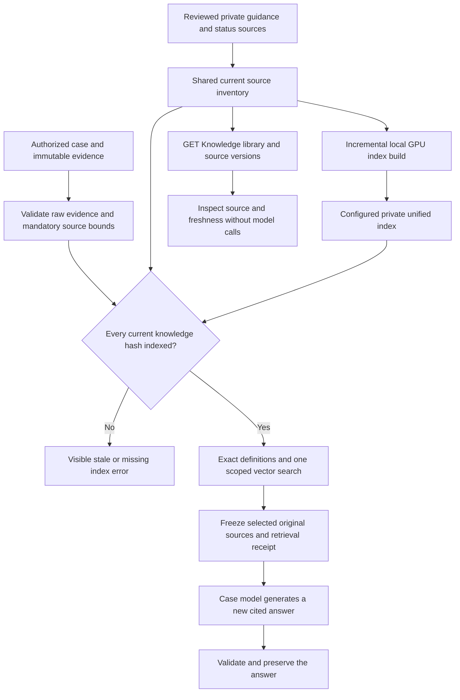

# Case knowledge, embeddings and the Knowledge library

The Knowledge library at `/knowledge` shows the same current reference documents that Java can select for saved Payment case investigations. It distinguishes general guidance, field-specific status definitions and their shared scope. It is separate from the Evidence library: knowledge explains how to interpret a field; evidence records what a particular payment's source returned.

`GET /api/case-knowledge` reads this inventory without querying the bank, embedding a question, running a model or changing a case. The page can search and inspect the definitions, source locators and embedding freshness. It does not edit, upload or approve guidance. The legacy synthetic runbooks and their worker interfaces remain available to the preserved workflow; they are not silently mixed into private payment-case guidance.

## One current source inventory

`CaseGuidanceSource` supplies the three original interpretation safeguards and eligible configured general guidance. `CaseStatusKnowledge` supplies the eligible status overview and all field-specific entries. Both the Knowledge library and case projection use these providers. The private inventory reviewed for this increment comprises 90 documents: three generic safeguards, six curated guidance documents, one workbook scope document and 80 status definitions. These are source counts, not an assertion that all deployments contain or use 90 documents.

General guidance retains its `fcr-case-guidance-v1` contract. The status source retains `fcr-status-knowledge-v1` and its exact field/code mapping. Definitions remain scoped to their configured tenant and evidence schema; the status workbook applies only to `PM_NEFT_TXN_LOG.CODSTATUS`, `.ACCTSTATUS` and `.MSGSTATUS`. No bank/product/release approval registry is implied. Another tenant receives only its applicable sources; an index belonging exclusively to another tenant discloses neither private document counts nor fingerprints.

Every current standard document contains exactly `id`, `kind`, `title`, `content` and `source`. Its version is the SHA-256 of canonical JSON over that complete document, including source metadata. The inventory version hashes the current document list. Changing wording, scope, a cell range or a source locator invalidates the affected embedding; a previously generated answer remains frozen with its original sources.

## Unified embedding index

Optional API property `poi.case-investigation.knowledge-index-file`, or environment `POI_CASE_INVESTIGATION_KNOWLEDGE_INDEX_FILE`, points to an ignored private index file. Blank preserves the earlier case/status-catalog path. Enabling it makes a current embedding for **every eligible knowledge document** a prerequisite for each new question, including mandatory safeguards. Existing status-only vectors cannot be assumed to use the unified document recipe.

```text
schemaVersion: case-knowledge-index-v1
model: qwen3-embedding:0.6b
digest: lowercase 64-character installed model SHA-256
dimensions: 1024
indexedAt: ISO date-time with an offset
tenants:
  - tenantId: authorized tenant
    evidenceSchema: fcr-case-evidence-v1
    documents:
      - id: current standard-document ID
        documentHash: exact current standard-document SHA-256
        vector: 1024 finite numeric components
```

The index is bounded to 4 MiB, ten unique tenants and 100 unique documents per tenant. Vectors must be nonzero and each component must be within `[-1,1]`. Unsupported fields, duplicate JSON keys/tenant IDs/document IDs, invalid dimensions or metadata invalidate it. Its embedding input is compact UTF-8 canonical JSON of the entire standard document, with sorted object keys and no ASCII escaping; `case-knowledge-index-v1` fixes this recipe. Model/dimension/recipe changes require rebuilding rather than mixing incompatible vectors.

Freshness is checked against the complete current source inventory on each new question. `CURRENT` means all current IDs and document hashes match and no extra stale entries remain. `MISSING` means the configured index or applicable tenant entry is absent. `STALE` means the index is malformed or differs from current sources. `DISABLED` means unified indexing is not configured. Individual items may be CURRENT, STALE or MISSING inside a stale inventory; `indexedDocuments` counts only exact current hashes. The library remains readable when the index is missing or stale, but new questions fail visibly until it is rebuilt. There is no silent partial-index or lexical fallback.

## Updating knowledge

1. Preserve the approved source privately with its fingerprint and applicability. Curate its definitions into the configured guidance/status source. Keep quoted native labels and original cell locators exact; do not promote a generated answer into reviewed guidance.
2. Read the authenticated current library inventory. Use each item's standard source fields and `version` hash as the embedding input identity. Do not embed library-only labels, filters, an answer or a different shortened text under that hash.
3. Generate embeddings locally with the installed `qwen3-embedding:0.6b` digest. Reuse an existing vector only when the recipe, model, digest, dimension and complete document hash match. Embed new or changed documents and remove entries for removed documents.
4. Validate the candidate, retain the previous index for rollback and replace the configured private index atomically. Confirm the authenticated library reports CURRENT for every applicable item. Do this outside an active model job; reading the library itself never builds embeddings.
5. Validate selected sources and an actual case answer. Record build counts, source/model fingerprints and measured latency separately from factual review. Rebuilding does not alter existing payment evidence, saved questions or answers.

The reusable builder is `tools/build-case-knowledge-index.py`; run it with the investigator virtual environment. First save the authenticated library JSON and create an ignored private working directory. For example, from the project root in PowerShell:

```powershell
& .\services\investigator\.venv\Scripts\python.exe .\tools\build-case-knowledge-index.py `
  --library .\runtime\private-knowledge\library-northstar.json `
  --existing .\runtime\private-knowledge\previous-index.json `
  --output .\runtime\private-knowledge\candidate-index.json
```

These paths illustrate operator-owned private files. Omit `--existing` on the first build; repeat `--library` for separately authorized tenant exports. `--ollama-url` defaults to `http://127.0.0.1:11435` and must remain an allowed local address. Output and its sibling `<output>.receipt.json` must be fresh paths different from every input. The builder validates source versions, embeds new/changed unique document hashes in batches of eight and reuses only compatible unchanged vectors. It never pulls a model, contacts the bank or edits a source. It writes an immutable candidate and build receipt; activation is a separate step after review. A reuse-only build records zero embedding calls and `REUSED_INDEX`, not a new GPU inference.

This is RAG maintenance, not model-weight training. Payment records remain case evidence rather than reusable status guidance. New bank/product/release guidance requires source review and explicit applicability before it becomes current knowledge.

## Selection for a question

After case/evidence authorization and native evidence validation, Java checks current index coverage. It retains the three generic safeguards, the status scope, field-definition qualifications, export interpretation and N10/outcome limits. It adds exact definitions for observed PAYMENT field/code pairs and explicitly named field/code pairs. Table/schema/column questions also retain the compact table reference when available.

One query search ranks all current eligible knowledge vectors and returns up to three semantic matches. Java deduplicates these with the mandatory/exact selection, retaining the original documents. It does not invoke a second status-only semantic search. A definition retrieved for a code absent from the payment remains reference knowledge, never an assertion that the payment had that code.

Every native source row remains present. Before query embedding, Java checks raw evidence plus pinned/exact sources, three largest possible additional documents and a bounded receipt against 100 documents/50,000 source characters. Final selection and the complete answer prompt receive their existing checks too. Excessive input fails without truncating evidence.

The frozen `CASE-KNOWLEDGE-RETRIEVAL` document records inventory version, embedding model/digest, GPU-origin receipt, mandatory/exact IDs and semantic IDs/scores. These original documents enter the job's existing guidance/input hashes. The answer worker subsequently BM25-orders its supplied bundle without dropping it; its `lexical-ranked-all-supplied` receipt describes that later ordering. Similarity scores describe retrieval, not confidence or verified payment outcomes.



## Faster repeated questions

The worker caches at most 128 previously GPU-verified **query vectors** for 1,800 seconds, keyed by recipe, model digest, dimensions and the exact question hash. A cache hit still checks the installed model digest and recomputes similarity against the current caller's supplied vectors. No answer, selected source list or cross-case evidence is cached. Failed embeddings never enter the cache. `processor: GPU` denotes the vector's verified origin; on a hit it does not mean another inference ran.

`POI_CASE_MODEL_KEEP_ALIVE_SECONDS` keeps only the normal case engine's local model runner available, default 1,800 seconds and bounded to 0–3,600. The original export engine and preserved strict experiment retain their existing lifetime settings. Model weights, context size, output budget, disabled thinking and the working case prompt remain unchanged. Each new question still generates a new answer.

Keeping the runner alive permits provider prompt-cache reuse when its input prefix remains the same. It helps most with a repeated/suggested question whose query vector is already cached. The native runtime allows only one loaded model: an uncached query can load the embedding model and evict Qwen, requiring another Qwen load. Large/new evidence still requires prompt processing, and answer tokens still require generation. Embeddings therefore do not guarantee every answer becomes fast.

Measure cold and warm runs using the same frozen evidence, guidance and question; report query-search time, model load time, prompt evaluation, generation time and output count. Keep factual/citation checks separate. Deployment and benchmark receipts belong in dated validation records; this architecture document does not assert deployment success or a blanket latency improvement.

