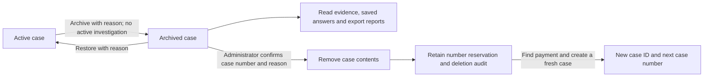

# Archive, restore and remove payment cases

The saved payment workflow has a separate case lifecycle. Archiving removes a case from the active queue while preserving its payment reference, case number, evidence versions, questions, answers, notes, reviewer conclusions and reports. Restore returns that same case to the active queue. Lifecycle actions do not change the bank payment or imply a payment outcome.

## Operator flow

On `/cases`, use **Active**, **Archived** or **All** alongside the existing search and ten-record pagination. Open a case and use its case management controls to archive or restore it with a reason. Archived cases remain readable, including evidence, saved answers and PDF exports. Restore before collecting evidence, asking a new question or changing management records.

An administrator can permanently remove an archived test or mistakenly created case. This requires a reason and typing the exact displayed case number. A case with a queued or running investigation cannot be archived or removed. Each accepted transition records who acted, when and why.

Switching between Case management tabs preserves the lifecycle reason, pending command and any unconfirmed retry. Returning to Case lifecycle refreshes its state when no command is pending or uncertain. An uncertain command requires **Retry pending action**, which uses the same payload and idempotency key. This state is held while the case page remains open, not across a full browser reload. If a refresh finds that another session has restored the case, the permanent-delete form closes and the normal archive controls return.

## API

All routes require a session and the case's tenant and bank/branch scope. Both the short case number and the internal ID identify the same case. Commands require CSRF and an `Idempotency-Key`. Archive and restore require an analyst, reviewer or administrator; permanent removal requires `ADMIN` and an already archived case. The administrator role does not confer normal investigation-writing or reviewer privileges.

| Method and path | Request |
| --- | --- |
| `GET /api/payment-cases?lifecycle=ACTIVE` | Active is the default; `ARCHIVED` and `ALL` are also supported |
| `GET /api/payment-cases/{id}/lifecycle` | Read state, lifecycle version, available actions, active investigation count and audit |
| `POST /api/payment-cases/{id}/archive` | `{expectedVersion, reason}` |
| `POST /api/payment-cases/{id}/restore` | `{expectedVersion, reason}` |
| `POST /api/payment-cases/{id}/permanent-delete` | `{expectedVersion, reason, confirmation}`; confirmation is the exact case number |

The lifecycle response includes `caseId`, `caseNumber`, `state`, `version`, `canArchive`, `canRestore`, `canDelete`, `activeInvestigationCount` and `audit`. Normal case representations add `lifecycleState` and `lifecycleVersion`; original evidence, investigation and frozen report bodies retain their existing meanings. Lifecycle version, management version and evidence version are separate values.

Use a fresh GET before a deliberate transition. Keep the original key and body when retrying an uncertain request. A conflicting lifecycle version or reused key with different content is rejected. Available-action flags help the UI; the backend independently authorizes and validates every command.

Reasons accept 1–2,000 characters; request bodies are limited to 8 KiB. Unknown fields, duplicate JSON keys, trailing JSON and unsafe/nonintegral versions are rejected. Retry keys accept 8–200 letters, digits, dots, underscores, colons or hyphens. A retry of a completed archive/restore returns the current lifecycle view without adding another event; an identical completed delete retry returns its original minimal deletion receipt. A deleted case's normal reads return 404.

## Preservation and deletion boundaries

Archive and restore store lifecycle state separately from the original case body. Mutation guards share the case row lock with evidence saves, management commands and investigation creation, so an archive cannot commit while a new investigation is concurrently queued. An evidence fetch already in progress must recheck lifecycle before saving its result.

Permanent removal purges case evidence, saved model jobs, frozen reports and management contents. It retains a minimal case tombstone, its number reservation and lifecycle audit so the number is never recycled. Deleted case links and earlier create-command receipts cannot expose the removed contents or recreate the deleted case. A later explicit creation for the same payment receives a new internal ID and case number. Source discovery records are separate from the removed case and can still be returned by an authorized search.

This is application-level removal, not secure erasure of database pages, external exports or backups. Existing downloaded PDFs and maintenance backups remain separate copies. No bank-side record is deleted.

## Local roles and validation

The existing local authentication setup adds an `admin` account using the configured local password. Analysts, reviewers and administrators can archive/restore; viewers can read. Production identity provisioning and retention policy remain deployment work; adding this local role is not a production authorization rollout.

Implementation and deployment checks are recorded in the dated lifecycle validation receipt and STATUS. Live case contents must not be removed to test this feature; use isolated fixtures for destructive lifecycle checks.
