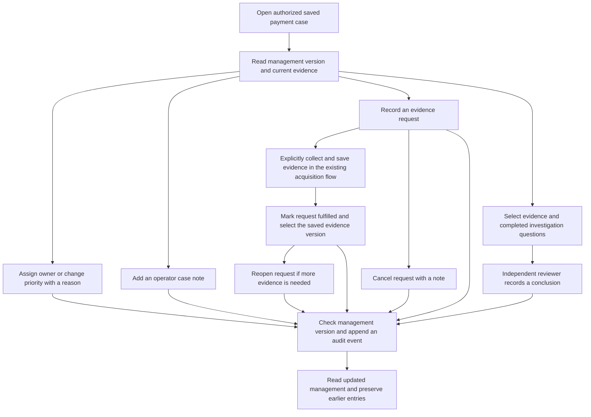

# Saved payment case management

Case management now provides [operational status transitions, independent resolution and explicit reopening](CASE_WORKFLOW.md), as well as [Archive, Restore and administrator removal](CASE_LIFECYCLE.md). Archived cases retain their evidence and management history and are read-only until restored. Resolved investigations are read-only until explicitly reopened. Lifecycle state, investigation status and the payment outcome are distinct.

The private Payment case supports an owner, priority, case notes, assigned evidence requests and reviewer conclusions. These commands do not call a bank API, run a model or alter payment records. Recording a conclusion preserves the current investigation status; the explicit `/workflow` command performs status transitions. A case opened as `OPEN` stays `OPEN` after a reviewer conclusion alone.

The original discovery record and its investigation reason remain intact. Management uses separate versioned state and append-only events. The normal case list, case detail and dashboard project the current owner and priority over the original record. Evidence versions, model jobs, original export answers and GPU configuration are unaffected.

## Operator flow



Reopening in this flow means reopening an **evidence request**, not changing the payment case status. Marking a request `FULFILLED` records an operator assertion that the requested material has been supplied. It does not certify evidence completeness or a payment outcome.

## Endpoints and permissions

All paths below are relative to `/api/payment-cases/{caseId}`. A signed-in user must retain access to the case's tenant and configured bank/branch scope. Reads are available to analysts, reviewers, viewers and administrators. Management writes require an analyst or reviewer, session CSRF and `Idempotency-Key`; recording a reviewer conclusion additionally requires the reviewer role. Administrator lifecycle permissions are separate.

| Method and path | Request body |
| --- | --- |
| `GET /management` | None |
| `POST /management` | `{expectedVersion,ownerId,priority,reason}` |
| `POST /workflow` | `{expectedVersion,status,reason,reviewerConclusionId?}`; see [workflow rules](CASE_WORKFLOW.md) |
| `POST /notes` | `{expectedVersion,text}` |
| `POST /evidence-requests` | `{expectedVersion,title,detail,dueDate?,assigneeId?}` |
| `POST /evidence-requests/{requestId}` | `{expectedVersion,status,note,evidenceId?,assigneeId?}` |
| `POST /reviewer-conclusions` | `{expectedVersion,evidenceId,evidenceHash,investigationIds,conclusion}` |

Successful writes return the full management representation, in the same shape as GET:

```json
{
  "caseId": "FCR-example",
  "version": 0,
  "status": "OPEN",
  "lifecycleState": "ACTIVE",
  "allowedTransitions": ["INVESTIGATING", "AWAITING_EVIDENCE"],
  "activeInvestigationCount": 0,
  "owner": null,
  "priority": "MEDIUM",
  "assignees": [
    {"id": "analyst", "name": "Aarav · Analyst", "role": "ANALYST"},
    {"id": "reviewer", "name": "Maya · Reviewer", "role": "REVIEWER"}
  ],
  "notes": [],
  "evidenceRequests": [],
  "reviewerConclusions": [],
  "audit": []
}
```

This example uses the existing Northstar demonstration identities. The server determines the eligible assignee list. The browser cannot supply a tenant, employee name or arbitrary new identity. The current application still uses configured demo accounts and tenant-level bank/branch scopes. SSO, user provisioning and production entitlement administration are separate future work.

| Field | Rules |
| --- | --- |
| `expectedVersion` | Integral JSON number, 0–9007199254740991, matching the current management version |
| `ownerId` | Required on management changes; `null` unassigns, otherwise one eligible server-provided writer ID |
| `priority` | `LOW`, `MEDIUM`, `HIGH` or `CRITICAL`; changing only owner is permitted |
| `reason`, case note `text`, transition `note`, request `detail`, reviewer `conclusion` | Nonblank text, at most 4,000 characters; original text is preserved |
| Request `title` | Nonblank text, at most 200 characters |
| `dueDate` | Omitted, null or a valid `YYYY-MM-DD` date; an overdue date can be recorded |
| `assigneeId` | Optional eligible server-provided writer ID; null unassigns; omitted on update preserves the assignee |
| Request transition `status` | `OPEN`, `FULFILLED` or `CANCELLED`; change status or assignee, with a required note |
| Transition `evidenceId` | Required for `FULFILLED`, omitted for `OPEN` or `CANCELLED`; at most 100 characters |
| Reviewer `evidenceHash` | Exact selected saved version's lowercase SHA-256 fingerprint |
| `investigationIds` | 0–20 distinct IDs, each at most 100 characters; completed jobs for the exact selected evidence ID/hash; an empty list records direct evidence-only review |
| `Idempotency-Key` | 8–200 letters, numbers, dots, underscores, colons or hyphens |

Bodies are limited to 32 KiB and reject unknown or duplicate JSON keys and trailing values. Text rejects unsupported control characters while permitting ordinary line breaks and tabs. The API cannot edit or delete earlier notes, request transitions, audit events or reviewer conclusions.

## What is retained

- A case note stores `id`, exact `text`, `createdAt`, `createdBy` and `createdByName`.
- An evidence request stores its original title, detail, due date and creator, its current status and update metadata, and its chronological `updates` history. Each transition retains its note and actor. Fulfillment saves the selected evidence ID, version and fingerprint after verifying the case identity and saved content hash. Later evidence does not silently replace that binding. Reopening or cancelling clears the current binding while preserving the earlier fulfillment in history.
- A reviewer conclusion stores `status: "RECORDED"`, its exact text, selected evidence ID/version/hash, selected investigation IDs and reviewer/time. It also retains each selected job's question, answer ID, input hash and creator. Every selected job must be completed and bound to that exact evidence version.
- An audit entry stores its ID, command action, actor/name, timestamp, management version and a readable description. Assignment/priority changes include the change reason. The database event also retains its original command-specific data.

Notes, requests, conclusions and audit entries are listed newest first; an individual request's transition history remains chronological. These management events complement the existing case-open/evidence/model-job activity shown by the workbench. They do not invent historical events for records created before management existed.

## Reviewer conclusion is not case approval

The recording reviewer must differ from the original case creator, selected evidence creator and every selected investigation creator. A reviewer who created the case or evidence cannot independently record its conclusion with the current identity; the application does not invent another reviewer account to bypass this rule.

Recording the conclusion is a human statement about a selected evidence version and optional completed questions. It is not proof that the model was correct, proof of beneficiary credit, or authorization to execute a payment action. This command performs no status transition. A separate reviewer-only workflow command may resolve the investigation after checking its current evidence, conclusion, open requests and active jobs. A report can show `RECORDED` only for the matching evidence ID/hash and selected investigation set, including an empty set; another selection has no implied reviewer conclusion.

## Concurrency and retries

Management begins at version 0 without a database write on GET. Every accepted command increments the shared management version once. The server locks the authorized case within the transaction, rechecks scope, checks the retry key and expected version, and commits management state, one append-only event and the idempotency record together. Two different commands based on the same version cannot both commit.

A repeated key with the identical command returns the current full management state without appending another event. A repeated key with another action, request target or body fails. Keep the same key and body after an uncertain network response. After a version conflict, refresh and inspect the new state before deliberately rebasing the preserved draft with a new command key.

Evidence saving uses the same case row lock but writes only the original case/evidence metadata. Owner, priority, notes and conclusion state live separately, preventing either operation from overwriting the other's changes. A management version is distinct from the immutable evidence version and the local model's job state.

| Error | Meaning |
| --- | --- |
| `400 CASE_MANAGEMENT_KEY_REQUIRED` | Missing or malformed retry key |
| `401`, `403`, `404` | Authentication, role/CSRF or case/scope/resource access failure |
| `403 MAKER_CHECKER_REQUIRED` | Reviewer independence rule failed |
| `409 CASE_MANAGEMENT_VERSION_CONFLICT` | Another management command changed the version |
| `409 CASE_MANAGEMENT_KEY_CONFLICT` | Retry key reused for a different command |
| `409 CASE_REVIEW_EVIDENCE_CHANGED` | Reviewer selected a different evidence fingerprint |
| `413 CASE_MANAGEMENT_TOO_LARGE` | Encoded request exceeds 32 KiB |
| `422 INVALID_CASE_MANAGEMENT` | Invalid input, assignee, transition or investigation selection |
| `503 CASE_MANAGEMENT_STORAGE` | Saved management/evidence records could not be verified |

The sidecar tables are `fcr_case_management`, `fcr_case_management_event` and `fcr_case_management_command`. They support application append-only history; this is not a claim of a tamper-proof external audit system or production retention policy. Final test and deployment outcomes are recorded separately in STATUS and dated validation receipts.
