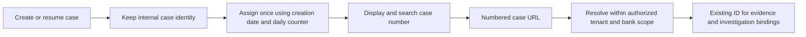

# Payment case numbers

[Archiving and restoring](CASE_LIFECYCLE.md) retain the same number. Permanent removal retains its reservation; the number cannot be reused. Creating a fresh case for that payment after removal allocates a new internal ID and the next number.

Saved payment cases have a permanent `caseNumber` formatted as **YYYYMMDD + five sequence digits**: `2026091600001`, `2026091600002`, and so on. The date uses the case creation instant in **Asia/Kolkata**. A new calendar day starts a new counter. Existing cases retain their number when reopened, updated or investigated on another day.

| Identifier | Purpose |
| --- | --- |
| `caseNumber`, e.g. `2026091600001` | Persisted text shown in the queue, search, case header, Evidence library, Q&A, links and new PDF reports |
| Internal `id`, beginning `FCR-` | Original case key; all evidence, investigation, management, report and idempotency bindings remain unchanged |
| Payment `reference` and UTR | Bank transaction identifiers; preserved exactly and used in bank inquiries, separately from case numbering |

## Allocation and migration

`fcr_case_number` maps each case ID and tenant to its unique number, date and sequence. `fcr_case_number_counter` stores the last value per day. A persistent allocator lock serializes assignment, including the first allocation of a day and concurrent backfill. Allocation participates in the case-creation transaction: failure rolls back both. Database constraints enforce uniqueness across this application database, including different tenants; access remains tenant and bank/branch scoped.

The sequence supports 99,999 allocations per day. Exhaustion returns `503 CASE_NUMBER_CAPACITY`, without wrapping or reusing another case's number. Allocation uses the counter rather than scanning for unused numbers. Removed cases must not decrement it. These are stable identifiers, not a promise of gapless regulatory numbering.

Startup assigns numbers to older cases after schema initialization and before discovery becomes available. Backfill uses original creation instants in Asia/Kolkata, ordered by instant then internal ID for ties. Repeating startup preserves mappings. It does not rewrite original case bodies, command receipts, evidence, citations, answers or frozen reports.

## URLs and API compatibility

New links use `/payment-cases/2026091600001`. Old `/payment-cases/FCR-…` bookmarks still work; the browser replaces the visible URL with the number while retaining report selection. Evidence Q&A also supports numbers in its case-selection URL.

Case list/detail responses add `caseNumber` as a JSON **string**. Create/resume responses retain `caseId` and include `caseNumber` at the top level and in `item`. Discovery candidates for saved cases expose `existingCaseNumber` alongside `existingCaseId`. The Evidence library exposes and searches the number alongside the existing search fields.

The case GET and child evidence, investigation, management and report HTTP endpoints accept either identifier. Controllers resolve a numbered path to the authorized internal ID before invoking services. Retries using either URL form retain the same bindings and idempotency keys. The frontend also uses the returned internal ID for child API calls. Unknown or unauthorized numbers return 404.

New report previews freeze the case number with the selected case and evidence. Summary and detailed PDFs show it. Earlier frozen reports retain their original content/hash and fallback filename; numbering does not regenerate answers or alter old reports.

The new tables belong to the investigation application's database. The FLEXCUBE package, payment references, UTRs and bank inquiry payloads are unchanged.
