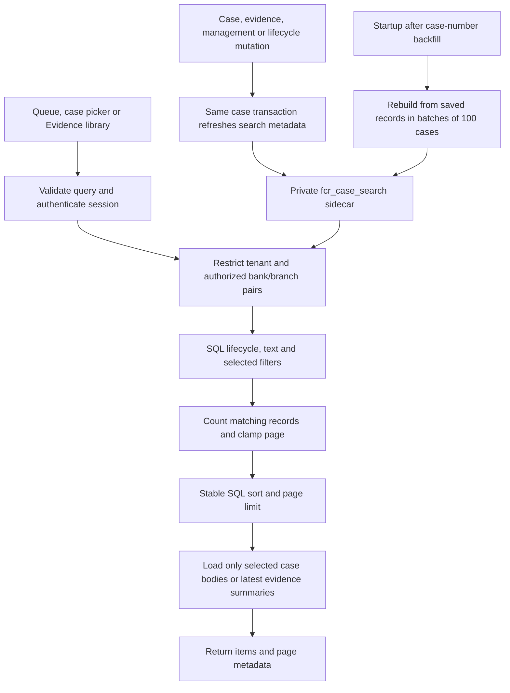
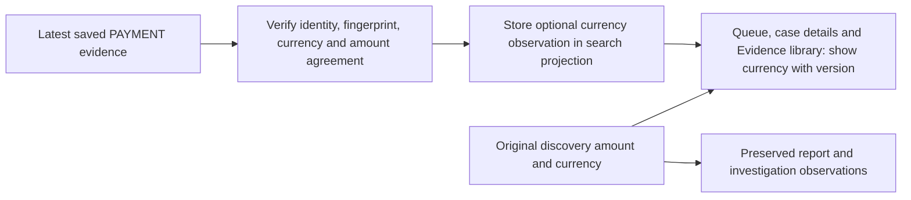

# Search and paginate saved payment cases

The case queue, the Evidence Q&A case picker and the Evidence library read bounded pages from the API. Search, authorization, counting and sorting happen in SQL before case bodies or evidence summaries are loaded for the selected page. These reads use locally saved records; they do not query FLEXCUBE or call the model.

## Saved-case API

`GET /api/payment-cases` requires an authenticated session. Every query is restricted to the actor's tenant and configured bank/branch pairs. Assignment and search filters do not grant access. Deleted cases are excluded from every lifecycle view.

| Parameter | Default | Allowed values / behavior |
| --- | --- | --- |
| `lifecycle` | `ACTIVE` | `ACTIVE`, `ARCHIVED`, `ALL` |
| `search` | Empty | At most 200 characters; literal, case-insensitive text matching |
| `work` | `ALL` | `ALL`, `MINE`, `OPEN`, `INVESTIGATING`, `AWAITING_EVIDENCE`, `AWAITING_REVIEW`, `RESOLVED` |
| `page` | `1` | Positive integer; a page beyond the result set clamps to the last page |
| `pageSize` | `10` | Integer from 1 through 50 |
| `sort` | `CREATED_DESC` | `CREATED_DESC`, `CREATED_ASC`, `UPDATED_DESC`, `CASE_NUMBER_ASC`, `CASE_NUMBER_DESC`, `PRIORITY_DESC` |
| `bank` | Omitted | Exact authorized bank code; combine with branch to narrow scope |
| `branch` | Omitted | Exact authorized branch code; combine with bank to narrow scope |
| `reference` | Omitted | Exact saved payment reference; independent of partial-text search |

Search trims surrounding whitespace and matches every entered word. Each word may match a different searchable field: case number, internal case ID, payment reference, UTR, investigation reason, owner ID/name, priority or investigation status. An empty search adds no text filter. Characters such as `%` and `_` are literal text, not SQL wildcards. Search is not fuzzy or semantic, and does not inspect raw evidence or model answers.

`MINE` means the case's assigned owner is the signed-in actor. Unassigned cases do not match it. Status filters describe investigation workflow, not payment success or failure. `UPDATED_DESC` uses the saved case's effective updated time, including a later management update; it is not a source transaction date. Timestamp ordering preserves full stored instant precision, with internal case ID as a stable tie-breaker. Priority order is Critical, High, Medium, Low.

The response is:

```text
{
  items: [authorized saved-case summaries],
  total: number of matching cases,
  page: effective page after clamping,
  pageSize: requested/default page size,
  totalPages: max(1, ceiling(total / pageSize)),
  sort: effective sort,
  search: normalized search,
  work: effective work filter,
  lifecycle: effective lifecycle filter
}
```

For zero matches, `items` is empty, `total` is 0, and `page` and `totalPages` are 1. `total` counts all matching authorized cases before the page limit. It is not the current page length or a global dashboard count. Consumers must follow the returned metadata rather than assume one response contains every saved case. Use the existing scoped detail route to open an exact case number or internal ID.

Supply one value for each supported query key. Invalid bounds, unknown sort/filter values and malformed queries are rejected. An explicit bank/branch filter must intersect the actor's configured scope; typing another code cannot expand access.

## Read flow and index maintenance



`fcr_case_search` is a private, rebuildable relational sidecar. The original case records, immutable evidence, investigation jobs and frozen reports remain authoritative. The sidecar contains search and ordering fields, current workflow/owner/lifecycle metadata, and evidence counts/latest-version identifiers. It does not replace source records or create new evidence.

Startup rebuild runs after case-number initialization and reads cases in batches of 100. Relevant writes refresh their case's search metadata inside the same transaction, using the existing case lock. A failed write must not publish a partially updated search row. Permanent removal excludes the case from the index; archive and restore update its lifecycle visibility. Search GETs do not rebuild or repair the index.

Count and page reads share a separate read-only, serializable transaction. This keeps their local result set consistent when another connection inserts or updates a case during the request, including on the native H2 database. A serialization conflict starts a fresh snapshot, up to three total attempts; exhaustion returns `503 CASE_SEARCH_BUSY` for an explicit refresh. Other failures are not retried.

The Evidence library retains its existing ten-item page contract, coverage/source filters and global authorized summary cards. SQL computes those aggregates from all authorized indexed cases before the library's text and display filters. Only latest evidence summaries needed for the selected page are loaded. Earlier versions remain available through the case evidence inspector. See [Evidence library](EVIDENCE_LIBRARY.md).

## Browser behavior

The saved-case queue keeps ten rows per page and debounces search by 250 milliseconds. Search, work, lifecycle and sort changes return to page 1; explicit refresh retains the chosen filters. The UI uses server totals and page metadata. The Evidence Q&A case picker also requests pages rather than downloading the full case registry.

Finding a case that matches an uploaded evidence reference uses an exact, bounded saved-case lookup with the relevant bank/branch scope. It does not scan the first visible page or treat that page as the full registry. Finding a match never changes the selected case or imports the file without the operator's explicit action.

## Currency supplied by saved evidence

PO01 discovery does not supply currency. When the original case currency is missing, case-list, case-detail and Evidence library responses may additionally contain `evidenceCurrency: {currency,evidenceId,version,sourceKind}`. This is a display observation from the latest saved evidence, not a replacement for the original `currency` or `amount` fields. The frontend identifies its evidence version. Existing discovery currency takes precedence.

The hint requires a verified snapshot fingerprint and matching case, reference, bank, branch and version. Every supplied PAYMENT row must contain the same uppercase three-letter currency, match the selected reference, and contain an exact numeric amount equal to the discovery amount. Empty, incomplete or conflicting rows provide no fallback; INR is never a default. Replacing the latest evidence with an ineligible version clears the hint. Reports and investigation inputs retain their original observation/selected-version semantics.

The nullable search-projection field is populated during startup rebuilding and the existing transactional refresh. Only the latest snapshot is inspected for this purpose. Paginated reads consume the small derived value, without fetching raw evidence per displayed case.



## Limits and remaining history work

Bounded hydration reduces application memory and response size for these lists; it does not promise constant-time search. Literal substring searches, authorized summary counts and large page offsets can still inspect many index rows. Startup and mutation refresh also inspect a case's saved metadata. Expected deployment volumes need separate measurements of startup, query, write and end-to-end browser time. No benchmark or deployment result is asserted by this document.

`total` and the returned items describe the local data visible to that query. A later request may have different totals or page contents after another user's update; numbered pages are not a frozen archive or a bank database snapshot. This change neither refreshes bank evidence nor changes investigation/model timing measurements.

This pass does not paginate individual evidence-version history, saved investigation history, management notes/conclusions/request history or the workbench's merged activity list. Those require separate contracts that preserve an explicitly selected older version, active-job polling, reviewer independence and exact report selections. Saved report history already uses its own bounded cursor contract; see [Report history](REPORT_HISTORY.md).
