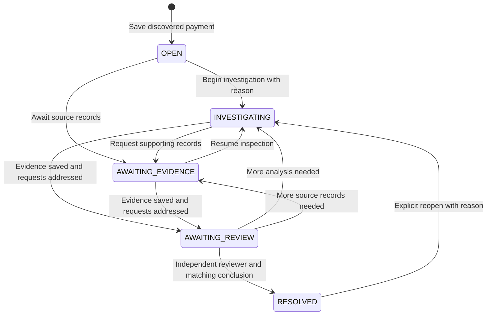

# Payment investigation workflow

The saved payment case now has an explicit operational status. This status describes investigation work; it does not assert payment success, beneficiary credit, settlement or any other banking outcome. Archive/restore remains a separate lifecycle control.

In **Case management → Overview**, an analyst or reviewer selects the next allowed status and records a reason. A case becomes resolved only through the separate reviewer-only resolution command. Recording a reviewer conclusion alone does not change status.



The command is `POST /api/payment-cases/{caseId}/workflow` with session CSRF, an `Idempotency-Key`, and the following body:

```json
{
  "expectedVersion": 3,
  "status": "RESOLVED",
  "reason": "The reviewed investigation is complete; the recorded source limitations remain visible.",
  "reviewerConclusionId": "CON-example"
}
```

`expectedVersion` is the shared management version, not an evidence version or lifecycle version. `reviewerConclusionId` is required only for `RESOLVED` and rejected for other transitions. Reasons must contain 1–4,000 characters. The response is the full management representation with additive fields `status`, `lifecycleState`, `allowedTransitions` and `activeInvestigationCount`, read under the same case lock. Case detail, queue, dashboard and workbench also show the projected status. Follow-up lists use this current lifecycle state so a case archived after initial list selection is excluded.

Resolution requires all of the following under the shared transactional case lock:

- Current state is `AWAITING_REVIEW`, and there are no queued/running investigations.
- At least one saved evidence version exists. Every open evidence request has been fulfilled or explicitly cancelled with a note.
- An independent reviewer conclusion matches the latest evidence ID and verified fingerprint.
- The resolving reviewer differs from the case creator, the selected evidence creator and creators of any investigations selected in that conclusion.
- The request's expected management version still matches. Resolution never silently selects another conclusion or newer evidence version.

The same no-active-investigation check applies to every workflow transition. Archived cases reject workflow changes until restored. Resolved cases retain readable evidence, reports and history, but reject new evidence, questions, notes, requests and management changes until an explicit reopening. Analysts and reviewers may reopen with a reason; viewers and administrators have no ordinary workflow-write powers. Existing lifecycle permissions are unchanged.

`WORKFLOW_CHANGED` events store previous/new status, the exact reason, actor/time, management version and the conclusion/evidence binding when resolved. Status is projected from these append-only events. No new schema column, backfill or original case-body rewrite is required. Existing cases without workflow events retain their original `OPEN` status. Previous evidence, answers, conclusions and frozen reports are not rewritten.

Identical command retries return the current management state without adding events, including after later status changes. A key reused for a different request fails. Concurrent evidence saves, workflow changes and management writes share the case row lock; the version check prevents competing management commands from both committing.

## Evidence-only review

`POST /reviewer-conclusions` now accepts `investigationIds: []`. This records direct human review of a saved evidence version when an AI answer is unnecessary, unavailable or unsuccessful. The selected evidence ID/hash remains mandatory and is verified normally. Up to 20 completed questions may still be selected; each must match the exact version and retain reviewer independence.

New conclusions include `reviewBasis: "EVIDENCE_ONLY"` or `"EVIDENCE_AND_INVESTIGATIONS"`. They remain `RECORDED`, preserving their original text. A report shows a matching conclusion only when its evidence fingerprint and selected question set match, including an empty set. A conclusion for an earlier evidence version remains historical and cannot resolve a case with newer evidence.

## Evidence request ownership

Evidence request create/update bodies accept optional `assigneeId`. The server checks the case's eligible tenant-scoped writer list. `null` unassigns; omitted on update preserves the current assignee. Projection returns `assignee: {id, name}` or `null`; older requests default to unassigned.

An update must change either status or assignee and still requires its explanatory note. Same-status reassignment is allowed. Existing fulfillment evidence validation remains in place. Request history preserves the assignee on new updates. Assignment records work inside the case and does not send a message or call an inquiry API.

The management UI warns before navigating away with unsaved text and offers explicit local JSON draft download/restore for notes, workflow reasons and reviewer conclusions. Restoring a draft does not submit a command or alter evidence.

## Verification boundaries

Isolated H2 tests cover state transitions, evidence-only review, stale-evidence resolution rejection, roles/scope, active jobs, archive behavior, retries, same-version races, request assignment and preservation of original case/evidence records. Frontend tests cover reasoned transitions, evidence-only selection, reviewer independence, resolved read-only controls and explicit reopening. Current execution outcomes are recorded in the milestone validation receipt; these tests do not establish production identity provisioning or bank/model availability.
