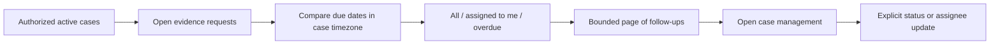

# Evidence follow-ups and assigned work

The Case queue retains Find payment followed by Saved payment cases. Its Work view filters assigned cases and the explicit investigation workflow states. Search composes with that filter and the active/archived visibility selection; changing a filter resets paging.

Below saved cases, **Evidence follow-ups** opens a read-only list of outstanding evidence requests. Choose All outstanding requests, Assigned to me or Overdue requests. Opening or refreshing this section performs a GET only. It does not fetch bank evidence, run an investigation, create a reminder event or contact another person. Overdue reminders are shown in the section; outbound notification delivery is not configured.

Evidence requests support an explicit assignee when created or updated in Case management. Unassigned legacy requests remain unassigned. The Assigned to me request view uses the request assignee; the saved-case view uses the case owner. Neither assignment grants access outside the existing workspace/bank/branch scope.

`GET /api/payment-case-work?view=ALL&offset=0&limit=10` requires a scoped session. Views are `ALL`, `MINE`, `OVERDUE`; limit is 1–25. The result includes `items`, filtered `total`, `hasMore`, counts for open/overdue/mine, `today` and `timezone`. Items contain case/reference/request identifiers, title, assignee, case owner/status, due date and days overdue, excluding evidence bodies and model answers. Only OPEN requests in active unresolved cases are included. Cancelled/fulfilled requests remain in case history.

Due dates are calendar dates. They become overdue the day after their due date in `poi.case-management.timezone` (default `Asia/Kolkata`), displayed in the UI. This timezone concerns investigation work, not bank timestamp interpretation or payment processing SLAs.

The response is bounded, but this local implementation reuses existing authorized case and management projections before paging. A database search/read model for large installations remains a separate scaling milestone. No scheduled emails, external notifications or automatic case transitions are introduced.
