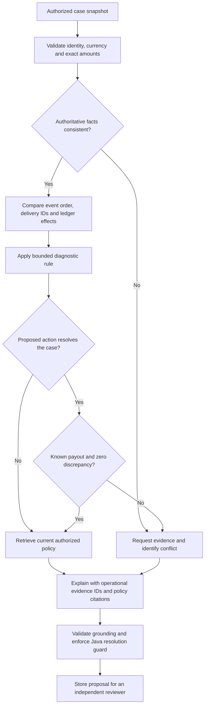

# Payment evidence and case decisions

This is a fictional payment processor and ledger model. It demonstrates backend engineering patterns without claiming bank- or payment-scheme certification.

## Authoritative facts
The Java API derives the tenant from its authenticated session, loads one case snapshot and computes reconciliation using exact integer arithmetic. Known values must remain within the JSON-safe integer range supported by React. Unknown provider information remains unknown; zero is not substituted for missing confirmation.

| Record | Meaning in this simulation |
| --- | --- |
| CAPTURE ledger entry | Positive payment capture in minor units |
| FEE ledger entry | Negative deduction |
| REFUND ledger entry | Negative refund posting |
| Provider feeMinor/refundMinor | Non-negative deductions from provider capture |
| Provider payoutMinor | Reported net payout at its asOf cutoff |
| Event occurredAt | When the provider/system says an event occurred |
| Webhook receivedAt | When this system received that delivery |
| providerEventId | Identity used to distinguish repeated delivery from a new event |

Compute ledger net as the signed sum of entries. Compute discrepancy as ledger net minus known provider payout. All compared entries must have the same currency and payment reference. Overflow, unsupported range and currency inconsistencies cannot silently round.

The Java/worker boundary uses the same normalized capture aliases (`CAPTURE`, `PAYMENT_CAPTURED`, `SALE`) and refund aliases (`REFUND`, `REFUND_POSTED`). Captures must be positive, refunds negative and fees non-positive; other signed adjustments remain entries in ledger net. Provider status is normalized before deciding whether a payout is known: blank, `UNKNOWN` and `UNAVAILABLE` statuses cannot turn a supplied zero into confirmation. The worker checks authoritative capture/refund/count/net facts against the supplied ledger rather than rendering contradictory totals. [STATUS](STATUS.md) distinguishes the current correction from its preceding test/runtime receipts.

Java accepts a new resolution proposal only when its authorized reconciliation has `calculatedBy="java-api"`, `validMoney=true`, `providerAvailable=true`, an integer provider payout and a known integer discrepancy of exactly zero. This is checked against the Java snapshot, independently of the worker's explanation. Missing payout or discrepancy is not zero. A resolution proposal that violates this requirement is rejected with `503 INVALID_WORKER_RESPONSE`, recorded as an investigation failure, and does not change the case or create an investigation.

## Diagnostic rules
| Observed evidence | Case conclusion | Proposed workflow action |
| --- | --- | --- |
| Client timeout, confirmed processor success, one matching capture, reconciled net | Transport timeout after success | Resolve case |
| Repeated provider event ID, one applied delivery, duplicates ignored, one capture, known payout and zero discrepancy | Duplicate webhook delivery | Resolve case |
| Receipt order differs from occurrence order, stale pre-capture state ignored, final capture consistent, known payout and zero discrepancy | Out-of-order webhook delivery | Resolve case |
| Otherwise supported timeout, duplicate delivery or ordering exception, but payout is unavailable or ledger-to-payout discrepancy is unknown/nonzero | Insufficient evidence; identify the missing reconciliation or quantify the mismatch | Request evidence |
| Confirmed processor refund missing from ledger at the cutoff | Refund posting exception | Escalate |
| Terminal processor rejection with no contradictory capture | Provider failure | Escalate |
| Missing identity/status/confirmation, conflicting terminal facts, incompatible amounts, or no applicable guidance | Insufficient evidence | Request evidence |

These rules govern case proposals. Resolving a case does not execute a payment. An unknown or conflicting condition takes precedence over a confident diagnosis.

For webhook ordering, compare actual instants across distinct receipt-time groups. Equal receipt times establish no precedence, even when the provider events occurred at different times. V6 records at most one strict inversion witness per later-received record, using the greatest occurrence time observed in earlier receipt groups; tied records cannot hide a nonadjacent inversion. The timing fact names occurrence and receipt separately. A provider snapshot's `asOf` is an observation time, not evidence of when payment success occurred.

A confirmed missing refund remains an escalation when it is the single supported exception and the other evidence checks pass. Its discrepancy is the reason to investigate the posting; the zero-discrepancy guard applies to resolution. Multiple independently observed anomalies still require evidence. A supported resolution must also include a finding linked to both authorized operational evidence and a policy citation, with neither insufficient confidence nor an insufficient-evidence outcome.

## Evidence workflow

## Review invariant
The proposal is tied to the case version used for investigation. A different reviewer approves or rejects the stored action. The API checks role, tenant, creator separation, version and command idempotency. Decision, case state and audit append commit in one database transaction. A retry with identical command content returns the original result; a changed command under the same key conflicts.

## Boundaries of the first dataset
The corpus contains six scenario templates and amount/identifier variations. It is useful for reproducible demonstrations and regression checks, but it does not cover every lifecycle event, currency, partial capture, reversal, network rule or real reconciliation convention. Expand the evidence model and tests before adding any new outcome.
