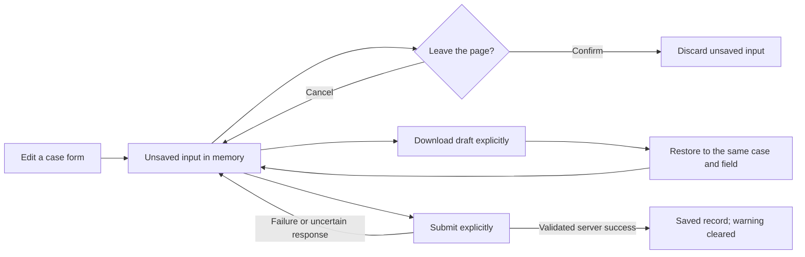

# Unsaved payment-case inputs

Manual/JSON evidence, Excel file selection, investigation questions and participating case-management forms register their unsaved state with the shared navigation guard. Internal links, programmatic navigation, sign-out and browser Back/Forward request confirmation before discarding those inputs. Canceling Back/Forward restores the original history entry and keeps the mounted form. Reload, closing a tab and external navigation use the browser's native leave-page warning. Browsers choose that warning's wording and require prior user interaction.

Saving one form clears only that form's dirty baseline after the server response is validated. Failed or uncertain submissions retain the input and existing retry identity. Downloading a draft does not mark the form as saved. Switching evidence methods or inspecting another saved result within the page retains the input; these actions do not require a leave-page prompt.

## Explicit recovery files

In **Case evidence → Manual + JSON**, **Download form draft** saves all current entries to a `case-evidence-draft-v1` JSON file, including an unfinished source-timezone value. Upload the file through **Upload JSON to fill the form** in the same case. Draft import verifies case identity, schema, configured columns, exact string values, file and row limits. Restored drafts retain manual provenance and need an explicit evidence save; incomplete values must be corrected before that save. Existing canonical JSON imports keep their normal strict validation and provenance.

The investigation question and participating text forms offer **Keep or restore a text draft**. A `case-text-draft-v1` file binds the text to its case and field. Restoring validates that scope and the field's length limit. Loading a different file over existing unsaved input asks before replacement.

Drafts are held in component memory or explicitly downloaded by the user. No payment data is automatically written to localStorage, sessionStorage, IndexedDB or a draft API. Downloaded files contain entered case data and remain wherever the user saves them. They are unsubmitted working copies, not evidence versions, reviewer decisions or investigation jobs.

## Verification and limits

Frontend tests cover route/link cancellation, real jsdom Back/Forward restoration, reload warnings, cleanup after save/undo/unmount, failed-save retention, separate evidence methods, exact draft round trips, wrong-case rejection and replacement cancellation. No bank/model calls or saved live-case changes are needed for these tests. Native browser warning wording, forced browser/process termination, session expiry, and downloaded-file retention are outside the guard's control. Recovery after a forced close requires a previously downloaded draft; the guard does not claim automatic crash recovery.

On 16 September 2026, the isolated Chromium acceptance run passed all three current-flow scenarios, including canceling internal navigation and browser Back while keeping the evidence form mounted, explicitly downloading a draft, leaving, restoring that file to the same case and confirming no evidence had been saved. The other scenarios exercised real Java/H2 case commands, independent review, PDF history and evidence follow-ups with a declared provider test double. The run exited successfully and its dedicated ports 19091–19093 were closed; it did not use the native operator site or bank/model services.
