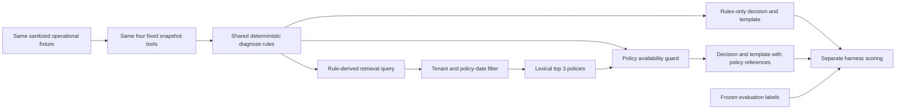

# Retrieval baselines and local-model evaluation

The final local runtime uses V6b with Qwen3 4B, lexical retrieval and five running project services: [runtime-final](validation/runtime-final.json). Java35, worker198 and UI34 tests, [replay17](validation/acceptance-compose-replay-v6b.json), [adversarial16](validation/adversarial-replay-v6b.json), [replay30](validation/evaluation-replay-test-v6b.json), [live Java17](validation/acceptance-compose-ollama-v6b.json), [selection review](validation/v6b-fact-selection-review.md), [planner/hybrid review](validation/v6b-live-planner-hybrid-review.json), [browser14](validation/frontend-browser-v6b.json), [cached startup](validation/start-with-ai-v6b.json) and [fresh-volume rehearsal](validation/rehearsal-compose-v6b.json) are recorded. These are bounded synthetic-data results; the model selects facts and the service renders wording/links. The main editable delivery is the project folder and its VS Code workspace. Earlier ZIP verification is preserved in `docs/validation/package-history/latest-release.json`; the user requested removal of redundant packages. See [source-folder delivery](validation/source-folder-delivery.json).

The deterministic baselines make the same outcome and action decisions on all **30 frozen test cases**. Adding lexical retrieval supplies the expected policy version in the top three results for **30/30 cases**, but ranks it first for only **25/30**. This run demonstrates policy-context availability. It does not demonstrate an improvement in classification, generative reasoning or explanation quality.

The complete machine-readable evidence is [baselines-test.json](validation/baselines-test.json). The comparator is [compare_baselines.py](../tools/compare_baselines.py). Its exact timestamp, package versions, source hashes, input hashes, individual predictions, retrieved policy IDs/scores, errors and metric denominators are recorded in that artifact.

## What was compared

| Component | Rules only | Fixed tools + lexical retrieval |
| --- | --- | --- |
| Allowed case input | Same sanitized operational snapshot | Same sanitized operational snapshot |
| Tool execution | All four fixed snapshot tools | Same four tools, same order |
| Classification and proposed case action | Existing deterministic `diagnose` rules | Same `diagnose` rules |
| Explanation | Existing deterministic template | Same template plus retrieved policy references |
| Retrieval | Disabled by design | Existing lexical retriever; top 3 |
| Policy availability guard | None | Same graph guard: no eligible policy causes abstention |
| Model/embedding calls | 0 / 0 | 0 / 0 |
| Adaptive tool planning | None | None |

The lexical arm is a retrieval-augmented deterministic explanation baseline, not an LLM result. The rules-only arm is an offline classifier: a resolve action without supporting citations would not satisfy Java's proposal validation. Neither baseline submits a review decision or modifies a payment.

Both invoke the actual LangChain tools from `SnapshotTools`: `get_payment_timeline`, `compare_settlement`, `inspect_webhooks` and `check_refund`. The comparator uses the worker's `diagnose` and lexical `KnowledgeStore` implementation directly. It follows the graph's no-policy abstention guard and first-citation template behavior. It does not instantiate the graph engine, provider, database or checkpoint store.



## Frozen sample and isolation

The comparator requires the entire 30-case `test` split, with five cases for each of six engineered outcomes: timeout after success, duplicate webhook, out-of-order webhook, missing refund, insufficient evidence and provider failure. The split contains 24 northstar and 6 silverline records. There is no limit flag or outcome selection flag, and partial saved-report comparisons are rejected.

The seed is `20260911`. The dataset manifest SHA-256 is:

```text
b467da9818fd0813665e06301b7ea5940b61d94c54ce04e3d34b1dc31223e140
```

The comparator first verifies the frozen fixture, runbook and label file hashes against `data/manifest.json`. Both arms receive byte-equivalent canonical input structures; their shared input-set SHA-256 is:

```text
4a19f25aaa8582d35606413a3d9eea02e35297e91d54eee5924f56b8ea9a532e
```

Input selection removes case title, description, tags, merchant text and event summaries. It keeps only identities, statuses, timestamps, monetary attributes, provider references and record fields used by the tools. The worker modules receive a `CaseSnapshot`, never expected outcomes, actions, citations or abstention labels. The harness uses labels to choose the frozen split and score results after baseline execution. A Python audit guard rejects label-file reads during baseline execution and rejects network connection attempts throughout the comparator process.

Settings are constructed explicitly with lexical retrieval and no vector DSN; they are not inherited from the running worker environment. Optional tracing is disabled in this child process. The completed run recorded **zero network attempts, zero model calls, zero embedding calls and zero baseline label-file reads**. Java, PostgreSQL, Ollama and the running worker were not called. Money calculation provenance is honestly `worker-fixture-baseline`; Java's authoritative reconciliation is tested separately by API acceptance.

## Recorded results

| Metric | Rules only | Fixed tools + lexical retrieval |
| --- | ---: | ---: |
| Outcome correct | 30/30 | 30/30 |
| Proposed action correct | 30/30 | 30/30 |
| Abstention behavior correct | 30/30 | 30/30 |
| Cases with nonempty evidence IDs | 25/30 | 25/30 |
| Valid references among cases with evidence | 25/25 | 25/25 |
| Policy context provided | 0/30, disabled | 30/30 |
| Expected policy version ranked first | 0/30, disabled | 25/30 |
| Expected policy version within top 3 | 0/30, disabled | 30/30 |
| Cases whose returned policies are all tenant/date eligible | Not applicable | 30/30 |
| Relevant first-citation link among cases with a finding | 0/25, disabled | 25/25 |
| Decision changes caused by the no-policy guard | Not applicable | 0/30 |
| Execution errors | 0 | 0 |
| Model / embedding calls | 0 / 0 | 0 / 0 |

Rules-only policy metrics are zero by construction. They are not presented as failures of an attempted retriever. The five correct abstentions have no finding or evidence IDs, so reference and finding-citation metrics use an explicit 25-case denominator. Citation eligibility is not credited vacuously when there are no citations.

Relevant-policy hit is the presence of a label-listed policy **ID and version**. The labels specify required supporting policies, not every potentially useful document, so this experiment reports hit/rank rather than asserting precision or recall against an exhaustive relevance set. Mean reciprocal rank within the top three is **0.916667** for the lexical arm.

The five first-rank misses are visible in the report: `CASE-1046` through `CASE-1050`, all insufficient-evidence cases, rank `RB-FAILURE:v1` ahead of the expected `RB-UNCERTAINTY:v1`, which appears second. These cases still abstain correctly and return the uncertainty policy within the context window. This is a ranking limitation, not an execution failure. It should remain visible; tuning the query against these same test cases and relabelling the rerun as untouched test performance would invalidate the holdout claim.

All raw rule decisions and final decisions agree across the 30 pairs. Repeating both arms produced **60 matching semantic-result hashes**, with zero mismatches. Timing fields are excluded from those hashes. Source files were unchanged during the recorded run.

The report includes one measured local duration per baseline/case, with alternating execution order to reduce first-run bias. Those timings are descriptive direct-module measurements. They are not a load test, an HTTP latency benchmark or a valid speed comparison with a historical graph or model run.

## Running the comparison

From the project root, using the installed worker environment:

```powershell
& .\services\investigator\.venv\Scripts\python.exe .\tools\compare_baselines.py --verify-repeat --report .\docs\validation\baselines-test.json
```

The tool does not need any running service. It imports the worker modules and reads only the declared local frozen data. No Ollama or embedding calls are made. A report `status` of `PASS` means execution, isolation, source stability and requested repeat checks passed; prediction metrics remain separately visible.

An optional archived `tools/evaluate.py` report can be included without triggering inference:

```powershell
& .\services\investigator\.venv\Scripts\python.exe .\tools\compare_baselines.py --verify-repeat --saved-report .\docs\validation\evaluation-replay-test.json --report .\docs\validation\baselines-test.json
```

The included archived replay report has the same manifest and all 30 test IDs, and its saved outcomes/actions rescore to 30/30 with zero recorded model calls. This is **historical context only**. That older report format lacks exact sanitized input hashes, raw citations, confidence and generated prose: citation-hit flags can only be quoted as previously scored, not independently rescored here. HTTP/graph overhead and historical code versions also prevent a controlled timing comparison. Replay-versus-replay agreement is not an AI uplift.

The same optional flag can inspect a future complete saved Ollama report; this comparator will still make no model calls. A valid claim about adaptive agents would require recorded tool selections, exact inputs, source/config/model identity, raw outputs/citations, full-case failures and a separate explanation-quality rubric. None of those results are inferred from the deterministic baseline scores.

## Limits of the conclusion

These are original synthetic template variants. The generator, rule predicates, query templates, runbooks and expected labels share engineered assumptions; a 30/30 decision score does not establish real banking accuracy, independent generalization or a calibrated confidence estimate. Both arms share the same classifier, so this design cannot demonstrate classification benefit from an LLM.

The useful measured distinction is that eligible, expected policy references become available while decisions remain unchanged. ID/version matching and tenant/date filtering do not prove that every explanatory sentence is entailed by its citation. The summaries are deterministic templates, and no human or model-based explanation-quality score is claimed. Java authorization, monetary arithmetic, review idempotency and persistence remain separate validation concerns.

## Separate full-stack live acceptance

[Qwen/Ollama acceptance](validation/acceptance-compose-ollama.json) passed 17 application-boundary checks through nginx, Java and the real worker with lexical retrieval. The 198.252-second run created two investigations using four actual generation calls. The JSON's `modelMetrics` cover only the first investigation: two calls and a 92.647-second graph. Those are not whole-run token or graph totals. This check verifies working generation, persistence and review controls; it is not a held-out model benchmark.

[AI-assisted comparison of the two accepted timeout outputs](validation/live-acceptance-results.json) found premature workflow claims. CASE-1002 said “Case resolved” before approval, and both timeout outputs used unqualified “no further action” wording. Their operational evidence IDs and constrained actions passed, but those checks did not establish that the prose respected the still-pending review. Later approval cannot retroactively justify a generated completion claim. The reviewer was an AI agent, not an independent human adjudicator.

## First six-family development sample

The [complete first sample](validation/evaluation-ollama-development.json) selected the first development case in each of the six engineered scenario families. It called the worker directly in Ollama mode with lexical retrieval; Java controls are covered by the separate HTTP acceptance. It is not the frozen 30-case test split, a random field sample, or an independent diagnosis benchmark. The deterministic evidence gate and provider schema constrain outcome/action before the model explains them.

| Development case | Recorded execution | Reported proposed action | Interpretation |
| --- | --- | --- | --- |
| CASE-1001, timeout | Provider timeout during synthesis; no accepted result | None returned | Explicit failure, no replay fallback; failed-request model usage unknown |
| CASE-1011, duplicate delivery | Accepted | RESOLVE_CASE | AI review found payment facts and proposed handling supported |
| CASE-1021, ordering | Accepted | RESOLVE_CASE | Proposal reason said “case resolved per policy” before approval: workflow overclaim |
| CASE-1031, missing refund | Accepted | ESCALATE | AI review found exact refund amount and posting exception supported; full settlement snapshot is needed to audit absent posting |
| CASE-1041, insufficient evidence | Accepted | REQUEST_EVIDENCE | AI review found conservative abstention, generic missing facts and an irrelevant top policy; not proof of calibration or generalization |
| CASE-1051, provider failure | Accepted | ESCALATE | AI review found failure evidence and proposed escalation supported |

Five of six requests were accepted. The report scores the failed request as false for outcome, action, citation, abstention and reference metrics, giving 5/6 for each; these figures combine execution availability with constrained checks and must not be described as 83.33% independent AI accuracy. Accepted results report ten actual model calls. `modelCalls` is null because failed-request usage was unavailable; neither ten nor twelve is an established whole-run total. Raw accepted summaries, findings and proposal reasons are retained in each row.

The completed [explanation review](validation/model-explanation-review.md), performed by Codex AI rather than an independent human reviewer, found one material workflow overclaim among the five accepted outputs and no material unsupported claim in the other four. It retained CASE-1041's weak specificity and top-policy relevance. This is a bounded qualitative inspection, not a calibrated pass rate. The earlier two timeout outputs are reviewed separately and are not added to the six-case denominator. [Exact checkpoint evidence](validation/model-development-review-evidence.json) preserves complete tool outputs for audit, while synthesis received only the compact assessment, operational IDs and the single top policy. CASE-1041 received RB-FAILURE:v1 at rank one despite unknown status; a relevant policy elsewhere in its returned three-citation list is not proof that it grounded the generated answer. Thus the harness's relevant-citation-hit flag and the review's context-relevance concern can both be true.

The first sample used a 120-second provider HTTP timeout; its full-stack acceptance used Java 270 seconds and proxies 300 seconds. The 180/390/420-second configuration and proposal-language correction were deployed around 02:11 IST on 12 September 2026. [96 worker tests](validation/worker-tests-96-pre-finding-only.json) cover the source changes, including service-owned review context and a narrow guard against observed workflow-completion/no-action assertions. Keep the first sample unchanged. A later rerun of these now-inspected development cases is a regression sample, not a newly untouched holdout. Full-synthesis live v2 failed on its second investigation; combined live-model/hybrid retrieval is still unverified.

## Historical 96-test-source replay regression after deployment

[Replay HTTP acceptance](validation/acceptance-compose-replay-final.json) passed 17 checks after the configuration/wording changes. The separately recorded [30-case replay regression](validation/evaluation-replay-test-final.json) has zero failures, expected outcome/action/citation/reference results on 30/30, zero model calls and `localSourcesUnchanged=true`. Local source hashes are reference provenance to pair with the separately verified worker image/test receipt; they alone do not attest the remote process. This direct-worker test still bypasses Java, while HTTP acceptance covers the application boundary. Neither result is a new retrieval ablation, an independent model-quality score, or a live test of the larger timeout and revised prompt. The earlier baseline and first live sample remain their own dated experiments.

## Failed full-synthesis v2 and deployed finding-only evaluation scope

The [exact v2 review](validation/live-acceptance-v2-results.json) records two attempts: CASE-1002 accepted, CASE-1003 rejected, overall acceptance failed. Codex review found the first result's financial-only wording supported. The second summary's grammatical subject was payment, but “resolved without further action” was ambiguous and unqualified; the narrow workflow gate conservatively rejected it. This is not proof of an explicit completed-case assertion. Both stages completed for both attempts: four provider calls are observed in accepted result/checkpoint evidence. No passing v2 acceptance report exists.

The v4 finding-only design was deployed with observed-facts context after [112 worker tests](validation/worker-tests-112-pre-timing-context.json) and [31 frontend tests](validation/frontend-tests-31-pre-knowledge-health.json). The model plans permitted tools and synthesizes one cited finding; rules supply public summary, confidence, missing facts and proposal. Insufficient evidence uses the model planner once, then skips synthesis with explicit provenance. Metrics are `synthesisScope="finding-only"` / `"skipped-insufficient-evidence"` and `assessmentSource="deterministic-evidence-rules"`; replay uses `"deterministic-replay"`. These are component-tested behaviors. [V3 replay acceptance](validation/acceptance-compose-replay-v3.json) passed 17 checks and [replay evaluation](validation/evaluation-replay-test-v3.json) passed 30/30 with zero model calls and unchanged local sources. The first live v3 finding had correct links but added “no further action required”; it was rejected without a stored investigation. No full v3 live pass or v3 six-family run is claimed. V4 context revision and full live acceptance now pass their own checks; the completed six-family finding review identifies two material errors; planner-only Java is now verified, while the combined path was later verified in the [V6b Java/hybrid probe](validation/live-hybrid-java-v6b.json).

Future evaluation must score the generated finding separately from rule-authored fields and record synthesis skips and real call counts. Passing deterministic summary/action checks cannot be credited as successful model authorship. Keep all original full-synthesis attempts and their failures; a finding-only rerun is a changed system with a smaller generation task, not an identical-arm comparison or an untouched accuracy benchmark.

The [exact failed live v3 receipt](validation/v3-live-acceptance-results.json) preserves the parsed model finding, rule-authored fields, provider timings, valid link identities, rejection and authenticated Java 404. It identifies the 108-test image and configuration; preliminary checks are not full acceptance.

## Latest v4 full live acceptance

[Observed-facts v4 acceptance](validation/acceptance-compose-ollama-v4.json) passed 17 HTTP/workflow checks in 100.801 seconds for two real investigations through nginx/Java/worker with lexical retrieval. The report's modelMetrics cover only the first investigation: 56.836-second graph and two actual calls, with `synthesisScope="finding-only"` and `assessmentSource="deterministic-evidence-rules"`. Those first-case metrics are not whole-run token totals; the separate [exact output review](validation/v4-live-acceptance-results.json) confirms four completed calls across both investigations. The model receives projected operational facts, authorized IDs and the top policy; the entire assessment, question, workflow and proposal are excluded from finding context. The planner still receives the question.

The completed v4 six-family sample and its material errors are described below; it is separate from the two-case full-stack review. The completed [two-case Codex AI review](validation/v4-live-acceptance-results.json) found both findings supported without workflow overclaims. CASE-1003 correctly copied INR 18,495.26 but called it “total”: it is ledger net/provider payout, not gross capture INR 18,824.69. That quantity-label clarity limitation remains visible. This is not a calibrated pass rate or independent human adjudication. Reconstructed finding context is hash-verified from frozen code/checkpoints, not a raw provider request capture. Compared with earlier full synthesis, this is a smaller model-authored task, so the 100.801-second observation does not establish a controlled speedup or general semantic improvement. Historical failures remain failures. Planner-only Java verification is now recorded separately; the combined path was later verified in the [V6b Java/hybrid probe](validation/live-hybrid-java-v6b.json).

## Completed v4 six-family sample and material finding errors

[V4 execution](validation/evaluation-ollama-development-v4.json) returned six accepted responses with zero request failures, 11 recorded model calls and unchanged local sources. All six rule-owned outcome/action and identifier checks passed. That is not 100% model accuracy. Five cases used two actual calls and generated one finding each; CASE-1041 used one real planner call and `skipped-insufficient-evidence`, with no model-written finding.

[Codex AI review](validation/v4-model-explanation-review.md), with [exact checkpoint evidence](validation/v4-development-explanation-review.json), identified two material errors among the five generated findings. Three had no material error identified; the planner-only response is excluded from model-explanation scoring. These are descriptive counts from selected synthetic development cases, not independent human adjudication or a calibrated pass rate.

- CASE-1021 said capture occurred before authorization. Authorization actually occurred at 06:20:02Z and capture at 06:20:05Z; only notification receipt order was reversed, at 06:20:10Z versus 06:20:45Z. Both time pairs were available to the model.
- CASE-1031 said the INR 6,113.19 refund was confirmed and posted. Confirmation and amount were valid, but ledger refund was zero and no REFUND entry existed. The proposed MISSING_REFUND/ESCALATE result was correct because it came from rules; it did not repair the false model-written posting claim.
- CASE-1011's duplicate explanation was supported, but its capture/fee statements require settlement facts beyond its two webhook links. Identifier validity alone does not establish complete claim-to-record linkage.
- CASE-1041 has no model explanation to score. Its rule-owned missing-evidence message remains generic; the top rejection policy was not used for finding synthesis because that stage was skipped.

The completed 8B comparison below held worker 112 code/context fixed and changed only the runtime model. Its cases were selected after 4B errors were observed, so it is a diagnostic/regression comparison, not an untouched holdout score or whole-corpus improvement. The checked-in default remains 4B; the subsequent V5 source changes would need separate evidence.

## V4-source replay, runtime and planner-only Java evidence

[V4 replay HTTP acceptance](validation/acceptance-compose-replay-v4.json) passed 17 checks and [adversarial replay](validation/adversarial-replay-v4.json) passed 13. The [30-case v4 replay evaluation](validation/evaluation-replay-test-v4.json) has zero failures, zero model calls and unchanged local source hashes. Running worker module hashes captured in [runtime-v4](validation/runtime-v4.json) match those evaluation references. These checks cover deterministic regression and runtime provenance, not model prose accuracy or prompt-injection robustness.

The separate [Java planner-only probe](validation/live-planner-only-java-4b.json) accepted CASE-1041 through nginx/Java in 34.979 seconds. Its metrics record one real Qwen3 4B planner call, `skipped-insufficient-evidence`, no findings and rule-authored REQUEST_EVIDENCE. Java preserved unknown provider payout/discrepancy. The `missingEvidence` text only says available records do not establish a supported pattern; it does not supply the concrete processor-status/ledger-cutoff checklist present in the uncertainty policy. This is correct abstention with limited guidance, and there is no model-written finding to score. It is one selected development example, separate from the six-family denominator.

The [final fresh-volume rehearsal](validation/rehearsal-compose-final.json) passed [17 checks](validation/acceptance-clean-compose-final.json) in 31.631 seconds, with the acceptance file hash matching its manifest and no remaining disposable containers or volumes. It validates recorded v4 built-source startup/review and cleanup, not model inference or a remote-clone installation. The later [V6b hybrid probe](validation/live-hybrid-java-v6b.json) passed; the completed 8B diagnostic is described below.

## Completed 8B selected diagnostic on unchanged worker 112

[Execution](validation/evaluation-8b-selected-development.json) recorded two accepted responses, zero failures, four completed calls and unchanged local sources. [Exact comparison and Codex AI review](validation/8b-selected-explanation-review.json), also summarized in [the review note](validation/8b-selected-explanation-review.md), show normalized requests equal to the 4B requests except investigation UUID, exactly equal operational outputs and equal reconstructed finding contexts. The context comparison is not a raw HTTP prompt capture. [Runtime evidence](validation/runtime-8b-comparison.json) identifies the same worker 112 image, Qwen3 8B, lexical retrieval, four threads, 4096 context and 180-second provider timeout; checked-in default remains 4B.

| Selected case | Model-only finding review | Recorded graph time | Completed calls |
| --- | --- | ---: | ---: |
| CASE-1021 | Money is correct, but webhook application “after” stale authorization materially blurs provider occurrence versus receipt/application order. No separate processing timestamp supports that application ordering. | 124.658 seconds | 2 |
| CASE-1031 | Refund confirmation, refund/discrepancy INR 6,113.19 and ledger net INR 24,024.87 are supported. The finding omits the former false posting claim; missing-ledger explanation and escalation remain rule-owned. | 106.467 seconds | 2 |

There is one finding with no material error identified and one materially ambiguous finding, not a semantic 2/2 pass. This direct-worker diagnostic performed no Java case transition or reviewer decision and repaired no prose. Selection after known failures, only one observation per case/model and AI rather than independent human review prevent a general accuracy or speedup claim. Higher model capacity alone does not justify changing defaults.

V5 now exposes explicit occurrence/receipt orders and observed refund ledger entries plus specific UNKNOWN-status evidence requests. Retrieval query stays unchanged and generated text is not repaired. Worker131 is tested/deployed, and the completed selected pair is reviewed below. The historical generic request list, 4B errors and 8B timing ambiguity remain part of the record.

## V5 selected findings after context clarification

[Execution](validation/evaluation-v5-selected-development.json) accepted the same two selected development cases with four completed calls, zero failures and unchanged local sources. [Runtime-v5-4b](validation/runtime-v5-4b.json) identifies 131-test image `4ed10f3`, Qwen3 4B and lexical retrieval. [Exact Codex AI review](validation/v5-selected-explanation-review.json) preserves model-only findings, rule-owned fields, actual observations, reconstructed context and original outputs. Reconstructed context is not a raw provider request capture.

| Selected case | Model-only review | Graph time | Calls |
| --- | --- | ---: | ---: |
| CASE-1021 | No material factual error identified. Authorization is earlier than capture; late receipt is supported, but the phrase leaves the authorization webhook implicit. Capture/fee quantities match. |73.187 seconds|2|
| CASE-1031 | No material factual error identified. Confirmed refund is absent from the supplied ledger, with equal INR 6,113.19 discrepancy. “A INR” is a grammar defect; absence is snapshot-scoped. |60.433 seconds|2|

This is two reviewed findings with no material factual error identified and two clarity/grammar limitations. It is not independent human adjudication, a new untouched holdout or a whole-corpus accuracy result. V5 changed context after observed failures, while reverting the runtime model from 8B to 4B; timing across those two revisions is not a controlled model-only comparison. Outcome/action remain rule-owned, and no prose was repaired.

Specific UNKNOWN-status evidence requests are covered by worker tests, but this pair contains no unknown-status case. The six-family 4B sample below now includes that path. No model-enabled V5 full-Java/hybrid pass is claimed. Current V6 requirements include fresh Java planner-only and live integration evidence. The older v4 receipts continue to prove only their recorded revisions.

## Completed V5 six-family 4B development review

[Execution](validation/evaluation-ollama-development-v5.json) records six accepted responses, zero failures, 11 successful model calls and unchanged source references. [Exact Codex AI review](validation/v5-development-explanation-review.json) separately scores five generated findings: one material temporal ambiguity, four with no material error identified, and one planner-only response excluded from explanation scoring.

CASE-1011 says two webhook deliveries occurred at the same time. Both records have provider occurrence time 06:10:05Z, but local receipts are 06:10:10Z and 06:10:30Z. The sentence's subject is delivery, so it materially blurs time scope; treat it as ambiguity, not an automatically proven categorical falsehood. One applied and one ignored delivery, capture and fee are supported. The finding links webhooks/provider but omits ledger IDs for its generic capture/fee clauses: incomplete link granularity, not invented ledger facts.

CASE-1021 retains an implicit authorization-webhook antecedent; CASE-1031 retains “A INR” grammar; CASE-1051's “settlement amount” is less precise than naming the zero payout or ledger net. These findings were reviewed within the supplied snapshot, without inferring future state. CASE-1041 returns three specific rule-owned requests for processor status, ledger coverage/cutoff and delivery history, allowing records to be absent rather than presuming they exist. Its one actual planner call is counted, but there is no model-written finding. Retrieval still puts the rejection policy first; it was not supplied to a synthesis stage because none ran.

[V5 deterministic HTTP17](validation/acceptance-compose-replay-v5.json), [adversarial13](validation/adversarial-replay-v5.json) and [replay30](validation/evaluation-replay-test-v5.json) pass independently. [Current component runtime](validation/runtime-v5-components.json) pairs the tested Java30/worker131/UI32 images; the [subsequent 8B override](validation/runtime-v5-8b.json) produced a completed selected diagnostic and broader sample, reviewed below. The repeated development sample and this selected error probe are not untouched holdout data or an independent accuracy estimate.

## Completed V5 8B batch: errors and reconciled usage

The [six-family harness](validation/evaluation-ollama-8b-development-v5.json) reports five accepted responses, one rejected request and nine accepted-result model calls; failed usage is unknown to that HTTP harness. The [exact checkpoint review](validation/v5-8b-development-explanation-review.json), summarized in [the review note](validation/v5-8b-model-explanation-review.md), separately records two completed stages for rejected CASE-1021. There are therefore eleven known completed calls across checkpoints, without claiming billing or cancellation telemetry.

Four accepted findings form the prose denominator: one material factual error and three with no material error identified, retaining traceability/snapshot limits. One accepted planner-only row has no explanation to score. CASE-1001 says success occurred at 06:05:50Z, which is provider `asOf`; the recorded success event occurred at 06:00:05Z. CASE-1021 names WH-1021-1 but omits it from evidenceIds, so the unchanged gate rejects the candidate after 34.503-second planning and 145.055-second synthesis. That rejection is not a timeout and was not silently repaired. Its candidate is reviewed separately from accepted prose. These are repeatedly inspected synthetic development cases and Codex review, not independent accuracy.

## V6 evaluation boundary and deterministic ordering regression

V6 working source asks the second actual model call for one or two catalog fact IDs, then renders exact service-owned text and evidence links. Its [198-test worker build](validation/worker-tests-198-pre-selection-priority.json) and [deployment](validation/runtime-v6-4b.json) are verified; the first live selection sample is recorded with three primary exception-coverage gaps; [V6b Java acceptance](validation/acceptance-compose-ollama-v6b.json) and [combined hybrid](validation/live-hybrid-java-v6b.json) subsequently passed. [UI34](validation/frontend-tests.json) supports explicit new provenance but does not establish selector performance. Historic V5 explanation-quality denominators remain unchanged.

Evaluate catalog correctness and source closure independently from model selection relevance and useful coverage. Render equality is a mechanical integrity check, not a generative-model semantic score. Rule-owned outcomes remain separate. A future fixed-selection versus model-selection comparison must use the same catalog/retrieval inputs; successful template rendering alone cannot demonstrate AI uplift. Reused development cases and exposed template variants are not newly independent data.

The [before-fix fourteen-case HTTP suite](validation/adversarial-tied-receipt-before-v6.json) passes 13 and fails the new tied-receipt case: equal receivedAt values are misclassified as OUT_OF_ORDER_WEBHOOK with RESOLVE_CASE instead of insufficient evidence. A working-source change now compares only strict receipt order. The expanded [post-fix 16-case suite](validation/adversarial-replay-v6.json) now passes; prior 13-case passes remain valid for their smaller scenario set, and the failed 14-case receipt is unchanged. This is a deterministic diagnosis defect, separate from the V5 model-written timestamp errors.

The expanded [before-fix delivery-state suite](validation/adversarial-delivery-states-before-v6.json) recorded 13 of 16 passing HTTP checks. It preserves three incorrect resolution proposals: tied receipts, a pending duplicate treated as ignored, and an APPLIED late authorization treated as ignored stale. These are rule-to-runbook mismatches, separate from model prose and the V6 selector contract. [ADR-018](DECISIONS.md#adr-018-require-observed-delivery-state-before-proposing-resolution) records the required observed-state checks. Corrections passed the [198-test worker build](validation/worker-tests-198-pre-selection-priority.json) and the deployed [V6 HTTP suite](validation/adversarial-replay-v6.json) passes 16/16. All three cases now yield INSUFFICIENT_EVIDENCE/REQUEST_EVIDENCE; historical before-fix receipts are unchanged.

A further [ledger-boundary correction](DECISIONS.md#adr-019-align-ledger-semantics-across-java-and-the-worker) is present in working source. Java passed [35 tests](validation/java-container-tests.json) and is deployed; the final worker passed [198 tests/build](validation/worker-tests-198-pre-selection-priority.json), and [V6 replay HTTP17](validation/acceptance-compose-replay-v6.json) passed after deployment. [Final model-enabled Java/reviewer acceptance](validation/acceptance-compose-ollama-v6b.json) subsequently passed 17 checks. Java and Python now share capture/refund aliases and strict posting signs; fees are non-positive, while generic adjustments retain their signed net effect. Worker consistency checks must not let validMoney=true override invalid visible postings or mismatched authoritative aggregates. The preserved [Java30 receipt](validation/java-container-tests-30-pre-ledger-alignment.json) predates this correction. The new Java count does not establish worker or combined-stack validation.

## Original V6 deployment and replay evidence

[Runtime-v6-4b](validation/runtime-v6-4b.json) captures Java `f2b77ca3`, worker `90077f26` and UI `ab12ff18`, Qwen3 4B/lexical, with ten running worker module hashes matching the receipt/local source. [HTTP17](validation/acceptance-compose-replay-v6.json), [adversarial16](validation/adversarial-replay-v6.json) and [30-case replay](validation/evaluation-replay-test-v6.json) pass; replay makes zero model calls. Tied receipts, pending duplicates and applied late authorization now produce REQUEST_EVIDENCE. This verifies the deployed deterministic path, not selector relevance or model quality.

The [first V6 six-family live sample](validation/evaluation-ollama-development-v6.json) completed six accepted responses and 11 calls, with no errors/source change. Three selections omitted available exception-specific facts; this is a coverage limitation, not a prose-accuracy result. Subsequent V6b integration and final release gates are recorded separately below. Old prose, failed checks and earlier startup/browser receipts retain their recorded scope.

## First V6 six-family selection evaluation

[Execution](validation/evaluation-ollama-development-v6.json) records six accepted responses, zero errors, 11 completed calls and unchanged sources. The denominator for model selection is five selection results; the sixth case was planner-only and generated no selection. The model chose IDs, while the service rendered every displayed sentence and evidence link. Do not score these outputs as successful model-written prose or infer independent diagnostic accuracy from rule-owned outcomes.

| Case | Selected IDs | Coverage observation |
| --- | --- | --- |
| CASE-1001 | FACT-PROVIDER-STATUS + FACT-SUCCESS-EVENT | Valid observations; available timeout fact omitted, so the primary exception is not covered. |
| CASE-1011 | FACT-PROVIDER-STATUS + FACT-SUCCESS-EVENT | Available repeated-delivery fact omitted. |
| CASE-1021 | FACT-PROVIDER-STATUS + FACT-SUCCESS-EVENT | Available occurrence/receipt ordering fact omitted. |
| CASE-1031 | FACT-SETTLEMENT + FACT-REFUND-OBSERVATIONS | Relevant ledger/payout discrepancy and confirmed-versus-ledger refund observations selected. |
| CASE-1041 | No selection; one planner call | Rule-owned insufficient-evidence requests; exclude from selection coverage. |
| CASE-1051 | FACT-PROVIDER-STATUS + FACT-TERMINAL-EVENT | Relevant failure facts selected; available capture-absence observation omitted. |

There are three primary exception-coverage gaps, plus the failure result's omission of available supporting capture absence. No 5/5 coverage score is claimed. Valid selection IDs and exact rendering constrain output integrity; they do not guarantee that the selected subset answers the question. This reused synthetic development sample is not independent human adjudication or untouched holdout data.

The bounded V6b prompt-priority correction is implemented/deployed. Its separately named six-case execution completed; preserve the first sample and do not report a later retry as the same experiment. [Exact review of the new selections](validation/v6b-fact-selection-review.md) is complete. [V6b Java/review acceptance](validation/acceptance-compose-ollama-v6b.json) passed; [combined hybrid](validation/live-hybrid-java-v6b.json) also passed; [browser14](validation/frontend-browser-v6b.json), [cached startup](validation/start-with-ai-v6b.json), [fresh rehearsal](validation/rehearsal-compose-v6b.json) and [final runtime](validation/runtime-final.json) also passed; archive verification belongs to the external post-freeze delivery record.

The [exact checkpoint review](validation/v6-development-fact-selection-review.json) and [readable review](validation/v6-fact-selection-review.md) preserve all ten selected IDs, catalogs, source evidence and provenance. Five findings match their exact catalog text/link composition, with no material factual error identified in the selected service text. Three generic selections still omit the main exception. This is a Codex AI review of reused synthetic development cases, not independent human adjudication, a selection-success rate or model-written prose accuracy.

## V6b selector-priority experiment

The authorized V6b selector-priority prompt is implemented and its [198-test build](validation/worker-tests.json) passed. It asks for the distinguishing exception observation before optional corroboration; no catalog, schema, model setting, rule or dataset changed. The [V6b runtime](validation/runtime-v6b-4b.json) is deployed; its [live comparison](validation/evaluation-ollama-development-v6b.json) completed six accepted responses/11 calls and addressed the three earlier generic selections. The [exact review](validation/v6b-fact-selection-review.md) is complete; this development comparison does not establish generalization. The original [V6 198-test receipt](validation/worker-tests-198-pre-selection-priority.json), runtime, checkpoints and exact review remain unchanged. The new [worker receipt](validation/worker-tests.json) records image `ae5b391e`; two existing prompt-boundary assertions became case-insensitive, and no wording-only test was added. The new prompt supplies a priority, not a forced fact ID or post-selection repair. The separately named paired V6/V6b execution and review above verify equal inputs/catalogs and the observed coverage change without a generalization claim.

## Completed V6b selection comparison and Java workflow

[The exact paired review](validation/v6b-development-fact-selection-review.json) and [readable findings](validation/v6b-fact-selection-review.md) record six accepted responses, eleven completed calls, five fact-selection results, nine selected IDs and one planner-only row. All five selected the distinguishing exception, compared with two in original V6. Catalog text/link composition matched for all five, and Codex operational/policy inspection identified no material factual error in those service-authored facts. This is not a model-prose score or independent held-out accuracy.

Normalized requests differ only by investigation UUID. Operational outputs, rule assessment, catalog and structured selector user input match exactly across the paired runs; only the selector SystemMessage changed. One controlled repeat on previously inspected synthetic cases establishes a useful local observation, not a causal guarantee of general improvement. One or two selected facts do not prove every policy prerequisite; capture, settlement and ignored-stale evidence can remain in the assessment/tool trace. Snapshot completeness and catalog correctness remain limitations.

[Full Java/reviewer acceptance](validation/acceptance-compose-ollama-v6b.json) passed 17 checks in 59.869 seconds with two real investigations. The harness metrics cover only the first graph: 29.800 seconds and two model calls. [Exact two-investigation review](validation/v6b-live-acceptance-results.json) confirms four completed calls and saved/checkpoint equality; do not multiply the first-case tokens or call this an accuracy benchmark. The run checks durable review/idempotency/export/audit as well as authenticated investigation creation.

[Fresh Java planner-only evidence](validation/live-planner-only-java-v6b.json) passed in 10.896 seconds: one actual planner call, zero findings, rule-owned INSUFFICIENT_EVIDENCE/REQUEST_EVIDENCE, and three specific requests for authoritative processor status with observation time, ledger completeness through a cutoff, and delivery history with occurrence/receipt/processing fields. This improves the guidance shown by the new saved result; it does not rewrite the generic historical V4 record. No review or payment action was submitted in that separate probe.

A [temporary hybrid runtime](validation/runtime-v6b-hybrid.json) now records the same source with optional embedding/vector retrieval enabled. The [combined Java/model/hybrid probe](validation/live-hybrid-java-v6b.json) passed in 37.044 seconds with two actual generative calls. Its [separate exact review](validation/v6b-live-planner-hybrid-review.json) checks saved/checkpoint/catalog equality, Java money and returned policy. [Browser14](validation/frontend-browser-v6b.json), [cached startup](validation/start-with-ai-v6b.json), [fresh rehearsal](validation/rehearsal-compose-v6b.json) and [final runtime](validation/runtime-final.json) are recorded; archive verification belongs to the external post-freeze delivery record.

## Completed V6b hybrid probe and remaining retrieval limit

The [Java hybrid probe](validation/live-hybrid-java-v6b.json) used the same V6b source with Qwen3 4B and Nomic/pgvector retrieval. CASE-1031 completed in 37.044 seconds (36.847-second graph, 709.433 ms retrieval), with two completed generative calls: planning and fact selection. It selected refund observations plus settlement, linked RB-REFUND:v1 and retained the correct INR 6,113.19 confirmed refund/ledger discrepancy with zero refund postings in the supplied snapshot. The proposal remains a rule-owned escalation; the probe submitted no review or payment command.

[The exact planner/hybrid review](validation/v6b-live-planner-hybrid-review.json) verifies saved/checkpoint/catalog equality and separately inspects Java calculations and operational/policy support. Its two-probe denominator is one lexical planner-only request plus one hybrid selection request: three generative calls total, separate from the six-case sample and full acceptance. Embedding requests are not generation calls. A restricted SELECT-only database read corroborates 12 persisted nomic-embed-text:v1.5 documents with actual 768-dimensional vectors in poi_knowledge. Metadata alone cannot prove a particular request used a vector or identify its provider; retain that limitation.

The UNKNOWN lexical request still ranks RB-FAILURE above RB-UNCERTAINTY. No fact selector ran for that insufficient-evidence response, so no policy was supplied to a completed selector and UNKNOWN was not relabelled FAILED. The three rule-owned evidence requests are supported and specific; the retrieval ranking defect remains visible. These are small synthetic development probes and Codex review, not independent semantic accuracy or broad hybrid-retrieval quality.

[Provider request evidence](validation/hybrid-provider-requests-v6b.json) preserves two successful POST /api/chat requests and one successful POST /api/embed request in the known serial probe window. No distributed request ID joins those log lines to the investigation; timing/window correlation corroborates the saved result, not an end-to-end tracing guarantee. Generative modelCalls remains two and excludes the embedding request.

## Final browser, startup and runtime evidence

[Browser validation](validation/frontend-browser-v6b.json) passed 14 actual checks on current planner-only and hybrid-selection results: explicit provenance, exact money, policy/source links, required review note, independent reviewer escalation, audit and historical replay handling. Decision DEC-732f8275-7690-4d5e-8ef2-a5b363944181 transitioned the hybrid case to ESCALATED at version 5. The export comparison preserved the investigation and all operational source records unchanged. The final check reloaded the tenant queue after startup; [two actual screenshots](screenshots/README.md) are saved. This is a bounded browser journey, not a broad device/accessibility study or independent model-quality review.

[WithAI startup](validation/start-with-ai-v6b.json) passed in 21.181 seconds with cached model files. [Fresh-data rehearsal](validation/rehearsal-compose-v6b.json) passed [17 checks](validation/acceptance-clean-compose-v6b.json) in 27.11 seconds and verified complete cleanup of its generated project containers/volumes. These startup receipts do not measure first downloads or inference. [Final runtime](validation/runtime-final.json) captures five running services, restored Qwen3 4B/lexical defaults and ten matching frozen worker modules. [Final build provenance](validation/final-build-provenance.json) matches 45 recorded local source hashes, ten running worker modules, the served JavaScript bundle and the running Java JAR against its retained tested-build JAR. The previous API manifest ID is no longer locally resolvable; no whole-image filesystem/configuration equivalence or cross-environment reproducible build is claimed. Earlier archive verification is preserved in `docs/validation/package-history/latest-release.json`. Those ZIPs were removed at the user's request; the editable source folder is the current delivery. Archive evidence is separate from inference or application acceptance.
