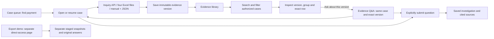

# Evidence library

The Evidence library at `/evidences` is the cross-case index for saved payment evidence. It connects payment discovery, evidence collection and questions over immutable source versions. It reads the same saved cases and evidence as the case workbench.

The two visible tabs are **Case evidence** at `/evidences` and **Evidence Q&A** at `/evidences/questions`. Evidence Q&A selects saved payment cases and their evidence versions for questions, using the same jobs and answers as each case workbench. The earlier **Export demo** remains available only by direct URL at `/evidences/exports`, with no tab or link in normal navigation. Its standalone snapshots and saved model answers remain preserved and separate from case evidence. Browsing the library does not attach them to a case or run a model. See the [Evidence Q&A operator flow](EVIDENCE_QA.md).

## Operator workflow

1. Find a payment under **Case queue** using reference/UTR, a discovery Excel file, or Inquiry API. Open or resume its case with an investigation reason.
2. Open that case and collect its four detailed outputs using **Inquiry API**, **Four Excel files**, or **Manual + JSON**. Saving creates an immutable evidence version.
3. Open **Evidence library** to find cases by case ID, payment reference, UTR or reason. Bank, branch, latest source and latest row coverage narrow the list. Matching cases use pages of ten.
4. Inspect a case's evidence. Select a version, a result group and a row to read the exact native field names and saved values. Review source timezone, group counts and warnings with those values.
5. Choose **Ask about this version** in the inspector to open **Evidence Q&A** with that case and exact evidence version. A viewer can use **View questions for this version**. Review the selected version, choose or write a question and explicitly run it. The same saved investigation is available in the payment case workbench. Use **Open case / collect evidence** to acquire further records. Empty versions direct writers to evidence collection instead of offering an investigation over no rows.



## How to read the page

Summary cards count all cases in the signed-in user's authorized tenant and bank/branch scopes, before search or filters. **Cases with rows** means the latest attached version has at least one source row. **Cases without rows** includes both cases with no attached evidence and cases whose latest version has zero rows. **Evidence versions** counts all saved versions belonging to those authorized cases.

Filters and table coverage describe each case's **latest version**:

| Coverage | Meaning |
| --- | --- |
| No evidence | No attached version exists |
| No rows | A version exists, but all four groups contain zero rows |
| Partial groups | At least one, but fewer than four, groups contain rows |
| Rows in all groups | PAYMENT, HOST, HISTORY and STATUS each contain at least one row |

These labels describe row availability. An empty group can be a legitimate result. Four populated groups do not prove complete evidence, successful source queries, OBPM acceptance, accounting, settlement or beneficiary credit. Completion metadata and source limitations remain visible in the inspector. Source dates are displayed as supplied; no source timezone is inferred from the laptop.

The latest version determines the source filter. A case whose latest version is JSON will not appear under Excel even if an earlier version came from Excel. The inspector still lists those earlier versions.

## Read API

`GET /api/evidences` is authenticated and read-only. Analyst, reviewer and viewer may inspect the cases available to their tenant and configured bank/branch scope. Authorization runs before summary counts, filtering and pagination. Other tenants' or unauthorized branches' cases and evidence do not contribute counts.

| Parameter | Default / allowed values |
| --- | --- |
| `search` | Empty; at most 200 characters; case-insensitive words across case ID, reference, UTR and reason |
| `coverage` | `ALL`, `NO_EVIDENCE`, `EMPTY`, `PARTIAL`, `ALL_GROUPS` |
| `source` | `ALL`, `BANK_API`, `EXCEL`, `JSON`, `MANUAL` |
| `bank` | Omit to include all authorized banks; exact configured numeric code |
| `branch` | Omit to include all authorized branches; exact configured numeric code |
| `page` | Positive integer, default 1; ten results per page; out-of-range page clamps to the last page |

Response contains `generatedAt`, `page`, `pageSize`, `total`, `totalPages`, global `summary`, authorized `scopes` and `items`. Each item contains the saved case identity/reason/source amount, `versionCount`, `coverageState` and `latestEvidence` summary or null. A summary contains the immutable version ID/number, source, timestamp, creator, four group counts/completion values, warnings and evidence hash. The list contains no raw evidence payload.

Inspection reuses the authorized case APIs:

```text
GET /api/payment-cases/{caseId}/evidence
GET /api/payment-cases/{caseId}/evidence/{evidenceId}
```

The frontend debounces search, resets pagination when filters change, cancels superseded reads and bounds request waiting. Bank and branch filters accept typed codes; use **Apply bank / branch** or Enter to apply both. Draft typing makes no request. Leave either field blank to include all authorized codes for that field; Clear/Reset clears both drafts and applied filters. Entering a code does not change backend access rules. Selecting another case/version clears the preceding raw preview before loading the new one. Failures are visible and retryable.

## Boundaries

No new bank or database integration is introduced by this page. It reads local saved case evidence; the existing bank inquiry adapter still needs its deployed request/response and authentication verified. Library browsing makes no model call or evidence mutation. The adjacent Evidence Q&A tab permits explicit questions over the same saved case/version using the existing case-investigation API. Evidence intake remains in the case workflow; the existing GPU default and preserved CPU/model baseline are unchanged.

The endpoint currently loads authorized case metadata and batches tenant evidence summaries, then filters and paginates in memory. This avoids per-case evidence queries, but it is not a measured solution for a bank-wide archive. Larger deployments need indexed search and database pagination, tested at their expected volume. Reads across cases/versions are not an atomic Oracle snapshot. Validation and actual deployed observations belong in the dated validation record.
