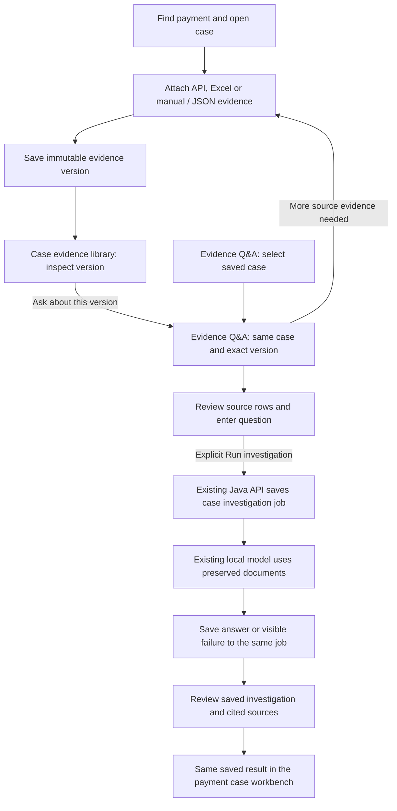

# Evidence Q&A for saved payment cases

The **Evidence Q&A** tab at `/evidences/questions` lets an operator select a saved payment case, choose an immutable evidence version, submit a question and inspect the saved result. It is another entry to the same case-investigation workbench and backend. It does not maintain a separate question or answer store.

Use the two visible Evidence library tabs as follows:

| Tab | Purpose |
| --- | --- |
| **Case evidence** — `/evidences` | Search across authorized cases and inspect saved source versions, groups and rows |
| **Evidence Q&A** — `/evidences/questions` | Select a case and evidence version, ask questions and review that case's existing investigations |

The earlier **Export demo** remains available by direct URL at `/evidences/exports` for demonstrations and testing. It has no tab or link in normal navigation. Its staged exports, saved model answers and original model baseline are preserved.

## Operator flow

1. **Select the payment case.** Search by reference, UTR, case ID or investigation reason, then choose a result from **Payment case**. The list contains cases authorized for the signed-in user. Search changes the available options; it does not silently select a different payment.
2. **Confirm the identity.** Expand **Payment details and investigation reason** to read the payment reference, UTR, bank, branch, exact source amount and reason. Use **Open case / collect evidence** when source records still need to be attached.
3. **Choose the evidence version.** The selector shows each saved version's number, source method, save time and whether it is latest. A case opened without an explicit version initially selects its latest saved evidence. A link from **Ask about this version** in the library selects the exact inspected version. An unavailable requested version produces an error; it is not silently replaced with the latest version.
4. **Inspect the available records.** Timeline and Evidence show source observations, native fields, row counts and limitations. A timeline is not proof of the payment's full operational lifecycle. Check the source version before asking a question.
5. **Choose a suggested question or write your own.** Suggestions cover the payment overview, OBPM acceptance, beneficiary credit, status codes, history and next evidence checks. A suggestion only fills the editable field. Questions are self-contained and limited to 2,000 characters.
6. **Run the investigation explicitly.** The existing Java API saves a job bound to the case, evidence ID and content hash. The local model then generates its response from that job's preserved source documents. Selecting a case, inspecting evidence, choosing a suggestion or refreshing the page does not start a model call.
7. **Review and retain the answer.** Saved investigations show the question, state, evidence version, user and time. Select one to inspect its generated claims, citations, unknowns, suggested next checks and provenance. A failure remains visible. A later evidence upload creates another version; it does not rewrite an earlier question or answer.



## What appears on the page

The top of the page explains the three steps: select a case, choose saved evidence, then ask and review. Once a case is selected, the shared workbench opens with **Investigations** initially selected. Its **Timeline**, **Evidence**, **Investigations** and **Audit trail** views remain available, along with the question panel and selected result.

| Situation | Page behavior |
| --- | --- |
| No saved cases | Links to **Find payment** to create a case first |
| No case selected | Requests a selection; no evidence or question is submitted |
| Requested case is unavailable | Shows an authorization/unavailability message and offers available cases |
| Case has no saved evidence | Links to evidence collection in that case; asking a question is unavailable |
| Selected version has zero source rows | Source limits remain visible; investigation submission is blocked |
| Requested version is unavailable for the case | Shows an error and requires selecting an available version |
| Existing job is queued or running | Displays its stored status and polls for updates; returning does not create another job |
| Answer used an earlier evidence version | Shows the version associated with that answer and its preserved sources |
| Viewer account | May inspect authorized cases, evidence and answers; cannot submit new questions |

The case and selected version can be addressed with clean URLs:

```text
/evidences/questions
/evidences/questions/{encodedCaseId}
/evidences/questions/{encodedCaseId}/{encodedEvidenceId}
```

Explicit selections survive login destination restoration and browser Back/Forward. Case and evidence identifiers are encoded separately. A URL does not grant access: the existing server checks still authorize the selected case, version and job.

## Storage and actions

The page reads the existing saved payment list, case workbench, evidence context and investigation-detail APIs. It uses `POST /api/payment-cases/{caseId}/investigations` only after an authorized operator submits a question. The request remains `{question,evidenceId,evidenceHash}` with CSRF protection and an idempotency key.

Evidence stays in `fcr_case_evidence`; job lifecycle and results stay in `fcr_case_investigation`. The case workbench and this tab read those same records. There is no second answer collection, no copying of a standalone export into a case, and no inference caused by switching tabs. See [case-investigation contracts and persistence](CASE_INVESTIGATION.md).

Bank inquiries remain explicit actions in [case evidence collection](CASE_EVIDENCE.md). Browsing this tab reads local saved records and does not fetch new bank data. Asking a question does not execute a payment, initiate recovery or change the payment outcome. The existing GPU runtime and preserved CPU/export demonstration remain unchanged.

Model wording is generated dynamically; the UI's suggested questions are not prepared answers. Response validation checks structure and source membership, not factual correctness. Inspect cited fields, exact status domains, source limitations and missing evidence before drawing a payment conclusion. Earlier model accuracy limitations continue to apply.

## Verification scope

The final implementation passed **249 frontend tests**, both TypeScript checks and the native build. Deployed browser checks verified selection, exact-version navigation, saved answers and citations, viewer access, empty/error states and mobile layout. The [delivery record](validation/evidence-qa-2026-09-14.md) records preserved data and verification limits. This milestone does not establish new model accuracy or validation of the bank endpoint.
