# FLEXCUBE inquiry integration

The application supports the supplied PO01 payment discovery and PO02 evidence services through an optional `FLEXCUBE` wire adapter. Java builds their `args0`/`args1` envelopes, validates the response and preserves the original source values. Browser requests and saved-case workflows remain unchanged. This is an application-side adapter; it does not modify or deploy FLEXCUBE source, execute payment commands or automatically run the model.

Source review and local adapter tests do not establish live bank connectivity. New installations retain discovery `MOCK` and evidence acquisition disabled until the deployment inputs below are confirmed and explicitly activated. The native profile was activated for the user's supplied UAT endpoints on 15 September 2026; consult its dated validation receipt for connection results. The earlier flat contract remains available as `CANONICAL`, the default wire format for compatibility.

## Deployment settings

Use fixed, team-confirmed HTTPS endpoints. These are generic examples, not live destinations:

| Purpose | Endpoint path |
| --- | --- |
| PO01 date, FCR-reference and UTR discovery | `https://bank-api.example/FCAPIService/NEFTPaymentDiscoveryInquiryService/processRequest` |
| PO02 four-group evidence | `https://bank-api.example/FCAPIService/NEFTEvidenceInquiryService/processRequest` |

For the native runtime, `tools/configure-flexcube-inquiries.ps1` updates ignored `runtime/native-ollama/private/application.properties` and makes a private backup. Preparing a confirmed base URL keeps discovery MOCK and both bank-call switches disabled:

```powershell
.\tools\configure-flexcube-inquiries.ps1 -ServiceBaseUrl 'https://bank-api.example/FCAPIService'
```

Only when the bank service user and posting date are confirmed, repeat with `-ServiceUser '<configured-user>' -PostingDate '<yyyyMMdd>' -EnableBankCalls`. These placeholders must be replaced with actual approved values. Optional `-SourceTimezone` defaults to `UNKNOWN`. The helper makes no network requests, preserves unrelated settings including tokens/scopes/model, and requires a restart. Running it without activation flags prepares a disabled connection even if earlier settings enabled it. Do not commit the private configuration or backups.

The resulting settings can also be merged manually, preserving existing values. The following is an activation checklist:

| Property | Value when deliberately activating |
| --- | --- |
| `poi.payment-discovery.mode` | `BANK_API` |
| `poi.payment-discovery.bank-enabled` | `true` |
| `poi.payment-discovery.bank-url` | Confirmed PO01 HTTPS URL |
| `poi.payment-discovery.wire-format` | `FLEXCUBE` |
| `poi.payment-discovery.timeout-seconds` | `10` |
| `poi.payment-discovery.api-token` | Optional gateway Bearer token; omit when not required |
| `poi.case-evidence.api-enabled` | `true` |
| `poi.case-evidence.api-url` | Confirmed PO02 HTTPS URL |
| `poi.case-evidence.wire-format` | `FLEXCUBE` |
| `poi.case-evidence.timeout-seconds` | `15` |
| `poi.case-evidence.api-token` | Optional gateway Bearer token; omit when not required |
| `poi.flexcube.user-id` | Approved server-side service identity |
| `poi.flexcube.channel` | `API`, if that channel is deployed and authorized |
| `poi.flexcube.posting-date-policy` | `EXPLICIT` |
| `poi.flexcube.posting-date` | Actual bank posting date in `yyyyMMdd` |
| `poi.flexcube.posting-zone` | `Asia/Kolkata`; used only by optional calendar policy |
| `poi.flexcube.source-timezone` | `UNKNOWN` until native source-date semantics are confirmed |

Posting date is the bank business context, separate from the selected inquiry date. Update it deliberately when the bank date rolls over. `CALENDAR` is an explicit alternative only when the bank authorizes deriving posting date from the configured calendar zone; it is not the default. Source timezone records native date interpretation and does not convert source strings or follow automatically from the posting zone.

Configure authorized tenant/bank/branch pairs through `poi.payment-discovery.scopes` (existing environment alias `POI_PAYMENT_DISCOVERY_SCOPES`), whose syntax is **`tenant:branch:bank`**. Configure a stable `poi.payment-discovery.deployment` for the source environment. Both the selected request and saved case are checked against these scopes. One deployment uses fixed endpoints and credentials; distinct bank connections require isolated deployments until server-owned per-bank routing exists.

The API runtime must trust the bank's approved certificate chain and verify its hostname. Redirects and TLS bypasses are unsupported. The supplied wrapper does not establish mandatory Bearer authentication or mTLS requirements; confirm the gateway's deployed requirements. Credentials, URLs and service context are server configuration, never browser inputs.

For the native local profile, an optional private `runtime/native-ollama/private/api-hosts` file enables a Java-only hosts resolver through `jdk.net.hosts.file`. This can map a certificate-covered alias to a fixed bank IP when Windows hosts cannot be edited. It replaces DNS for the API JVM with no fallback, so include localhost and every needed nonliteral API hostname. Other processes retain ordinary DNS; HTTPS verification is unchanged. Remove the file and restart to restore the API's ordinary resolver, using a normally resolvable bank hostname. The user-approved local setup and live results are documented in [hostname validation](validation/uat-hostname-2026-09-15.md).

Restart the native API after changing properties; the launcher reuses already-running processes. Use `tools/stop-native-gpu-demo.ps1` followed by `tools/start-native-gpu-demo.ps1`. Preserve the saved database, evidence, answers and model configuration. Configuration enablement is not a reachability test.

## Request and response behavior

The server generates `args0` with the authorized bank/branch, service code, user, channel, explicit posting date and a 28-character correlation value: `PO01` or `PO02` followed by 24 UUID hexadecimal characters. The bank's accepted correlation-length limit remains a deployment check. Bank/branch codes must be unpadded nonnegative integers no larger than `2147483647`; incompatible values fail before an upstream call. `args0` scope must equal the selected `args1` scope.

PO01 receives either strict `yyyy-MM-dd` inquiry date plus count 1–200, or an exact `FCR`/`UTR` reference without date/count. Date selection is based on native initiation date, not posting date. Counts and look-ahead describe distinct payment references; all returned host subsequences remain grouped with their payment. A UTR can identify multiple candidate payments. Exact matching rejects truncation. Reference text is preserved, and PO01's missing currency is not invented.

The current discovery amount contract accepts nonnegative plain decimal text with up to 38 integer digits and 18 fractional digits. Source SQL uses `TM9`, which can emit exponents for very large or small values. Exponents and values outside the accepted bounds reject the entire batch without rounding. Confirm the installed amount column's precision/scale and export representation before broad inquiries; the supplied compatible examples do not establish support for every database amount.

PO02 receives the saved FCR reference and bank/branch; its reference limit is 40 characters. The four arrays map to PAYMENT (29 fields), HOST (36), HISTORY (15) and STATUS (7). The deployed serializer can omit nullable DTO properties. New adapter schema `flexcube-neft-evidence-v2` accepts supported optional omissions and records `omittedFields` separately from explicit `nullFields`. The editable text projection uses empty strings; cited rows and timeline fields retain explicit nulls and absent properties. The case and Evidence library label these as **Source null** and **Not supplied**. Historical v1 snapshots retain their exact original normalization and fingerprint.

Missing or null arrays, missing row identity/query metadata, unsupported columns, incompatible values, mismatched scope and responses exceeding configured bounds still fail without saving a successful version. All returned rows require textual source table, query observation time and scope count; PAYMENT requires its reference, while HOST/HISTORY also require bank and branch. Explicit empty arrays are retained. Nullable STATUS tuple fields remain unknown and can match the package's explicit both-NULL joins; no payment outcome is inferred.

HTTP 200 alone is insufficient. The current adapter requires textual `errorCode: "0"`, integer-zero `replyCode` and `spReturnValue`, matching correlation and posting date, and no enabled or malformed supported override/charge flags. These are adapter acceptance rules for the supplied contract, not independently verified semantics of an unavailable upstream core helper. Failures are visible and do not fall back to MOCK.

PO02 performs separate queries and supplies no group-level completion/truncation report. **Coverage remains `UNVERIFIED`, including empty groups.** Row counts show supplied records, not whole-payment completeness. Native status labels and successful service execution do not prove beneficiary credit, settlement or another payment outcome. The legacy `CANONICAL` evidence contract still requires explicit per-group acquisition metadata; its `COMPLETE` label records the wrapper's validated declaration only.

## Evidence and investigation flow

PO01 `referenceSubsequenceNumber` may be JSON `null`, matching nullable native `REF_SUBSEQ_NO`. Discovery preserves that unknown as `null` in `hostSubsequences`, alongside any known integer strings (for example `["0", "1", null]`). Empty subsequence strings also mean unknown. The original response and null-field paths remain in the inquiry receipt. The website displays **Unknown**, never a fabricated zero; missing columns, numeric JSON cells and invalid populated values still fail validation. Existing saved cases retain their original observations when resumed.

```mermaid
flowchart LR
    A[Authorized date or exact lookup] --> B[Java builds PO01 context]
    B --> C[Fixed HTTPS PO01 service]
    C --> D[Validate TLS status scope and returned rows]
    C --> X[Connection failure shown in form]
    D --> N[Group host rows preserving unknown subsequences]
    N --> E[Select payment and save case]
    E --> F[Explicit evidence collection]
    F --> G[Java builds PO02 from saved identity]
    G --> H[Fixed HTTPS PO02 service]
    H --> I[Immutable evidence with raw response and null or omitted field provenance]
    I --> J[Inspect rows warnings and unverified coverage]
    J --> K[Explicit question using selected version]
    K --> L[Existing local model with saved citations]
```



PO02 full snapshots include optional `upstream` metadata: adapter schema version, receipt time, original request, decoded raw response and native-null paths, plus omitted-field paths in v2. The snapshot fingerprint includes that provenance. Version lists exclude these larger bodies. No source rows or historical answers are overwritten. Investigation is a separate action, and model output still requires factual review.

An HTTPS handshake or peer-validation failure returns `DISCOVERY_TLS_ERROR` or `CASE_EVIDENCE_TLS_ERROR`, with an actionable message in the existing frontend form. Use the bank-provided hostname covered by its certificate and a trusted certificate chain. A successful request from another client does not establish Java TLS compatibility. No trust-all option, insecure retry, redirect or mock fallback is used.

For the first approved UAT test, confirm deployment, service identity, posting date, TLS trust, permitted scope and any gateway credentials; perform a small date lookup, exact lookup, and explicit PO02 collection. Check valid empty results, multiple host rows, UTR ambiguity and a known error. Record results privately. No integration success or payment conclusion should be claimed from offline fixtures alone.

See [payment discovery](PAYMENT_DISCOVERY.md), [case evidence](CASE_EVIDENCE.md) and [case investigations](CASE_INVESTIGATION.md) for the unchanged website and application endpoints.
