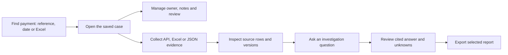

# Frontend design and readability

The payment workspace uses one shared visual system across sign-in, the case queue, payment details, evidence, investigations, reports, management, libraries and service health. This refresh follows the user's 16 September 2026 request for an attractive, consistent and understandable frontend.

## Visual rules

| Element | Current treatment |
| --- | --- |
| Navigation | Navy sidebar on desktop; labeled navigation across the top on smaller screens |
| Main actions | Blue, text plus an icon, at least 44px high |
| Secondary actions | White with a visible border; destructive actions retain red treatment |
| Content | White cards, consistent inner padding, restrained shadows and clear headings |
| Text | 14px body, 13px labels and 12px metadata in the refreshed components |
| Focus | Visible blue keyboard outline, skip-to-content and active navigation semantics |
| Data | Exact references, amounts and source content remain available; narrow tables become labeled cards |
| Feedback | Selected tabs, errors, disabled controls and status states remain distinct |
| Motion | Reduced-motion preference is respected |

Colors come from shared CSS tokens: ink `#172b45`, muted text `#56687e`, primary blue `#245bd7`, teal `#087f75`, canvas `#f3f6fb` and white surfaces. Teal is used for source coverage and confirmed UI state; it does not label a payment successful merely because evidence exists.

## Operator flow

The workflow guide explains each stage. Case-page jump controls move keyboard focus to the chosen section without changing the URL or submitting an action. Finding, fetching, saving and running an investigation remain explicit actions.

The queue distinguishes each discovery method with a labeled card. Saved cases emphasize the short case number, payment reference and reason, with clear Open case and Export PDF actions. The evidence workspace has readable upload groups and version coverage cards. Investigation questions, saved jobs, cited answers and raw sources use separate visual sections. Knowledge search and filters align; its progress meter uses actual current embedding coverage.

## Implementation and limits

`ui-refresh.css` contains shared tokens and shell/control styles. `discovery-refresh.css`, `workbench-refresh.css` and `library-refresh.css` contain scoped component layouts. Both frontend entry points import the same files after the preserved base stylesheet. The refresh does not replace the underlying API, model or authorization contracts.

A discovered scope-initialization issue is covered by regression tests: configuration defaults must never overwrite explicit operator input, including a cleared field. Case data, evidence versions, original answer prose and citations must remain unchanged by styling.

Responsive and browser checks, test counts, deployment hashes and preservation results belong in the dated validation receipt. This design review is not a claim of complete accessibility certification or production readiness.
