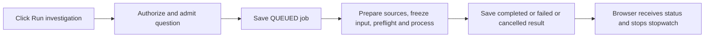

# Payment investigation timing

The payment case workbench and Evidence Q&A share one timing display. A valid **Run investigation** click starts a browser stopwatch immediately, including the time spent submitting the request and preparing its evidence. It follows the submitted job through queueing and processing until the page observes a completed, failed or cancelled status. Checking readiness is separate and does not start this stopwatch or a model call.

The browser measurement includes network and status-polling delays. It is an elapsed measurement, not an estimated completion time. A polling failure cannot establish that the job finished. Leaving the page does not cancel the server job; reopening a pending job can show an approximate elapsed time from its saved timestamps instead of the original browser stopwatch.

## Saved server timing

Java records `requestedAt` when a new submission enters the investigation service, before evidence projection and knowledge retrieval. The job summary and detail expose the same additive `timing` object:

| Field | Interval |
| --- | --- |
| `preparationMs` | Request received to durable job creation; admission time for new durable jobs, not later semantic retrieval |
| `queueMs` | Job creation to processing start; for a job that becomes terminal before starting, creation to that terminal timestamp |
| `processingMs` | Processing start to terminal result, including source preparation, preflight, worker waiting/generation and answer validation |
| `totalMs` | Request received to terminal result for new jobs |
| `totalBasis` | `request-received` for new jobs; `job-created` for historical jobs without a request timestamp |

All durations are nonnegative integer milliseconds or `null` when the relevant stage has not ended or its timestamps cannot establish the duration. Server intervals use server timestamps; a reversed or invalid interval is unavailable. They do not include browser-to-server transport, response delivery or the UI polling delay. The terminal timestamp is assigned as the result is saved, before the final database transaction returns.

Old saved jobs are not rewritten. Read responses derive the intervals supported by their existing `createdAt`, `startedAt` and `finishedAt` timestamps. Their total is labeled as time since job creation because earlier preparation was not recorded. Missing historical times remain unavailable.

Timing is retained for successful, failed and cancelled jobs. New durable jobs survive API restart: processing reconnects to the same frozen worker receipt, and elapsed intervals can include downtime and waiting. An expired worker lease during generation becomes an interrupted failure without automatic regeneration. Only older unfinished synchronous jobs receive the legacy restart-interruption failure. Idempotent resubmission returns the original job and timing rather than resetting the measurement. Cancellation requested during generation remains active until the matching worker acknowledgement or terminal receipt; clicking Cancel is not the terminal timestamp.

New jobs with `queueVersion: case-job-v1` also expose `phaseTiming` to distinguish admission from source preparation:

| Field | Interval |
| --- | --- |
| `admissionMs` | Request received to durable job creation |
| `preparationMs` | Actual preparation start to frozen input; if preparation ends in failure/cancellation before freezing, to that terminal timestamp |
| `workerWaitAndGenerationMs` | Frozen input to terminal persistence, including exact preflight, transport/worker waiting, generation and answer validation |

These phase intervals are optional, nonnegative milliseconds; missing or unfinished intervals remain `null`. They are not individual model-call timings. Public phases distinguish `QUEUED`, `PREPARING`, `PREFLIGHT`, `SUBMITTING`, `GENERATING`, `WAITING` and `CANCELLING`, with terminal phases matching the final status. See [CASE_JOBS](CASE_JOBS.md) for the complete protocol and recovery guarantees.

The existing `answer.model.durationMs` remains model-reported generation duration, including the existing bounded correction when used. It is distinct from the saved total and browser wait. Timing does not alter model prompts, GPU settings, evidence, answers, citations or bank calls.

The list and selected result show saved timing when available, and terminal values stay fixed on rereads. The frontend remains compatible with older jobs that omit optional timing or phase fields. Timing metadata itself is additive to saved job JSON; the durable queue has separate database migrations described in [CASE_JOBS](CASE_JOBS.md).
