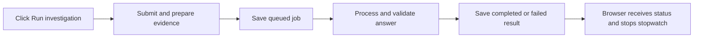

# Payment investigation timing

The payment case workbench and Evidence Q&A share one timing display. A valid **Run investigation** click starts a browser stopwatch immediately, including the time spent submitting the request and preparing its evidence. It follows the submitted job through queueing and processing until the page observes a completed or failed status.

The browser measurement includes network and status-polling delays. It is an elapsed measurement, not an estimated completion time. A polling failure cannot establish that the job finished. Leaving the page does not cancel the server job; reopening a pending job can show an approximate elapsed time from its saved timestamps instead of the original browser stopwatch.

## Saved server timing

Java records `requestedAt` when a new submission enters the investigation service, before evidence projection and knowledge retrieval. The job summary and detail expose the same additive `timing` object:

| Field | Interval |
| --- | --- |
| `preparationMs` | Request received to durable job creation, including scoped evidence and guidance preparation |
| `queueMs` | Job creation to processing start; for a job that fails before starting, creation to failure |
| `processingMs` | Processing start to terminal result, including worker calls and answer validation |
| `totalMs` | Request received to terminal result for new jobs |
| `totalBasis` | `request-received` for new jobs; `job-created` for historical jobs without a request timestamp |

All durations are nonnegative integer milliseconds or `null` when the relevant stage has not ended or its timestamps cannot establish the duration. Server intervals use server timestamps; a reversed or invalid interval is unavailable. They do not include browser-to-server transport, response delivery or the UI polling delay. The terminal timestamp is assigned as the result is saved, before the final database transaction returns.

Old saved jobs are not rewritten. Read responses derive the intervals supported by their existing `createdAt`, `startedAt` and `finishedAt` timestamps. Their total is labeled as time since job creation because earlier preparation was not recorded. Missing historical times remain unavailable.

Timing is retained for both successful and failed jobs. Interrupted jobs become failed through the existing restart recovery; their timestamp-based interval includes the time until interruption was recorded, including downtime. Idempotent resubmission returns the original job and its timing rather than resetting the measurement.

The existing `answer.model.durationMs` remains model-reported generation duration, including the existing bounded correction when used. It is distinct from the saved total and browser wait. Timing does not alter model prompts, GPU settings, evidence, answers, citations or bank calls.

The list and selected result show the saved timing when available. A new frontend build remains compatible with jobs that omit the optional timing fields, and the additive backend response does not require a database migration.
