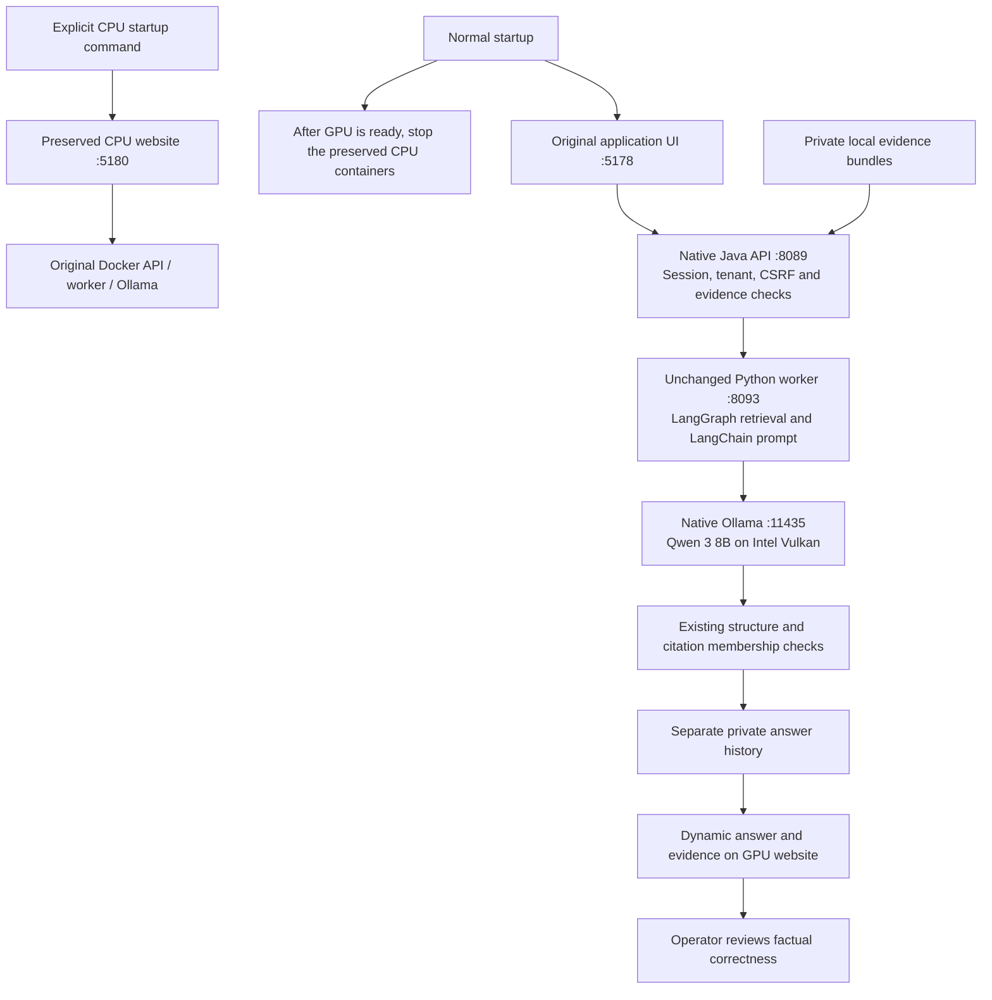

# Default Intel GPU mode

**Measured result:** a full evidence request took 101.750 seconds on Intel Arc 140V/Vulkan versus the historical 640.306-second CPU run (84.11% less waiting). All 37 model layers were offloaded. The full answer still failed factual review. Read [the benchmark and limits](validation/native-gpu-2026-09-13.md) before interpreting this as a payment-analysis capability.

The original Docker/Ollama baseline on port 11438 and its code remain the showcase baseline. These helpers control a separate native Windows process on **127.0.0.1:11435**. Setting Vulkan requests acceleration; it does not prove that this laptop's Intel GPU was used or that latency improved. Record those conclusions only after log inspection and measured inference.

The lifecycle scripts expect the separately verified official Ollama **0.34.0** portable installation at `runtime/native-ollama/0.34.0/ollama.exe` and a prepared model store at `runtime/native-ollama/models`. The separate `setup-native-ollama.ps1` helper downloads and verifies this installation and copies the existing Qwen model; the start/stop scripts themselves download nothing and make no inference requests.

**Current default:** open [the main website](http://127.0.0.1:5178/), select **Analyst · Northstar**, and sign in with `demo-pass-local`. Normal login opens [Case queue](http://127.0.0.1:5178/cases); open [Evidence library](http://127.0.0.1:5178/evidences) from the sidebar for case evidence. Its [Export Q&A tab](http://127.0.0.1:5178/evidences/exports) retains separately staged export questions. The former experimental port 5179 and password are obsolete. The original CPU website moved to port 5180; its backend, model configuration and stored records remain unchanged. `compose.override.yaml` reserves 5178 for native GPU by replacing only the Docker web port. The standard launcher and VS Code start task now select GPU.

The login screen and successful logout use `/`; authenticated root visits and normal login open `/cases`. Explicit deep links are restored after login. Page navigation uses `/cases`, `/cases/:id`, `/payment-cases/:id`, `/evidences`, `/evidences/exports`, `/knowledge` and `/system`, without hash fragments. Old bookmarks normalize to these paths. Both builds share this routing behavior and require an SPA fallback for direct page loads; see the [routing map and validation](validation/clean-page-urls-2026-09-14.md).

## First-time preparation

This machine is already prepared. For a repeat setup, keep the original project Docker containers and existing `qwen3:8b` model available. Use Java 17, Node, the project's installed frontend dependencies and its existing investigator Python environment. Run from this project's root:

```powershell
.\tools\setup-native-ollama.ps1
New-Item -ItemType Directory -Path '.\runtime\native-ollama\artifacts' -Force
docker cp payment-operations-investigator-api-1:/app/api.jar .\runtime\native-ollama\artifacts\api.jar
Push-Location .\apps\web
try {
    & .\node_modules\.bin\tsc.cmd --noEmit -p native-gpu/tsconfig.json
    if ($LASTEXITCODE -ne 0) { throw 'Native frontend type check failed.' }
    & .\node_modules\.bin\vite.cmd build --config vite.gpu.config.ts
    if ($LASTEXITCODE -ne 0) { throw 'Native frontend build failed.' }
} finally { Pop-Location }
.\tools\start.ps1
```

Use the tested running API jar; the older local Maven target artifact on this machine predates the UAT routes. The recorded native jar SHA-256 is `daa06371dbd16b8bbf435a88facdab2c31a3fded066e62b9e234572bb5383be9`. If the original API container or its jar path differs, inspect that container before copying; do not silently use an older jar. Setup verifies the portable ZIP against SHA-256 `a7dd1b174f39d3d1b8a25d4cbc86045d0e190b17187bfdcbe2f2ee3b5a11470e` and verifies copied model blobs. See [Ollama's Windows instructions](https://docs.ollama.com/windows) and [the pinned release](https://github.com/ollama/ollama/releases/tag/v0.34.0). On first native startup, Ollama may also create its normal user-profile identity key if absent; this experiment does not read or copy that key.

## Flow



There is no connection from this flow to a bank database, a live payment action or a cloud inference endpoint. The evidence and generated result remain local. GPU answers are generated afresh when submitted; saved history is labeled separately.

From the project root in Windows PowerShell 5.1 or PowerShell 7:

```powershell
.\tools\start-native-ollama.ps1
.\tools\stop-native-ollama.ps1
```

Startup waits up to 45 seconds by default for `/api/version` to report the pinned version; `-StartupTimeoutSeconds` accepts 5–60 seconds. This probe establishes readiness only. Startup runs the new process hidden, with a separate model store, Vulkan requested, integrated GPUs explicitly enabled (`OLLAMA_IGPU_ENABLE=1`), cloud features disabled, one parallel request and one loaded model. The launcher's environment is restored immediately afterward. User/system environment settings and the existing Docker server are not modified.

The first actual native startup discovered Intel Arc 140V through Vulkan but logged that integrated GPUs were being dropped until `OLLAMA_IGPU_ENABLE=1` was set. The launcher now includes that opt-in. Device discovery alone is insufficient: inspect the subsequent runner/offload logs and inference measurements to confirm GPU execution. The flag is defined in the [pinned Ollama source](https://github.com/ollama/ollama/blob/v0.34.0/envconfig/config.go).

The process receipt is `runtime/native-ollama/server.json`; per-launch stdout/stderr logs are in `runtime/native-ollama/logs`. Reuse and stop require the recorded executable path, PID and exact process start time, and they verify any listener's owner and loopback bind address. An unrelated process occupying port 11435 is not stopped. Existing receipts and logs are retained, and later startup archives stale receipts. Paths containing junctions/symlinks inside the project are rejected. A project-specific lifecycle mutex rejects concurrent start/stop operations, and the receipt is written through a temporary file.

The stop helper stops only the verified native server; it does not issue a system-wide Ollama kill or modify Docker volumes. These helper scripts alone do not enable a website model mode or establish a successful GPU benchmark.

## Separate full website stack

The additional wrappers start the existing Python virtual environment, the copied tested Java jar and the separately built Vite preview, with new ports and private state:

```powershell
.\tools\start.ps1
.\tools\stop-native-gpu-demo.ps1
```

| Component | Native experiment | Retained Docker baseline |
| --- | --- | --- |
| Website | `http://127.0.0.1:5178/` | `http://127.0.0.1:5180/` |
| API | `127.0.0.1:8089` | `127.0.0.1:8088` |
| Worker | `127.0.0.1:8093` | `127.0.0.1:8091` |
| Ollama | `127.0.0.1:11435` | `127.0.0.1:11438` |

The native API uses a separate H2 database, answer store and generated backend service key under ignored `runtime/native-ollama/private`. It reads the existing private bundle directory; it does not modify the exports. Its local demo login is `analyst` / `demo-pass-local`. API session cookies use `POI_GPU_SESSION`; the separate Vite proxy also rewrites the copied API's legacy logout cookie name so GPU logout does not erase the CPU website's session.

The frontend uses the original App and styles directly, without a GPU banner or CPU switch. After native startup succeeds, the normal launcher stops this checkout's preserved CPU demo containers. Their models, volumes and configuration remain saved. Run `tools/start.ps1 -Mode CPU -WithAI` only when explicitly demonstrating the CPU version. GPU inference still uses ordinary CPU work for the application, retrieval and request handling; stopping the CPU model demo does not imply zero CPU utilization.

The native demo keeps the same `qwen3:8b`, 32K context and 1,400-token UAT response budget, with a 360-second model limit. **It unloads the model after each UAT answer** to leave memory for the retained CPU demo; expect cold model loading on the next question. Run one expensive question at a time across both demos. Dedicated benchmark runs may temporarily retain the model to measure cold versus warm latency; those measurements must be labeled separately from the website's unload-after-answer configuration.

The launcher creates no inference request. Readiness therefore does not prove GPU offload, faster answers or correct answers. Its receipt is `runtime/native-ollama/demo-server.json`, and it validates executable, PID, exact start time, full observed command line and loopback port ownership before reusing/stopping services. The Windows virtualenv interpreter child is tracked separately when it owns the worker socket. New child environments exclude inherited application overrides, cloud credentials and tracing flags; the launching shell's environment is restored afterward.

If startup fails, only the processes newly started by that attempt are eligible for cleanup. The stack stops Ollama only when it started that exact recorded native server; an independently started native Ollama server is preserved. Receipts, local databases, answers and logs survive stopping. The helper does not stop baseline Docker services, change their files, or automatically reclaim an unrelated process's port.

The native Java process receives `-Djdk.net.unixdomain.tmpdir=<project>/runtime/jt`. On this laptop, a minimal `Selector.open()` / `HttpClient` probe failed with the inherited temporary directory and passed with this scoped directory. Oracle documents this property for automatically bound UNIX socket addresses and a roughly 100-byte pathname limit; the launcher validates containment and allows at most 100 UTF-8 bytes including the longest generated socket filename. See [Java 17 networking properties](https://docs.oracle.com/en/java/javase/17/core/java-networking.html). The JDK support discussion describes Windows filename remapping as one possible cause of similar failures, but the underlying cause on this laptop has not been established. See [OpenJDK discussion](https://mail.openjdk.org/pipermail/nio-dev/2023-March/013297.html). This process argument changes neither the installed JDK configuration nor the parent shell's TEMP/TMP values.

## Offline lifecycle checks

Run `tools/test-native-gpu-guards.ps1` for syntax and process-identity regression checks without starting or stopping a server, opening a socket or calling a model. On 13 September 2026, its 47 checks passed in both PowerShell 7 and Windows PowerShell 5.1. They verify fractional UTC timestamps after JSON deserialization, reject a one-tick process-start mismatch and changed command line, and reject invalid or timezone-free timestamps. They also cover a process exiting between the process and CIM lookups: only a confirmed exit is treated as absent, while a live process with unverifiable identity is still rejected. This guards against PowerShell 7 automatically converting JSON timestamps into DateTime values: formatting those values as ordinary strings would lose fractional precision. The scripts compare full UTC ticks instead. These offline checks do not replace actual startup, readiness, GPU and shutdown measurements.
