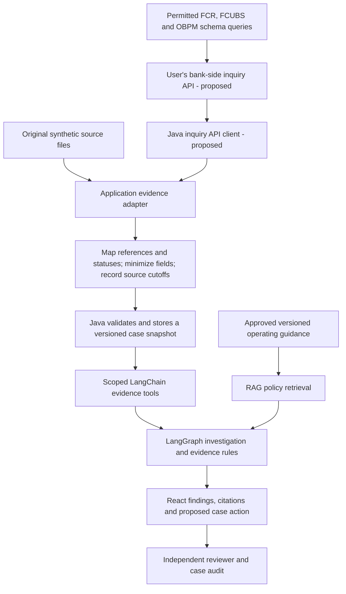

# Using the investigator and designing an OBPM 14.7 integration

Updated: 12 September 2026. **Status: the first synthetic outbound NEFT/ECA importer, investigation branch, scoped retrieval and React views are implemented.** Follow the [current walkthrough](OBPM_STEP_BY_STEP.md) and [validation evidence](validation/obpm-milestone.md). The user will create a bank-side inquiry API that can read the FCR, FCUBS and OBPM schemas. This application's client for that API and the broader message/accounting rules remain proposed. The application has no bank connection. The [inquiry API design](OBPM_INQUIRY_API.md) records the settled boundary and required evidence.

Pratik confirmed that his product version is Oracle Banking Payments (OBPM) 14.7 and that his work gives him access to its database and schema. The exact maintenance release, local customizations and permission to use an environment for this project are unverified. Record mappings must be validated against that deployment. Workplace access does not by itself authorize transferring employer or customer information into a personal portfolio.

## Use the existing application

1. Open http://127.0.0.1:5178. If stopped, open the project's VS Code workspace and choose **Terminal > Run Task > POI: Start application (Docker)**. On a fresh machine use the [setup guide](SETUP.md), including `tools/start.ps1 -WithAI` for model installation.
2. Sign in as `analyst`, password `demo-pass-local` unless changed locally.
3. Search for `CASE-1031`. Inspect its Timeline and Evidence. This is an existing synthetic refund/posting example, not an OBPM transfer.
4. Select **Replay** for deterministic graph execution, or **Ollama** for real model tool planning and bounded fact selection. Ask: “Investigate this discrepancy, show supporting evidence and applicable policy, and recommend the next case action.” Click **Run investigation** or **Run another investigation**.
5. Read the findings, source citations, missing evidence and tool trace. Rules determine the assessment and proposal; the model selects tools and supported fact IDs. Service templates supply the selected fact wording. Replay uses no chat model. Ollama does not automatically enable hybrid retrieval; the current default retrieval mode is lexical.
6. To demonstrate review, sign out and sign in as `reviewer` with the same local default password. Open the latest analyst-created proposal, check its evidence, enter a review note and approve or reject it. The reviewer must differ from the investigator. A stale or already reviewed proposal requires inspecting history and, if needed, a fresh analyst investigation.
7. Inspect Audit and Export case. Approval changes investigation case state only; it does not execute a payment or change OBPM.

Try `CASE-1001` for a timeout with evidence of successful processing and `CASE-1041` for insufficient evidence. The [demo script](DEMO.md) explains the expected evidence in all three examples. Existing cases may already contain previous investigations and decisions; preserve that history.

On this date, HTTP health checks returned `UP` for the Java API through port 5178 and the worker on port 8091. The worker reported lexical retrieval and configured model `qwen3:4b-instruct`. This was a health check, not a new model execution or OBPM integration test.

## What Oracle documentation establishes

The following are official OBPM 14.7 references, not Oracle Banking APIs, Fusion Payments or another adjacent product:

| Oracle reference | Verified relevance | Boundary |
| --- | --- | --- |
| [14.7 Web Services library](https://docs.oracle.com/en/industries/financial-services/banking-payments/14.7.0.0.0/web.html) | Publishes SOAP/REST guides, an interface inventory and Payments Swagger JSON | Each operation must be inspected for scope and enabled in the actual deployment; an origination operation is not an inquiry |
| [Remittance Enquiry Request](https://docs.oracle.com/en/industries/financial-services/banking-payments/14.7.0.0.0/paycu/remittance-enquiry-request.html) | External systems can query inbound/outbound payment status with reference, source, branch and other filters; a USER ID participates in access-right validation | The deployed request contract and authenticated identity must be verified; a supplied user field alone is not sufficient authentication |
| [NEFT Outbound Transaction View](https://docs.oracle.com/en/industries/financial-services/banking-payments/14.7.0.0.0/innug/neft-outbound-transaction-view.html) | `PTDOVIEW` exposes transaction and external statuses, pending queue information, dispatch/credit confirmation details, and links to queue actions, accounting and messages | A screen reference identifies evidence to map; it does not establish a database table or REST endpoint |
| [Accounting Queue](https://docs.oracle.com/en/industries/financial-services/banking-payments/14.7.0.0.0/obpeq/accounting-queue.html) | `PQSACCQU` supports transaction/queue reference lookup and viewing queue action history | The same screen also has a resend operation. This design only observes evidence |
| [14.7 user guide library](https://docs.oracle.com/en/industries/financial-services/banking-payments/14.7.0.0.0/index.html) | Separate NEFT, India RTGS, IMPS and exception-queue guides establish rail-specific documentation | Do not apply one rail's statuses, acknowledgements or settlement assumptions to another |

These documents make a read-only evidence integration plausible. They do not certify this project, establish a supported direct-table contract, or prove that every useful record is available in one database.

The interface inventory and Swagger linked from the 14.7 Web Services library both identify these query operations:

| Method and path | Documented function |
| --- | --- |
| `POST /PMReST/obpmrest/payments/commonTxnFetch` | Common Transaction Query; `PMDCTNVW`, action `FETCH_TXN` |
| `POST /PMReST/obpmrest/payments/singleTxnFetch` | Common Single Transaction Query; `PMDCSTVW`, action `FETCH_TXN` |

POST is the documented HTTP method despite inquiry semantics. These are public-documentation findings, not requests executed against the user's system. Validate the installed patch's sanctioned Swagger/WSDL, request/response fields, identity controls and enabled operations before implementing a client. Query coverage must be checked against the full evidence contract below.

Event-driven ingestion is a later option. The [External Notification Queue documentation](https://docs.oracle.com/en/industries/financial-services/banking-payments/14.7.0.0.0/paycu/external-notification-queue.html) assigns transports to particular system classes (PM/JMS, FCUBS or OFCL/Web Service, OBLM/REST). It does not establish unrestricted generic outbound webhook support. Any bridge needs deployment-specific validation and an independently approved feed; attaching a consumer to an existing operational queue could affect delivery to its current consumer.

## Recommended connection design

Start with **NEFT outbound payment exceptions**, extending the implemented synthetic ECA evidence path. Extend to RTGS and IMPS after validating separate lifecycle rules.

The user will implement the read-only inquiry API inside FLEXCUBE. That bank-side service can query the permitted FCR, FCUBS and OBPM schemas using fixed, parameterized queries and return only the mapped evidence for the authorized payment. This application's Java backend will call that API, validate its response and build an immutable evidence snapshot. Database access and credentials stay behind the bank-side API; the application, React and the model receive no Oracle database connection. Existing installed inquiry operations can inform or support the bank-side implementation where their evidence coverage is sufficient. Original synthetic JSON remains the local development source. The [inquiry API design](OBPM_INQUIRY_API.md) defines the evidence boundary, while the [input/output blueprint](OBPM_INPUT_OUTPUT_BLUEPRINT.md) explains dashboard outputs.

The bank inquiry API and application client in this diagram are proposed. A bounded synthetic ingestion path now exists at `POST /api/obpm/imports`, with a sample-import screen and immutable evidence versions. It accepts only the original-synthetic outbound NEFT v1 contract in [OBPM_IMPLEMENTATION_CONTRACT](OBPM_IMPLEMENTATION_CONTRACT.md). A real API response requires an explicit, validated adapter and contract extension; bank records must not be relabeled as synthetic to pass the existing importer.

## Evidence mapping contract to validate

These are proposed logical fields, **not claimed Oracle column names**. No actual schema SQL has been generated or executed.

| Evidence group | Minimum information to map | Investigation use |
| --- | --- | --- |
| Payment identity | Source deployment, host, branch, internal transaction reference, direction, rail, network/source code, available external reference | Correlate records and enforce access without assuming a reference is globally unique |
| Payment facts | Amount, currency, business/value date, creation time and source timezone | Exact money and business-date context; INR/paise initially |
| Processing history | Native status, normalized stage, occurrence time, observed time and sequence/version if available | Reconstruct processing and expose late or conflicting observations |
| Queue and error history | Queue reference/code, entry/exit times, action history, error code and minimized error description | Locate where processing stopped and which evidence is missing |
| Accounting evidence | Handoff/request reference, response status, entry reference, debit/credit direction, account role, amount/currency and posting time | Separate a generated accounting instruction from a confirmed posting |
| Messages and acknowledgements | Message/reference correlation, direction, native message/status code, occurrence/receipt time, relevant extracted fields | Compare dispatch, network acknowledgement and subsequent response evidence |
| Returns and reversals | Original-payment linkage, independent return/reversal reference, amount, status and event times | Preserve the distinction between an original transfer and its later return or reversal |
| Snapshot provenance | Extract ID/time, per-source cutoff, completeness/availability, mapping version and content hash | Make an investigation reproducible and distinguish missing data from negative evidence |

Transaction views can expose accounting handoff evidence without proving final posting in an external core banking system. Where the required confirmation belongs to FLEXCUBE or another system, record it as unavailable until a separately authorized source provides it. An empty extract alone does not prove that no entry exists.

Use source identity plus native record identity/version for deduplication. Record import batches and failures; checkpoint an incremental cursor only after a batch commits. Account for equal timestamps and late updates with stable tie-breakers, overlap and deduplication. Choose an approved consistent-read strategy; otherwise retain each source's cutoff and disclose timing differences. A new import must create a new evidence version and leave earlier investigation snapshots unchanged.

## Domain and AI changes required

The current six scenarios use a simulated provider and capture/fee/refund/payout evidence. An OBPM debit must not be relabeled as a capture, a payment return as a refund, or an acknowledgement as final settlement merely to fit those rules.

Add rail-specific transaction, accounting and message types; preserve native status codes alongside a versioned mapping. Unknown or unsupported statuses must request evidence. Define when dispatch, network settlement, beneficiary confirmation and accounting posting are established separately. Keep the initial amount scope at INR; the current backend explicitly rejects other currencies.

Proposed new LangChain tools include `get_obpm_payment_timeline`, `inspect_obpm_queue_history`, `compare_obpm_accounting` and `inspect_obpm_messages`. These names are design placeholders, not currently callable tools. They would inspect the Java-authorized snapshot. The model would have no general SQL tool, database credentials or payment-action tool.

Structured transaction evidence belongs in validated business records. RAG supplies the applicable operating guidance: original synthetic runbooks for the portfolio, or organization-approved procedures inside an authorized deployment. Version and filter guidance by tenant, OBPM release, rail and effective date. Treat message text, error descriptions and retrieved documents as evidence, not instructions that can override tool permissions.

Example proposed scenario: a synthetic NEFT payment has a recorded accounting handoff and dispatch event, but lacks the necessary acknowledgement through a stated cutoff. The investigator should show that evidence, identify the missing confirmation and recommend the next evidence check. It must not infer settlement, failure or permission to resend solely from a timeout. This scenario requires new rules and fixtures before it can run in the app.

## Implementation sequence and acceptance

| Step | Deliverable | Required evidence |
| --- | --- | --- |
| 1. Mapping | Confirm exact 14.7 patch, initial rail, status meanings, source availability, correlation keys and permitted field set | Reviewed contract with unknown mappings explicit; no invented tables or endpoint paths |
| 2. Synthetic adapter | Original OBPM-style fixtures, deterministic generator, mapping and validation layer | Exact paise values, unknown statuses, missing evidence, duplicates and late updates handled correctly |
| 3. Ingestion | Authenticated Java import contract, batch provenance, quarantine/rejection behavior, immutable snapshots and deduplication | Reimport creates no duplicate evidence; failed batches do not advance the cursor; tenant isolation holds |
| 4. Investigation | Rail-specific tools, rules, fact catalog, runbooks and React evidence labels | Distinguish dispatch/acknowledgement/accounting; demonstrate supported outcomes and abstention on unseen fixture variants |
| 5. Authorized sandbox | Connect the Java API client to the user's inquiry service in the approved environment | Bank-side queries and response mapping verified against the actual release; bounded requests, source permission checks and source-to-snapshot reconciliation |

An inquiry API response alone is not completion. End-to-end claims require the mapping, evidence semantics, import controls and investigation workflow to pass together.

No credentials, workplace extracts or customer records are needed to build steps 1–4 with an original example contract. Deployment-specific mappings can be developed inside the approved work environment; only information permitted for external sharing should enter this portfolio. Authorized read-only source inspection and an in-browser mapping-spreadsheet preview informed the design. No database connection was made, and proprietary source bodies and transaction data were not imported into the public application fixtures. Internal source identifiers and review notes remain outside these public guides. Exact installed-release compatibility remains to be verified.

For a resume today, describe the existing investigator and its **OBPM-oriented adapter using synthetic data** within the documented tested scope. Claim an OBPM sandbox integration only after the inquiry API path actually runs and its scope is documented; Oracle certification or production deployment would require separate evidence.
