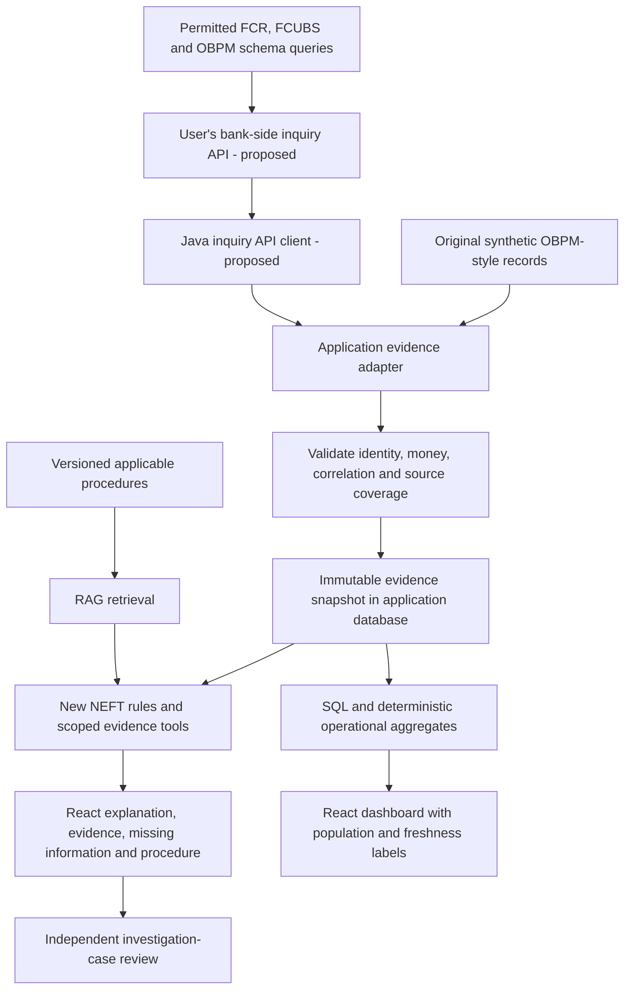

# OBPM input, analysis and dashboard blueprint

Prepared 12 September 2026 as a broader design blueprint. **Subsequent implementation:** the synthetic outbound NEFT/ECA subset now has typed ingestion, rules, scoped retrieval and banking evidence views; see the [current contract](OBPM_IMPLEMENTATION_CONTRACT.md) and [walkthrough](OBPM_STEP_BY_STEP.md). The bank-side inquiry API connection, continuous synchronization, message/accounting rules and bank-wide analytics remain unimplemented. The example wrapper below remains illustrative and is not an import payload.

## Recommended approach

Start with one outbound NEFT payment at a time through the user's bank-side inquiry API. The user will implement that API inside FLEXCUBE, where it can query the permitted FCR, FCUBS and OBPM schemas. This application's Java backend will call the API and validate the returned payment, queue, request and coverage evidence. Oracle database access stays inside the bank-side service; the application has no direct Oracle connection. The [inquiry API design](OBPM_INQUIRY_API.md) defines the required evidence, correlation and delivery steps.

Oracle documents external payment status enquiries and publishes REST/SOAP interface material.[^1] Availability, identity requirements, exact operations and evidence coverage must be checked for the installed maintenance release. An API that returns only current transaction status is insufficient for a complete investigation.

Use original synthetic examples for the personal portfolio. A real inquiry service, application, model runtime and data stores must operate within the approved organizational environment. The user supplied internal source/documentation links and authorized read-only inspection, including an in-browser mapping-spreadsheet preview. The inspected material does not establish compatibility with the installed OBPM maintenance release. Proprietary source bodies and transaction data were not imported into the public application fixtures; internal identifiers and review notes remain outside this public guide.

The bank inquiry API and application client arrows are proposed. Current case approval affects the investigation workflow only. It does not resend a payment, post accounting, clear a queue or modify OBPM.

## Required inputs

These are **logical data requirements, not Oracle table or column names**. Exact joins and fields must be mapped against the installed release. We do not need the whole schema, customer names, unrestricted logs or full account numbers.

| Group | Minimum fields | What the dashboard or analysis can show |
| --- | --- | --- |
| Payment identity and facts | Deployment, exact release, authorized host/branch, internal reference, external reference if available, rail, direction, network/source, amount/currency, business/value/activation dates | Searchable payment header, amount and scope; references correlated within the correct deployment |
| Native processing state | Transaction status, external-system status, observed time and status history | Current observed stage and timeline; payment status stays separate from case status |
| Queues and attempts | Queue code/reference, current response status, entry/exit times, request-attempt ID, errors/minimized remarks, response time, prior actions and actors/roles where permitted | Recorded hold, queue age, attempted recovery and the evidence behind the explanation |
| Messages | Type/reference/direction, transaction and bundle membership, application sequence and IFSC where applicable, sent/received times, response codes; N10 confirmation fields when available | Dispatch and confirmation evidence; no assumption that every acknowledgement proves beneficiary credit |
| Accounting and external responses | Request/handoff and journal references, event, debit/credit, account role, amount/currency, posting status, transaction/bundle linkage, response and observation times | Accounting evidence panel separating requested, handed off and confirmed posted entries |
| Returns/reversals | Own identity, original-payment linkage, amount, native status and timestamps | Original transfer and subsequent return/reversal history without conflating them with a card refund |
| Procedures/configuration | Document/version, applicable rail/release/queue, effective dates, status dictionary, approved SLA/calendar/timezone and action prerequisites | Applicable cited procedure; SLA checks only where configuration is known |
| Extraction provenance | Extract ID, source cutoffs/covered interval, mapping version, stable source IDs/versions, pagination completion, errors and per-source coverage | Freshness, completeness, reproducibility and explicit unknowns |

PTDOVIEW identifies payment, external-system, queue, dispatch and credit-confirmation evidence and links related views.[^2] It does not establish a specific database table. Some decisive evidence may belong to FLEXCUBE/DDA or another external accounting system. OBPM's request/handoff alone is not independent confirmation that the external system posted or blocked funds.

For INR, preserve the source decimal value and convert exactly to paise using decimal/integer arithmetic. Preserve native codes beside any versioned interpretation. Do not map bank debit to the current prototype's `CAPTURE`, or a return to `REFUND`, to reuse an incompatible rule.

## Identity, joins and evidence coverage

Use deployment + authorized host/branch scope + native transaction identity as the mapping key; validate actual uniqueness. Correlate child records to the specific payment, request attempt or bundle. SFMS acknowledgement matching uses application sequence and originating IFSC, and messages can cover a bundle.[^3] Amount/time coincidence is not a sufficient join.

Represent each source as `COMPLETE`, `PARTIAL`, `UNAVAILABLE` or `NOT_REQUESTED`, with its covered scope, cutoff and reason. `COMPLETE` refers only to that declared query scope. Preserve event time separately from observation/receipt time. A truncated page, failed query or empty unavailable source must not become evidence that an event never occurred. Unknown native codes or ambiguous matches should be retained as unresolved evidence.

## How an analyst would use it

Proposed flow:

1. Select an authorized deployment/branch and enter a payment reference. Rail/direction are explicit; start with NEFT outbound.
2. Click Fetch evidence. The Java backend calls the user's bank-side inquiry API and shows an import result, source cutoffs and any missing groups. This fetch control and API client remain proposed; the current interface imports original synthetic snapshots.
3. A validated changed snapshot is saved with its own version. An exception trigger or analyst request creates an investigation case; ordinary payments need not all become cases.
4. Click Investigate. NEFT tools inspect the snapshot, rules determine supported conclusions, and retrieval provides eligible guidance. The model selects scoped tools and supported facts; it does not execute SQL or determine monetary truth.
5. Review the explanation, source links, unresolved questions and procedure conditions. A different reviewer can approve/reject the case proposal.
6. Refreshing evidence creates a new snapshot when facts change. Earlier investigations retain their original evidence and policy versions. A proposal based on superseded evidence needs a fresh assessment before approval.

The current fixture seeder ignores existing case IDs and is not this ingestion mechanism. Implement import-job status, counts, rejected records, idempotent deduplication, late-update handling and commit-safe cursors. Keep evidence versions separate from case workflow versions; reject stale review against either. First implement on-demand retrieval, then add bounded batch ingestion if operational overview data is available.

## Dashboard outputs

| Surface | Proposed output | Data condition |
| --- | --- | --- |
| Overview | Loaded cases, awaiting review, current exception counts and amounts, age buckets, source freshness | Explicit population, filters and cutoff; distinguish counts of payments, cases and queue entries |
| Payment timeline | Status changes, queue transitions, requests/responses and message events | Stable correlations; distinguish occurred and observed timestamps |
| Investigation | Recorded blocker or supported explanation, evidence IDs, missing evidence, next evidence check | No invented root cause when the external outcome is unknown |
| Messages | SFMS response and N10 credit-confirmation details | Correct message type and transaction/bundle membership |
| Accounting | Handoff, external response and confirmed entries by event/account role | No zero substitution for unavailable balances; bundle totals stay distinct |
| Procedure | Applicable document/version, prerequisites and local operating guidance | Release/rail/effective-date compatibility; retrieved text is evidence, not executable instructions |
| Review/history | Analyst findings, case decision, audit trail and evidence version | Case resolution is not payment settlement |

The current dashboard counts `payment_case` rows. Those are case metrics, not bank-wide payment throughput. A useful operational design stores a separate minimal payment population and creates cases for exceptions or explicit investigations. If only exception records are supplied, label the dashboard as the imported exception population.

Success/failure rates require the full eligible cohort, including successful and unresolved payments, a defined observation window and complete pagination. Queue age starts at the current queue entry; payment age is different. Unknown entry time means unknown age. SLA breaches need approved thresholds and clock/calendar rules. Sum distinct eligible payment amounts once per currency; a payment in several queues is not several payments, and pending value is not measured financial loss. Root-cause frequency needs supported classifications, not unchecked model labels.

## Worked example

The [paired input/output example](examples/obpm-evidence-design-example.json) is original synthetic design material. **It is not accepted by the current app API and was not generated by an executed investigation.** The example shows an observed ECA timeout with unavailable DDA/accounting evidence.

Expected explanation: OBPM recorded ECA response `T` for the stated attempt; the underlying external outcome remains unknown. Queue age can be calculated from the supplied timestamps, but insufficient funds, absence of an amount block, posting failure and beneficiary-credit failure cannot be inferred.

The procedure panel can show Oracle's timeout-specific Resend condition and creation of a new reference.[^4] It should first request current external evidence and the applicable local operating procedure. The assistant does not execute Resend. N10, when validly correlated, is positive beneficiary-credit confirmation; it must not be treated as a generic transport acknowledgement.[^5]

## What source review establishes and what remains

The authorized source review identifies candidate bank-side objects, reference transformations and status semantics for the inspected source tree. The mapping must record primary/foreign keys, timestamps, scope filters, release and evidence group, then be validated against the installed system. Keep deployment-specific object identifiers and source links in the private mapping notes. The public [inquiry API design](OBPM_INQUIRY_API.md) describes logical response fields so the application can consume an original contract without importing product implementation or a proprietary source corpus into RAG.

Read-only source inspection and the mapping-spreadsheet preview have occurred. A database connection or live inquiry call has not occurred. Source-tree findings do not establish exact maintenance-release compatibility or a validated runtime mapping. The personal demo continues with original synthetic examples and public Oracle documentation.

## Implementation order

1. Confirm the exact patch and complete the bank-side inquiry mapping and evidence-coverage checklist for outbound NEFT; the API can gather permitted evidence from FCR, FCUBS and OBPM.
2. Implement original synthetic evidence sources, normalized banking types, ingestion/versioning and one ECA-timeout investigation path.
3. Add NEFT tools/rules, applicable runbooks, banking evidence panels and explicit source-quality labels.
4. Validate known/missing/conflicting evidence, exact money, duplicate and late imports, tenant isolation, stale review and conditional procedures.
5. Implement the Java client for the user's inquiry API in an authorized non-production environment, reconcile sample API responses to source views and expand only after coverage is established. Extend the current synthetic-only contract explicitly before accepting approved bank evidence.

No credentials or real transaction dump is needed to write steps 1-4 against an original example contract. Implementation and synthetic fixtures can be created by Codex; the deployment-specific mapping still requires factual validation against permitted source material.

## Sources and related design

[^1]: Oracle [Remittance Enquiry Request](https://docs.oracle.com/en/industries/financial-services/banking-payments/14.7.0.0.0/paycu/remittance-enquiry-request.html) and [14.7 Web Services library](https://docs.oracle.com/en/industries/financial-services/banking-payments/14.7.0.0.0/web.html).
[^2]: Oracle [NEFT Outbound Transaction View](https://docs.oracle.com/en/industries/financial-services/banking-payments/14.7.0.0.0/innug/neft-outbound-transaction-view.html).
[^3]: Oracle [SFMS ACK/NAK processing](https://docs.oracle.com/en/industries/financial-services/banking-payments/14.7.0.0.0/innug/sfms-ack-nak-messages-processing.html).
[^4]: Oracle [External Credit Approval Queue](https://docs.oracle.com/en/industries/financial-services/banking-payments/14.7.0.0.0/obpeq/external-credit-approval-queue.html) and [Exception and Investigation Queues Overview](https://docs.oracle.com/en/industries/financial-services/banking-payments/14.7.0.0.0/obpeq/exception-and-investigation-queues-overview.html). The overview identifies ECA queue code `EC`; the detailed guide identifies timeout response `T`.
[^5]: Oracle [N10 credit confirmation](https://docs.oracle.com/en/industries/financial-services/banking-payments/14.7.0.0.0/innug/credit-confirmation-ack-message-n10-processing.html).

See also the [OBPM integration design](OBPM_14_7_INTEGRATION.md), [evidence for the specialization](OBPM_POSITIONING_EVIDENCE.md), [current API contract](API_CONTRACT.md) and [delivery status](STATUS.md).
