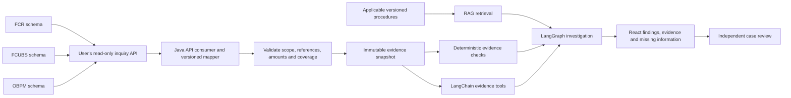

# NEFT inquiry API: source-to-dashboard plan

Prepared 12 September 2026. **The local mock inquiry milestone is now implemented:** four original synthetic responses, a bounded Java HTTP consumer/mapper, durable case import and React fetch workflow. See the [executed walkthrough](OBPM_MOCK_INQUIRY.md) and [mock wire contract](obpm-inquiry.openapi.json). The broader three-schema design below remains proposed; no bank connection or installed Oracle endpoint is claimed.

## Connection boundary

The user will implement a read-only inquiry API inside the banking environment. That API may query the FCR, FCUBS and OBPM schemas where relevant. Payment Operations Investigator will call the API from its Java backend. Database queries and database credentials remain inside the inquiry service. React and the investigator consume validated evidence through our backend.

The runtime supports the narrower [synthetic ECA contract](OBPM_IMPLEMENTATION_CONTRACT.md), including a client restricted to the local mock service. The bank API connector and expanded evidence types in this document remain to be implemented. Real records must never be relabelled `SYNTHETIC` to pass its validator.

## First inquiry

Start with one outbound NEFT payment. A proposed operation is `GET /inquiry/v1/neft/payments/{reference}` with an explicit `referenceType`, deployment and permitted branch/host scope. This path is our proposal, not a verified Oracle service. Authentication must determine allowed scope; query parameters cannot grant access to another branch or deployment.

Support a native payment reference first. Add UTR/source-reference lookup only after uniqueness and cross-system correlation are established. Multiple matches require a selection result or an explicit ambiguity error, never selection of the first row.

Return a parent object and separate child collections. Do not flatten payment, history, messages, blocks and ledger entries into one SQL join: their independent one-to-many relationships multiply rows.

| Response section | Required information | Intended dashboard use |
| --- | --- | --- |
| `source` and snapshot metadata | Product and exact release per source; deployment/host/branch; source timezone; snapshot ID; mapping version; actual observation cutoff per section | Origin, freshness and mapping traceability |
| `payment` | Stable native identity; separate typed references; rail/direction; source network/channel; decimal amount and ISO currency; creation and business dates; raw state | Payment header and native status |
| `hostRecords` | All relevant host subsequences, raw processing/accounting/message states, errors and source timestamps | Explain originating-system processing |
| `statusHistory` | Source row identity where available, native states, change time and ordering limitations | Observed timeline |
| `queueRecords` | Actual OBPM queue identity, payment link, current-record evidence, raw queue/response codes, entry/exit times | Current hold and as-of queue age |
| `externalRequestAttempts` | Distinct request IDs, operation, payment correlation, request/response times, explicit recorded timeout and raw response | Separate current request from earlier attempts |
| `coreBlocks` and `coreErrors` | Core request/block references, requested/approved/outstanding amounts, currency, separate master/detail states, sanitized errors | Core-side ECA evidence, without assuming an OBPM response was received |
| `messages` | Message identity/type/direction, payment or bundle membership, send/receive time and raw acknowledgement/confirmation state | Distinguish dispatch, transport acknowledgement and beneficiary confirmation |
| `accountingEntries` | Internal/external reference bridge, entry serial, event, account role/token, debit/credit, currency/amount, business dates, authorization/deletion/balance state, reversal links | Posting evidence when the source semantics support it |
| `sourceCoverage` | Per-section scope, as-of time, complete/partial/unavailable/not-requested status, pagination and truncation information, missing-data reason | Separate absent records from absent evidence |

These names describe a proposed expanded response. They are not a payload accepted by the present v1 importer. In particular, current v1 rejects populated message/accounting arrays and cannot represent arbitrary queue action history.

## Mapping and interpretation rules

- Preserve the reference namespace and source product. Similar names do not establish a join. Record the observed handoff mapping between the originating payment, OBPM reference, core request and ledger reference.
- Read only systems involved in the actual payment route. Availability of three schemas does not establish that every payment has records in all three. Preserve the actual prefunding and routing context when available.
- Preserve raw status fields separately and attach decoded labels only from a verified, versioned mapping. Core master, block-detail and OBPM response codes are different domains.
- A core master state alone does not establish a successful block. Accounting interface rows alone do not establish posted debit/credit. Missing response is not rejection. Missing N10 is not proof of failed beneficiary credit.
- Derive current queue/attempt from a verified source pointer or active-record rule, not just the greatest timestamp. Preserve all relevant attempts and state transitions.
- Use decimal strings and an ISO currency. Resolve numeric currency codes through the installed currency mapping. Exact Java minor-unit conversion must reject unsupported precision rather than round silently. Serialize large Oracle numeric identifiers as strings.
- Oracle `DATE` has no timezone. Document the source timezone before converting timestamps to UTC; preserve business dates as dates. Query execution time is an observation time, not payment creation or queue entry time.
- Preserve group cardinality. Where source history has no stable unique key or total ordering, disclose that limitation rather than invent a source sequence.
- Use a consistent read cutoff when available. Otherwise expose each section's actual observation time and the consistency limitation. An empty fully completed query differs from a failed or truncated query.
- Keep full accounts, customer names and raw message payloads out of the response unless a later justified requirement needs them. Stable account tokens/roles support correlation; masked last digits alone are not unique keys. Sanitize error text and parameters.

## Work sequence

1. **Confirm installed objects.** Compare source-backed candidate names with the actual three schema owners, object types, synonyms, columns and key constraints. An internal source-mapping reference and read-only metadata worksheet are saved locally under ignored `runtime/obpm-inquiry-design/`; they are not application input or public fixtures.
2. **Complete the native OBPM mapping.** Locate the installed NEFT payment view source, current queue and queue-history sources, ECA request/response sources, and the code that correlates those references. Older mapping labels do not establish physical tables or maintenance-release compatibility.
3. **Implement one-payment inquiry inside the bank.** Use bounded parameterized queries, separate child result sets, explicit source scope, coverage, and failure reasons. No payment mutation operations are needed.
4. **Agree the response contract using original synthetic examples.** Cover pending request, recorded timeout, later response, multiple attempts, partial history, ambiguous lookup, posting/reversal and unavailable sources. These will be test fixtures, not exports of bank transactions.
5. **Implement our Java API consumer and expanded mapper.** Add the typed fields needed for core blocks, messages and accounting; keep unknown outcomes explicit and preserve snapshot/review versioning. Do not relax the existing synthetic importer in place.
6. **Reconcile in the authorized test environment.** Compare the same payment and cutoff against source inquiry screens and entries. Verify correlation, status semantics, dates, amounts, pagination and route-specific missing records before enabling a finding.
7. **Extend the dashboard and investigation rules.** Render the new evidence groups, tested explanations and cited procedures. Case review continues to affect case workflow only.

The immediate missing input is the installed native OBPM object/column/key mapping and its reference-correlation rules. The next useful exchange is schema metadata or a matching Grok DDL/query link; no customer transaction dump is required.

## Output boundaries

The implemented synthetic application can identify a supported recorded ECA timeout or report insufficient evidence. Richer core-block, message and accounting explanations are planned extensions. RAG supplies applicable procedure references; transaction facts come from the inquiry evidence and deterministic checks.

A one-payment inquiry supports individual investigation and aggregates over imported cases. Bank-wide NEFT counts, success percentages and ageing distributions require a separately scoped paginated population API with complete denominator coverage. Imported exceptions alone cannot provide those metrics.

Oracle's [14.7 NEFT guide](https://docs.oracle.com/en/industries/financial-services/banking-payments/14.7.0.0.0/innug/toc.htm) identifies relevant inquiry, queue, message and accounting workflows. Its [14.7 service documentation](https://docs.oracle.com/en/industries/financial-services/banking-payments/14.7.0.0.0/web.html) is a service-reference starting point, not proof that a specific deployed endpoint returns all these evidence groups.
