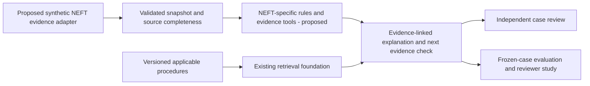

# Evidence for an OBPM-focused payment investigator

Verified 12 September 2026. This review checks the proposed strength: explaining why a NEFT payment is held, showing the supporting records, and retrieving the applicable procedure.

**Later implementation on the same date:** the original synthetic NEFT/ECA subset is now built and tested; see [the milestone receipt](validation/obpm-milestone.md). The original review below records the evidence available before that implementation. It still does not establish a real Oracle integration, independent banking accuracy or measured operator productivity.

**Verdict:** Oracle's documentation supports a concrete, technically meaningful use case. The current project demonstrates reusable investigation and retrieval engineering. An implemented OBPM/NEFT specialization, productivity improvement, commercial advantage and independent NEFT accuracy remain unproven. Calling this the strongest direction is an engineering judgment based on the user's domain experience and the evidence below, not a measured ranking of alternative projects.

## Claim and evidence

| Claim | Evidence | Supported conclusion |
| --- | --- | --- |
| Payment exceptions require investigation | Oracle describes exception-specific queues with predefined actions and host-scoped records.[^1] | The workflow exists in the product; its frequency and business cost were not measured here. |
| The proposed assistant has concrete evidence to inspect | PTDOVIEW exposes external-system status, transaction status, pending queue, dispatch and credit confirmation, plus accounting/message/action-log views.[^2] | A mapping contract can identify source evidence. No direct-table schema or complete query coverage is established. |
| NEFT knowledge materially affects the interpretation | Oracle separately documents SFMS acknowledgements, N10 beneficiary-credit confirmation and inbound N04/N02 matching.[^3][^4][^5] | A generic interpretation of all acknowledgements as equivalent would be wrong. |
| Procedure retrieval has specific content to preserve | ECA Resend and Retry have different prerequisites; Accounting Resend also has a status prerequisite and creates a new reference.[^6][^7] | Recommendations must carry the applicable conditions and evidence. A general suggestion to retry is inadequate. |
| Integration is technically plausible | Oracle documents external remittance status enquiries, reference filters and user access-right validation.[^8] | There is an inquiry capability to evaluate. This is not proof our connector works or supplies every required record. |
| The category matters to Oracle | Its current Banking Payments page advertises operational agents and AI-assisted repair.[^9] | The direction has vendor-recognized relevance. It also has direct overlap with existing advertised products. |

## Concrete domain proof

### Outbound: acknowledgement versus confirmed beneficiary credit

Oracle's N10 procedure says the beneficiary bank sends the positive acknowledgement after successful beneficiary credit. Processing it updates PTDOVIEW to `Settled` and records the N10 reference and credited date/time.[^3] SFMS F20/F27 acknowledgements are documented separately, with message correlation using the external application sequence and originating IFSC.[^4]

Proposed demonstration: given a correctly matched N10 plus an inconsistent displayed status, expose the inconsistency and its source timestamps. Given only an SFMS acknowledgement, do not infer beneficiary credit from that evidence alone. An absent N10 in an incomplete extract does not prove failure. These are proposed test expectations, not an executed NEFT case.

### Inbound extension: approved but still Active

Oracle documents that an incoming payment can remain `Active` while its corresponding N04 is missing. Matching N04 to N02 uses batch time, date and receiver IFSC before the final-credit processing described in the guide.[^5]

A useful investigation would distinguish a genuinely missing message, a present but unmatched message, and a message absent only from the supplied extract. This is an inbound extension example; the initial integration proposal starts with outbound NEFT.

### Procedure: preserve action prerequisites

The ECA queue documents Resend for timeout status and Retry for a rejected record whose cancellation is not complete and whose activation date is current. The two operations have different authorization behavior.[^6] The Accounting queue documents Resend for rejected transactions and creation of a new reference; it explicitly does not support authorization for that action.[^7]

Our independent case-review gate is a portfolio control. It must not be described as a universal native OBPM maker-checker requirement. The proposed assistant would explain prerequisites and request missing evidence; it would not execute those payment actions.

## What the project actually demonstrates

The [implemented product specification](PRODUCT.md) and code establish a synthetic payment-investigation foundation:

- [LangGraph workflow](../services/investigator/investigator/graph.py): scoped tool selection, evidence collection, policy retrieval, synthesis and validation.
- [Evidence tools and rules](../services/investigator/investigator/evidence.py): inspect payment timelines, settlement comparisons, webhooks and refunds from supplied snapshots.
- [Policy retrieval](../services/investigator/investigator/retrieval.py): tenant/date eligibility and lexical ranking, with a separately configured hybrid path.
- [API contract](API_CONTRACT.md): Java owns money, authorization, versioned snapshots and reviewed case transitions.
- [MoneyFacts.java](../services/api/src/main/java/dev/pratik/poi/MoneyFacts.java) and [InvestigationService.java](../services/api/src/main/java/dev/pratik/poi/InvestigationService.java): executable checked-money reconciliation, resolution validation, self-review denial and stale-version checks.

The retained [model-enabled application acceptance](validation/acceptance-compose-ollama-v6b.json) and [exact result review](validation/v6b-live-acceptance-results.json) cover 17 workflow checks across two investigations and four chat calls, including independent approval and self-review denial. These are recorded integration checks, not 17 AI cases or a new execution in this review.

The [integration design](OBPM_14_7_INTEGRATION.md) explicitly states that an OBPM connector, import API and NEFT-specific rules are not implemented. Current cases use a simulated provider with capture/refund/payout semantics. Renaming these fields to NEFT terms would not validate a banking integration.

### Freshly reproduced results

This review reran the existing comparator against the current source and frozen 30-case synthetic test split. The [new machine-readable receipt](validation/obpm-positioning-baselines.json) records PASS, exact inputs/source hashes and these results:

| Metric | Rules only | Same tools/rules plus lexical retrieval |
| --- | ---: | ---: |
| Expected outcome and action | 30/30 | 30/30 |
| Expected procedure ranked first | Retrieval disabled | 25/30 |
| Expected procedure within top three | Retrieval disabled | 30/30 |
| Cases with all returned citations tenant/date eligible | Not applicable | 30/30 |
| Model / embedding calls | 0 / 0 | 0 / 0 |

All 60 repeated semantic-result comparisons matched. The run made no network requests and bypassed Java and the live worker. All [45 source hashes](validation/obpm-positioning-source-check.json) checked against the retained final-build receipt matched; that is local source correspondence, not a fresh runtime or model check.

**What this proves:** reproducible policy-context retrieval on the declared synthetic cases. **What it does not prove:** improved diagnosis, independent semantic correctness, NEFT accuracy or reduced analyst time. The rules supply decisions in both arms, and the cases share engineered templates. The five first-rank misses remain visible. See [evaluation method](EVALUATION.md).

Separately, the retained [live-model development receipt](validation/evaluation-ollama-development-v6b.json) records six accepted responses and eleven chat calls. It is a small reused development sample: the model selects tools/fact IDs, service templates supply wording and rules determine the assessment. It is not a 100% AI-diagnosis result, and it was not rerun in this review.

## What would establish the OBPM specialization

The following is an acceptance proposal, not completed work or a claim of production benefit:

1. Implement the outbound NEFT mapping, preserving native status codes, message types, transaction/bundle identity, accounting roles, observation times and per-source completeness.
2. Freeze original NEFT cases and expected procedures after domain review. Include ECA timeout/rejection, SFMS acknowledgement without N10, matched N10, missing accounting confirmation, late/conflicting records, unknown statuses and outdated guidance. Reserve separate unseen variants for final evaluation.
3. Compare ordinary evidence views/manual document search, rules-only assistance and retrieval-assisted investigation on the same evidence. Test model tool/fact selection separately from the rule-owned diagnosis.
4. Score correct processing-stage explanation, supported evidence references, procedure prerequisites, abstention on incomplete data, and unsupported success/failure claims. Report every case and failure, not only successful demos.
5. To claim time savings, run a counterbalanced study with domain reviewers on different matched cases, including review/correction time. Report sample size, errors and completion-time distributions; do not infer savings from model latency or vendor marketing.

## Defensible wording

Today: **Built a synthetic payment-operations investigator with scoped evidence tools, versioned policy retrieval and independent case review; designed an OBPM 14.7 NEFT integration against Oracle's documented workflows.**

After implementing and validating the new path: describe the actual OBPM-oriented synthetic scenarios, mappings and results. Claim a working OBPM sandbox integration only after it has been tested in an authorized environment. There is currently no evidence for a unique market gap, an advantage over Oracle's advertised agents, production accuracy or hiring outcomes.

## Oracle sources

[^1]: [OBPM 14.7 Exception and Investigation Queues Overview](https://docs.oracle.com/en/industries/financial-services/banking-payments/14.7.0.0.0/obpeq/exception-and-investigation-queues-overview.html).
[^2]: [OBPM 14.7 NEFT Outbound Transaction View](https://docs.oracle.com/en/industries/financial-services/banking-payments/14.7.0.0.0/innug/neft-outbound-transaction-view.html).
[^3]: [OBPM 14.7 N10 credit confirmation processing](https://docs.oracle.com/en/industries/financial-services/banking-payments/14.7.0.0.0/innug/credit-confirmation-ack-message-n10-processing.html).
[^4]: [OBPM 14.7 SFMS ACK/NAK processing](https://docs.oracle.com/en/industries/financial-services/banking-payments/14.7.0.0.0/innug/sfms-ack-nak-messages-processing.html).
[^5]: [OBPM 14.7 N04/N02 matching and final credit](https://docs.oracle.com/en/industries/financial-services/banking-payments/14.7.0.0.0/innug/n04-and-n02-messages-matching-release-final-credit.html). The source varies between EAC/ECA terminology; this review preserves the message-matching claim without resolving that terminology inconsistency.
[^6]: [OBPM 14.7 External Credit Approval Queue](https://docs.oracle.com/en/industries/financial-services/banking-payments/14.7.0.0.0/obpeq/external-credit-approval-queue.html).
[^7]: [OBPM 14.7 Accounting Queue](https://docs.oracle.com/en/industries/financial-services/banking-payments/14.7.0.0.0/obpeq/accounting-queue.html).
[^8]: [OBPM 14.7 Remittance Enquiry Request](https://docs.oracle.com/en/industries/financial-services/banking-payments/14.7.0.0.0/paycu/remittance-enquiry-request.html).
[^9]: [Current Oracle Banking Payments product page](https://www.oracle.com/financial-services/banking/banking-payments/). Unversioned advertised AI capabilities; see the [Oracle product review](ORACLE_INVESTIGATION_TOOLS.md) for release and dependency distinctions.
