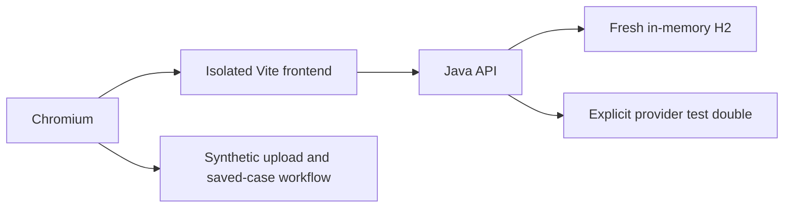

# Payment-case browser acceptance

The Java CI job uses the supported Java 17 version range and records the exact resolved JDK. After the Java suite, Playwright exercises the actual React app and Java API in Chromium using only original synthetic data. The existing Compose/replay acceptance remains a separate legacy regression check.

Run from a clean checkout:

```sh
mvn -f services/api/pom.xml clean verify
cd apps/web
npm ci
npx playwright install chromium
npm run test:e2e
```

Ports 19091 (web), 19092 (API), and 19093 (provider test double) must be free. The harness refuses to reuse an existing server. It starts a fresh H2 in-memory database and strips inherited application/model configuration before starting Java. It never accesses the operator's native database or bank endpoints. On Windows the Java helper can use a project-local Unix-domain-socket temporary directory; this is unrelated to bank TLS.

The provider boundary returns a deliberately labeled test answer with citations to the actual submitted synthetic source documents. The suite exercises contract handling, saving and review, not Ollama accuracy or performance. It does not download or call a language model. Browser failures retain a Playwright trace and screenshot containing synthetic test data; these directories are ignored by Git.

Four scenarios cover the current payment workflow through independent review, PDF/report history and lifecycle; canceled navigation and explicit draft recovery; assigned overdue evidence requests; and database case search, sorting and pagination across more than ten records. The final scenario also checks an Evidence Q&A case selected outside the current page, draft retention during paging, and a narrow viewport without page overflow. Dedicated test-only loopback shutdown endpoints close the owned servers after execution, avoiding orphan test listeners on Windows. These endpoints are absent from the production Vite configuration and API.



Reference: [setup-java version syntax](https://github.com/actions/setup-java#supported-version-syntax) and [Playwright test web servers](https://playwright.dev/docs/test-webserver).
