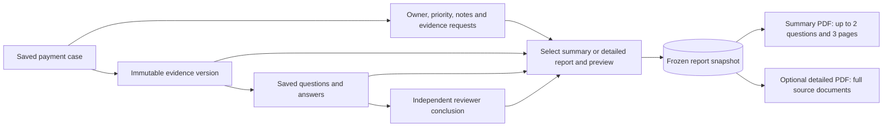

# Payment investigation PDF reports

Choose **Export PDF** beside a saved case, in its investigation/Q&A workbench, or in the payment-case header. Each entry opens that case's report choices at `/payment-cases/{caseId}?report=1`. Case management is below Selected payment and before evidence acquisition.

1. Keep the default **Case summary**, or explicitly choose **Detailed report**.
2. Choose a saved evidence version. The latest completed question for that version is selected by default in the summary. Select up to two questions for a summary, or up to twenty for a detailed report. Older versions and unfinished/failed jobs are labeled explicitly; an unfinished job contributes its saved status without an invented answer.
3. In Detailed report only, optionally include all raw rows from the selected evidence. Complete cited documents are included in the detailed report. The summary uses short source references instead.
4. Generate a preview, check its scope and reviewer status, then download the PDF.

The preview freezes a report record on the server. Download uses that record and its fingerprint, so later notes, new evidence or model-job completion cannot silently change the PDF. Generate another preview to include newer changes. Opening choices, previewing and downloading never calls the bank or model.

## Summary contents

The default is a concise case document, capped at three pages. It includes payment identity, bank/branch, saved amount, owner/priority, reason, evidence version/row counts, key source cautions, selected question and original answer excerpts, key unknowns/next checks, short source references and the matching reviewer conclusion. Source conflicts with the saved discovery record take priority among the displayed cautions. The latest note and a small number of outstanding evidence requests appear when present. It omits raw JSON, full cited documents, duplicate provenance, model diagnostics and complete activity history.

Excerpt and item limits are stated explicitly in the PDF. They do not rewrite or certify the saved answer. All selected questions appear; the API rejects more than two in summary mode instead of silently dropping questions. Full text remains in the saved investigation and Detailed report. Unusually large case fields that cannot fit the three-page cap return an actionable error rather than an oversized summary.

## Detailed report contents

- Case identity, bank/branch, source amount, investigation reason, owner and priority.
- Selected evidence version, acquisition source, row coverage and limitations.
- Selected questions, saved job state, original model-written answers, unknowns and next checks.
- Complete preserved cited documents and answer provenance, including each answer's own evidence version.
- Investigation notes, evidence requests and their current state, case activity and management audit.
- The latest independent reviewer conclusion matching the exact evidence fingerprint and selected completed-question set, or **Pending** when none matches.
- Optional raw evidence appendix, technical identifiers and report fingerprint.

Source identifiers, amounts and dates retain their stored text. Blank, null and absent fields are distinguished. A4 pages wrap long values; unsupported Unicode/control characters use documented code-point notation rather than being silently discarded. The report fingerprint checks stored content integrity; it is not a digital signature or proof that a payment conclusion is correct.

## Authorization and persistence

Java rechecks case, tenant and authorized bank/branch scope on preview and download. Analyst, reviewer and viewer may export records they can read. Exporting does not give a viewer permission to change case management. Session cookies and CSRF apply to both POST endpoints. Report data stays in the local database and the user's downloaded file.

`POST /api/payment-cases/{caseId}/report-preview` requires an `Idempotency-Key` and these fields:

```json
{
  "evidenceId": "EVD-example",
  "investigationIds": ["CIN-example"],
  "includeEvidenceRows": false,
  "reportMode": "SUMMARY"
}
```

For a case without selected evidence use `evidenceId: null`, an empty investigation list and `includeEvidenceRows: false`. `reportMode` accepts only `SUMMARY` or `DETAILED`. The browser explicitly requests SUMMARY by default. Omitting mode preserves the former three-field API contract as DETAILED; old frozen reports keep their original presentation. SUMMARY rejects raw rows and more than two questions. The response is a frozen `payment-case-report-v1` bundle, including `reportId`, `reportHash`, `case`, `management`, `evidence`, `investigations`, `caseActivity`, `review`, `scope` and `warnings`. Full selected answers/citations remain frozen internally in both modes; only PDF presentation differs.

`POST /api/payment-cases/{caseId}/report.pdf` accepts only `reportId` and `reportHash` from that preview and returns an attachment with `application/pdf`, `Cache-Control: no-store` and `X-Content-Type-Options: nosniff`. Errors remain structured JSON even when the client requests PDF. A lost preview response can be retried with the same key and body. Reusing a key with other choices returns a conflict.

Limits: two investigations/three pages for Summary; twenty investigations/200 pages for Detailed; 8 KiB selection request, 8 MiB saved report bundle and two concurrent PDF renders per API process. Oversized reports return an actionable error; select fewer investigations or another format. [Saved report history](REPORT_HISTORY.md) now lists authorized frozen snapshots and supports downloading an earlier snapshot without preparing another preview. There is no report-retention scheduler.

The renderer uses [Apache PDFBox](https://pdfbox.apache.org/) inside Java with an embedded, licensed DejaVu Sans font. It performs no network fetch, browser rendering, active document scripting or model generation.



Reports document an investigation. They do not execute a payment, prove beneficiary credit, approve a transaction, resolve the case automatically or replace factual review. Owner choices currently come from the local authorized identity catalog; production SSO, directory integration, case closure policy and document retention remain deployment work.
