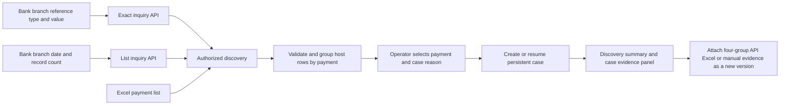
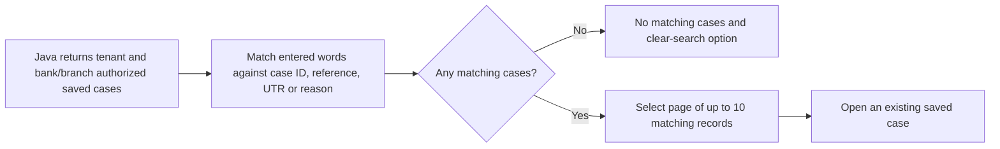

# Find a payment and open a case

Current numbering: saved cases display and search a persistent `YYYYMMDD` + five-digit case number, and new links use it. Internal IDs and bank payment references remain distinct and unchanged. See [case number allocation and compatibility](CASE_NUMBERS.md).

Implementation handoff, 14 September 2026. See [exact lookup and environment-neutral labels validation](validation/reference-lookup-2026-09-14.md) and the [original discovery validation](validation/payment-discovery-2026-09-14.md). The optional [FLEXCUBE adapter](FLEXCUBE_INTEGRATION.md) now supports `NEFTPaymentDiscoveryInquiryService` (PO01), using server-built `args0`/`args1` and `neftPaymentDiscoveryDetails`. The earlier flat/native-column contract remains supported as `CANONICAL`. These are selectable server wire formats; the browser endpoints remain unchanged. Source review and local tests do not establish a bank connection or live response verification.

## Operator workflow

Open **Case queue** at `/cases`. Below the page introduction, a shared guide shows **Find payment → Case → Evidence → Investigation**, with Find payment highlighted. It appears before the summary cards and search form, and describes the workflow rather than a payment's processing status. Evidence library uses the same guide with Evidence highlighted. The legacy synthetic workflow is preserved through direct links; its tab is absent from normal navigation. Payment discovery supports three inputs:

1. Reference / UTR: enter the bank and branch codes, choose the reference type and enter its value, then **Find transaction**. This calls the exact lookup operation, without an inquiry date or record-count parameter. It does not filter a limited date list or substitute previously uploaded records.
2. Excel upload: upload a payment-list XLSX workbook, review normalized candidate rows, select one and enter its case reason. Uploading the list does not automatically create cases.
3. Inquiry API: enter bank and branch codes, inquiry date (defaults to today's calendar date in Asia/Kolkata) and record count, then **Find transactions**. Review the results, then open the selected case.

The active native runtime uses `BANK_API`; historical/mock fixtures remain separate from the active payment workflow. An Excel workbook is treated as private imported evidence regardless of whether an operator uploads the supplied fictional example. The existing internal classification `PRIVATE_UAT` is retained for storage compatibility and displayed as **Private evidence**; it does not assert the uploaded file's source environment. A repeated case selection resumes the same case; it does not create one case per host subsequence or question.

Switching discovery input methods preserves the typed bank and branch but clears the selected Excel file. Choose the workbook again when returning to Excel upload, so the file submitted always matches the visible chooser. Administrator and Viewer sessions can read saved cases; discovery and case creation require Analyst or Reviewer.



`REF_SUBSEQ_NO` remains a required column but may contain JSON `null` or an empty string; a blank Excel cell is also accepted. These represent an unknown host subsequence and become one `null` entry in the grouped `hostSubsequences` array. Known values remain exact integer strings, sorted numerically before the unknown entry. For example, `"0"`, `"1"` and `null` display as **0, 1, Unknown**. Repeated unknown observations remain in the original discovery receipt but share one unknown marker in the grouped display; the displayed array size is not a count of source host rows. A zero is never substituted for missing source data.

## Search and paginate saved cases

**Saved payment cases** remains below **Find payment**. Its search box filters the saved list immediately by case ID, payment reference, UTR or investigation reason. Matching ignores case and surrounding whitespace. For multiple words, every word must occur in at least one of those fields; they need not all occur in the same field. Partial references and partial words match. An empty search shows all authorized saved cases in the existing newest-first order. This is text matching, not fuzzy or semantic search.

Filtering applies to the full authorized list before pagination. Each page shows at most ten matching cases. Numbered pages and Previous/Next controls navigate the results; the page indicator and displayed range describe the filtered list, while the title count and summary cards still describe all saved cases. Changing or clearing search returns to page 1. Refresh preserves the search and returns to page 1. No matching rows produces a clear empty result instead of displaying unrelated cases.



The current local application filters and paginates in React after one authorized saved-list read. It performs no bank/API lookup on each keystroke and does not change saved data. This limits rows displayed per page, not the number fetched from Java; a high-volume deployment would require a separately implemented server-side paginated endpoint. See [validation](validation/saved-case-search-2026-09-14.md).

## Exact lookup and list bank API contracts

The FLEXCUBE target is a fixed configured HTTPS `.../FCAPIService/NEFTPaymentDiscoveryInquiryService/processRequest` endpoint. Set `poi.payment-discovery.wire-format=FLEXCUBE` and configure the shared server identity, channel and bank posting date as described in [the integration guide](FLEXCUBE_INTEGRATION.md). The default `CANONICAL` wire format retains the earlier flat request/response contract shown below. Do not send that flat body directly to PO01.

Both website methods call the Java backend, which calls the configured internal bank endpoint in BANK_API mode. The following two mutually exclusive shapes are the browser requests and CANONICAL upstream requests; FLEXCUBE mode transforms them into PO01 context and inquiry arguments. In MOCK mode the operations use original synthetic records; no bank is connected.

**Reference / UTR — exact lookup:**

```json
{
  "orgBank": "760",
  "orgBranch": "1352",
  "referenceType": "FCR",
  "reference": "900000000000000000000001"
}
```

Use `referenceType: "UTR"` to look up the supplied UTR. No date or record-count field is accepted for this operation. The service validates that every returned row matches the requested reference and authorized bank/branch. One matching payment can have multiple host rows; they form one selectable transaction. Multiple payments matching a UTR remain explicit choices. A response reporting incomplete/truncated exact matches is rejected instead of silently selecting a first row. The application reports `EXACT_MATCH`, `AMBIGUOUS` or `NOT_FOUND` for the configured source; these do not establish a payment outcome.

**Inquiry API — dated list:**

```json
{
  "orgBank": "760",
  "orgBranch": "1352",
  "inquiryDate": "2026-09-14",
  "recordCount": 20
}
```

Bank code is an explicit request parameter: ESAF uses `760` as supplied by the user; other banks use their own configured code. The server validates the requested bank/branch pair against the signed-in tenant's configured scope. Identical branch numbers in different banks remain distinct. Credentials, endpoint and permitted scope stay backend configuration. Inquiry date currently means the selected calendar day; the application defaults to today's date in fixed Asia/Kolkata. This is not a bank business/BOD date and does not establish the timezone or current SYSDATE of the source Oracle database. Record count means payments, not flattened host rows. The UI/API limit is 1 to 200 payments.

Normalized/CANONICAL response example with original fictional values; raw PO01 instead returns camelCase `neftPaymentDiscoveryDetails` rows and wrapper metadata:

```json
{
  "observedAt": "2026-09-14T10:30:00+05:30",
  "hasMore": false,
  "items": [
    {
      "PIO_REF_TXN_NO": "900000000000000000000001",
      "PIO_ORG_BRN": "1352",
      "PIO_ORG_BANK": "760",
      "REF_SUBSEQ_NO": "0",
      "UTR_REF_NO": "DEMO-UTR-0001",
      "DATINITIATION": "2026-09-14T09:15:00",
      "NUMAMOUNT_4038": "1250.40",
      "CURRENCY": "INR",
      "DIRECTION": "OUTBOUND"
    }
  ]
}
```

The seven columns from the user's query are required headers. UTR may be blank when not assigned. Add **CURRENCY** as an ISO currency only after resolving the installed code mapping; otherwise the application displays currency as not supplied. PO01 supplies no currency and the adapter does not invent one. **DIRECTION** is optional. Long references, UTRs and exact amounts are strings. The current amount boundary is nonnegative plain decimal text with at most 38 integer and 18 fractional digits. SQL `TM9` may emit exponent notation for extreme values; an incompatible amount rejects the entire batch without rounding. Confirm the installed precision/scale before broader bank inquiries. Return all relevant host subsequences for selected payments. Errors, truncated groups and ambiguity must not be represented as an ordinary empty success. FLEXCUBE empty success requires validated wrapper status, explicit result array and observation metadata; these are not independent proof of database query completeness.

For a dated list, `hasMore` reports more matching payments than the requested limit; it is not evidence of processing failure. PO01's `hasMoreRecords` likewise counts distinct FCR references, not flattened host rows. For exact lookup, `hasMore` must be false and all matching groups must fit the backend's safety bounds (200 payments / 2000 native rows); otherwise the bank service must report an error or the application rejects the response. `observedAt` records the bank-side observation; the supplied PO01 implementation obtains its observation timestamp before opening the cursor, not at fetch completion. Date selection uses native initiation date, separately from `args0` bank posting date. These operations return discovery observations, not full event/history, accounting, confirmation or settlement evidence.

## SQL handoff

The fifth package function `AP_BA_NEFT_DISCOVERY_INQ` now implements the three selection paths in `runtime/obpm-uat/api/PK_BA_NEFT_EVIDENCE_INQ.sql`. Its companion `DISCOVERY_FUNCTION_GUIDE.md` maps parameters and documents the count-plus-one cursor/JSON wrapper contract, with calls in `TRY_NEFT_DISCOVERY_INQ.sql`. The package groups identities before applying limits and preserves conflicting matched rows. This local addition has not been compiled or executed in Oracle; existing source-key and schema checks still apply. The original four detailed inquiry functions are unchanged.

The original query's ROWNUM limit precedes final ORDER BY. Sort in an inner query before limiting; Oracle describes this [top-N pattern](https://docs.oracle.com/en/database/oracle/oracle-database/21/sqlrf/ROWNUM-Pseudocolumn.html). A host join can also consume the limit with repeated payment rows.

`runtime/obpm-uat/sql/13_payment_discovery_api.sql` selects bounded payment candidates first, then obtains their scoped host rows. It uses all four request parameters, including `:p_org_bank`, after the server authorizes the bank/branch pair. It emits text identifiers and source-local ISO dates and describes wrapper grouping/hasMore logic. It is a read-only draft, not an executed UAT query. Validate native keys, datatypes, date semantics, access privileges and the execution plan before deployment. An older explicit payment reference must remain investigable even when it is outside the discovery date window.

`runtime/obpm-uat/sql/14_payment_reference_lookup.sql` provides separate bound FCR-reference and UTR predicates for the exact operation. It applies no date window or user record limit. Return all host subsequences, preserve multiple matching payment identities, and do not use `ROWNUM = 1` to conceal ambiguity. This worksheet has not been executed against Oracle.

## Excel input

Download the template from the Find payment panel. Replace the original example rows with the authorized discovery export. The Payments sheet starts with the seven native headers in row 1 and optional currency/direction columns. Keep references/UTRs as Text. Use ISO `YYYY-MM-DDTHH:mm:ss` timestamps or actual Excel date values, not ambiguous locale date strings. Keep source decimal precision.

The backend rejects formulas, corrupted/oversized workbooks, damaged numeric references, inconsistent payment duplicates and records outside the selected authorized branch/bank. Host subsequences are grouped into one selectable payment. A supplied row-number column is presentation data; it must not become a payment key. The template includes instructions separately from the data sheet.

## Application endpoints

| Endpoint | Purpose |
| --- | --- |
| GET `/api/payment-discovery/config` | Mode, configured scopes, default calendar date and result limit |
| POST `/api/payment-discovery/lookup` | Exact reference/UTR inquiry with bank and branch |
| POST `/api/payment-discovery/search` | Dated list inquiry with bank, branch and record count |
| POST `/api/payment-discovery/uploads` | Multipart XLSX plus authorized `orgBank` and `orgBranch` |
| POST `/api/payment-cases` | Stored `candidateId` plus reason and idempotency key |
| GET `/api/payment-cases` | Tenant-scoped saved payment cases |
| GET `/api/payment-cases/dashboard` | Summary of saved payment cases only |
| GET `/api/payment-cases/{id}` | Persistent discovery snapshot and case details |

`/lookup` accepts exactly `orgBank`, `orgBranch`, `referenceType`, `reference`; `/search` accepts exactly `orgBank`, `orgBranch`, `inquiryDate`, `recordCount`. CANONICAL forwards these flat shapes; FLEXCUBE maps them into PO01 `args0`/`args1` using server-owned context. Neither substitutes a local uploaded record for the API response. Results identify coverage; exact lookup additionally returns `matchStatus`. Multiple UTR matches remain selectable transactions. Viewer accounts can read saved cases but cannot upload, acquire new records or create cases. Every mutation requires the existing session CSRF token.

The browser submits a stored candidate ID when opening a case; it cannot replace the candidate's payment fields, tenant or source. Cases are stored separately from original demo records. The same scoped private payment can resume a case across Excel and bank API discovery; mock identities are isolated. Original snapshots are retained when the same case is selected again. Case reason records the operator's reported issue, not a verified payment failure.

## Attach detailed evidence after opening the case

The saved case's **Case evidence** panel now supports **Inquiry API**, **Four Excel files**, and **Manual + JSON**. It uses the four detailed function results: PAYMENT (29 columns), HOST (36), HISTORY (15), and STATUS (7). This differs from the seven-column payment-list workbook used in **Find payment**. Use the per-group templates provided inside the saved case.

Every input is checked against the case's stored reference, bank and branch. Excel and manual/JSON records preserve exact text and unverified source completion. The separately configured evidence API uses saved identity. Its FLEXCUBE mode maps PO02 arrays, preserving raw provenance and UNVERIFIED completion, including empty groups. CANONICAL compatibility mode requires explicit four-group acquisition metadata. Evidence calls remain disabled until deliberately enabled; discovery MOCK records are not a detailed-evidence fallback.

Successful acquisition or explicit save creates an immutable version. Inspect **Saved evidence versions** for original rows, notes, row counts and warnings. The case evidence indicator updates; the original discovery observation and resolution status remain intact. Follow [the step-by-step evidence guide](CASE_EVIDENCE.md) for payloads, all three input workflows, validation limits and private endpoint settings.

## What this increment does not establish

Discovery-only cases contain payment-list observations and do not run the model or synthesize missing transaction evidence. The [four-group evidence attachment](CASE_EVIDENCE.md) stores a case-scoped version history. The [case investigation workbench](CASE_INVESTIGATION.md) allows explicit version-bound model questions, raw source timelines, saved answers and audit history. Existing Evidence Q&A and its CPU/GPU implementations remain preserved. Their prior factual-validation limitations remain applicable; a question does not close or execute a payment.

User-facing navigation, headings and badges use **Evidence Q&A** and **Imported evidence**, without assuming an environment. `PRIVATE_UAT` is a legacy internal classification displayed as **Private evidence**; this label is not an environment claim. Existing internal routes, source documents, historical classifications and source-provided environment notes remain intact. This presentation change does not grant access to an environment or certify a new production integration.

The API adapter must be explicitly configured for BANK_API; default MOCK results are labelled. Bank mode uses a fixed backend URL, standard TLS validation, bounded request/response limits and visible failures. It does not fall back to mock on bank failure. Local tests and opening the page do not contact a bank endpoint.

## Native runtime configuration

The original launcher supports the following discovery-specific environment settings. New FLEXCUBE context and wire-format settings can be configured through the ignored private Spring properties file or [configuration helper](FLEXCUBE_INTEGRATION.md#deployment-settings):

| Setting | Default / purpose |
| --- | --- |
| `POI_PAYMENT_DISCOVERY_MODE` | `MOCK`; choose `DISABLED` for Excel uploads/saved cases only, or explicitly configure `BANK_API` |
| `POI_PAYMENT_DISCOVERY_BANK_ENABLED` | `false`; bank HTTP calls require explicit `true` and BANK_API mode |
| `POI_PAYMENT_DISCOVERY_BANK_URL` | Empty; fixed HTTPS URL owned by backend configuration |
| `POI_PAYMENT_DISCOVERY_DEPLOYMENT` | `FCR-UAT`; set a unique stable deployment name before importing that environment's data |
| `POI_PAYMENT_DISCOVERY_SCOPES` | Local demo defaults `northstar:1352:760,silverline:2468:760`; real scope mappings must match bank authorization |
| `POI_PAYMENT_DISCOVERY_TIMEOUT_SECONDS` | `10`, bounded to at most 30 seconds |

Use the confirmed PO01 path `https://bank-api.example/FCAPIService/NEFTPaymentDiscoveryInquiryService/processRequest`; this is a generic example, not a live destination. FLEXCUBE wrapping is implemented, while gateway authentication, certificate trust and deployed service behavior still require environment validation. The prepared native profile sets the new endpoints and FLEXCUBE format with bank calls disabled and discovery MOCK. Do not bypass TLS checks to make a connection succeed.

To support another bank, add its approved tenant/bank/branch combination to `POI_PAYMENT_DISCOVERY_SCOPES` using the existing `tenant:branch:bank` syntax, then restart the API. Reference / UTR, Excel upload and Inquiry API share editable bank and branch fields. Each accepts 1–10 digits as text; changing the bank preserves the entered branch, and switching methods preserves both codes. The backend authorizes the submitted pair; typing a code does not grant access. FLEXCUBE's separate numeric DTO limits still apply when using that adapter. The current adapter uses one configured endpoint/deployment; banks requiring different endpoints or credentials should run isolated deployments until server-owned per-bank endpoint routing is implemented.

Changing discovery settings requires restarting the native stack so the Java process receives them. `tools/start.ps1` reuses already-running processes rather than silently changing their configuration. The CPU model baseline is unaffected by these discovery settings.
