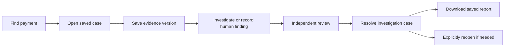

# Product specification

## Objective
Deliver a resume-ready enterprise-style portfolio application within seven days: from a payment case to an evidence-linked investigation and independently reviewed case decision. Enterprise-style refers to tested architecture, user workflows and engineering controls; production readiness requires separate operational evidence.

## Current saved-payment workflow

The primary product now follows payment discovery, saved case creation, immutable evidence acquisition, local-model investigation and independent human review. [Case workflow](CASE_WORKFLOW.md) adds explicit investigation states and reviewer-controlled resolution/reopening, separate from archival and payment outcome. [Assigned work and evidence follow-ups](CASE_WORK_QUEUE.md), [draft protection](DRAFT_PROTECTION.md) and [saved report history](REPORT_HISTORY.md) support completing and retaining that work. The original simulated scenarios and replay modes below remain legacy regression fixtures; they are not the normal saved-payment interface.

## Users
- Analyst: searches cases, examines records, initiates investigations and reviews evidence.
- Reviewer: approves or rejects another analyst's case proposal.
- Viewer: read-only observation.
- A second synthetic tenant demonstrates isolation across every data path.

## Product experience
A React operations workspace includes a case queue, priority/search filters, operational summaries, payment timeline, ledger and webhook evidence, runbook citations, tool execution records, missing-evidence findings, review controls, audit history and case export.

The workspace distinguishes model-selected evidence, service wording, deterministic assessment and recorded source data. Findings link to evidence IDs and applicable document versions. Historical model explanations retain their original prose and labels. A bounded catalog does not prove that all relevant facts were selected or that source records are correct; analysts must inspect cited facts before an independent reviewer acts. An unresolved case is a valid result.

## Committed seven-day scope
1. Timeout after successful processing.
2. Duplicate webhook delivery.
3. Out-of-order webhook delivery.
4. Missing refund causing a reconciliation discrepancy.
5. Insufficient evidence requiring escalation or evidence collection.
A confirmed provider failure is an additional control scenario.

One simulated provider and one currency (INR) keep the first release coherent. No real customer, account, payment-rail or employer data is required.

## AI responsibilities

The optional [UAT evidence question page](UAT_MODEL_QA.md) adds a distinct mode: model-generated prose over a private export snapshot and supplied source notes, with exact citation membership checks and saved provenance. It does not use the fixed sentence selection described below. Its explanations are read-only and need human factual review; they do not classify or execute banking recovery actions.
RAG retrieves versioned operating guidance. Typed tools inspect an authorized payment snapshot. LangGraph controls the local investigation and saves checkpoints. In live mode, Ollama selects scoped read-only tools, then selects one or two authorized fact IDs when a supported conclusion is available. The service displays those exact fact sentences and their complete source links. It adds no unselected facts and does not rewrite a model-generated answer. If evidence is insufficient, tool planning remains a real model call, but the finding stage is explicitly skipped.

Deterministic evidence rules supply the outcome, summary, categorical confidence, missing facts and proposed case action in both modes. The UI labels the new selection path as “AI-selected evidence” and discloses service wording when its origin is recorded. Historical model-written findings remain “AI evidence explanation”; planner-only results remain “Ollama tool planning”. Saved provenance identifies rule-derived assessment separately from actual model usage. Fact selection is narrower than open-ended explanation and still requires analyst review; it is not a claim of perfect grounding.

Money calculations, authentication, authorization, case state transitions, idempotency and approvals belong to deterministic backend code.

Synthetic case INR values use exact safe-integer minor units. Java rejects out-of-range money; React formats valid values using integer quotient/remainder so even the largest permitted amount retains its final paise digit. Invalid display inputs are visibly labeled instead of silently rounded. The separate UAT evidence page displays exact source decimal strings and does not convert those observations into ledger amounts or case decisions.

## Two execution modes
- Replay: actual graph and retrieval with deterministic evidence reasoning. Useful for reproducible demo and backend tests. It is explicitly not LLM inference.
- Local model: actual LangChain/Ollama tool planning, with typed fact selection only when evidence is sufficient. The service renders selected fact wording and links; assessment and proposed action remain rule-derived. Invalid selections and provider errors remain visible; there is no silent conversion to replay. Model usage and provenance are recorded separately from review status.

## Outcomes
Proposals are RESOLVE_CASE, ESCALATE or REQUEST_EVIDENCE. These change only simulated case workflow after authorized review. They never debit, credit, retry, refund or otherwise execute payments.

## Definition of portfolio-ready
A clean checkout can run the documented local demo. Authentication, isolation, exact amounts, replayed decisions and failure handling pass tests. The React flows are verified in a browser. The dataset and evaluation are reproducible. Live-model results have their own measured evidence or are explicitly identified as unavailable. Documentation contains setup, flow diagrams, decisions, failure analysis and a truthful resume/demo pack.
