# Source ZIP privacy and reproducibility

The optional `tools/package_release.py` creates a local source archive from a **clean, reviewed Git working tree**. It does not walk the project directory looking for files to copy. Runtime settings, bank endpoints, uploaded evidence, branch mappings, databases, model files and saved answers belong in ignored private storage and must stay out of both Git and releases.

This source archive does not contain an operational database or private configuration. It is not a deployment backup, a publication, a production-readiness certificate or proof that arbitrary business data is safe to share.

```mermaid
flowchart LR
  Git[Git tracked source and current commit] --> Paths[Ignore rules and release path checks]
  Paths --> Clean[Require reviewed clean source]
  Clean --> Scan[Bounded text and workbook inspection]
  Scan --> Zip[Deterministic ZIP and source manifest]
  Zip --> Verify[Recheck member paths, bounds and hashes]
  Verify --> Recheck[Recheck source and Git state]
  Recheck --> Local[Local ZIP and SHA-256 checksum]
```



## Workflow

1. Run `python tools/package_release.py --check`. This reads only eligible tracked source and local Git metadata. It creates no files and returns a nonzero exit status when the checkout is not ready. Findings report paths and rule names; they never reproduce matched credentials or endpoint values.
2. Review the staged filename list and content before committing. Check every new fixture, document and image for business data; check configuration examples for placeholders. Resolve all reported findings. Ordinary untracked source must be deliberately reviewed and committed or removed from the intended release. The packager does not stage, commit, push, remove or automatically redact files.
3. After changes are committed and the working tree is clean, create the local archive:

   ```text
   python tools/package_release.py --source-date-epoch 1789689600
   ```

   Use an agreed fixed UTC epoch for reproducibility, or set `SOURCE_DATE_EPOCH`. Without one, the timestamp is the current UTC time. Identical working-tree bytes, commit, policy, timestamp and Python/zlib runtime produce identical archive bytes.
4. Independently verify the result with `python tools/package_release.py --verify release/<archive>.zip` and compare the adjacent `.sha256` checksum. The tool rechecks the current path/content policy and every manifest entry without extracting the archive.
5. Review the final manifest before sharing. Creating a ZIP is local only; sharing or publishing is a separate action.

There is no dirty-tree bypass and no fallback that packages an unpacked source folder without Git. A release with incomplete untracked feature files could be both misleading and unusable, so it is blocked. An active development checkout can still use `--check` to inspect tracked content without generating an incomplete archive.

## Selection and blocking rules

- Selection begins with Git index entries at stage zero. Only ordinary tracked files in the explicit source directories/top-level source allowlist are eligible. `.vscode` and the project workspace file are included when tracked and clean.
- Git ignores are also checked against tracked files. A force-added ignored file, prohibited private/generated path or unexpected top-level file blocks packaging; it is not silently approved because it was committed. Remove accidental private files from Git and handle any prior exposure separately.
- The private/generated deny policy applies at every directory depth. It includes `runtime`, `dbdata`, `private`, `secrets`, uploads, attachments, `AGENTS.md`, workstation overrides, caches, build output, certificate/key stores, database files, model artifacts and historical private packaging receipts. `.env.example` is eligible; actual environment files are not.
- Changed tracked files and untracked eligible source block creation. Ignored files and untracked non-source files are neither read nor archived. Git status is not evidence that an untracked private file was inspected.
- Linked files, linked parents, Windows junctions/reparse points, Git symlink modes, submodules, conflicted index stages, case-insensitive collisions, unsafe member names and paths outside the project are rejected. Source size/read consistency checks and a final Git/source recheck detect ordinary concurrent edits.
- The archive has one fixed project prefix, a `SOURCE_MANIFEST.json` containing source hashes, byte counts, policy and commit, and an adjacent archive checksum. Verification rejects unmanifested entries, duplicates, unsafe paths, encrypted entries, non-regular members, excessive sizes and hash mismatches.

## Content checks and limits

The bounded scanner catches recognizable private-key blocks, selected provider-token formats, long bearer tokens, credentialed remote URLs and literal RFC1918/link-local/IPv6 private endpoints. Loopback and documented local container service connections remain usable. Findings must be reviewed; no automatic masking changes application source.

The public discovery `.xlsx` template receives additional inspection of its compressed XML/relationship members. Unsafe, encrypted, duplicate, oversized or opaque embedded workbook members block release. XML cells and relationships run through the same checks. Images receive ordinary byte-text scanning, **not OCR**. The scanner does not understand whether a screenshot, payment reference, branch name, status workbook, hostname, ordinary password, obfuscated string or document is proprietary. Human review remains required, including all new public binary assets.

An exact content-hash exception may identify an already reviewed synthetic negative-network test. It applies only to the private-network rule in that one file; content changes invalidate it, and credential/key checks remain active. There is no directory-wide test exemption or command-line suppression switch.

Limits are 64 MiB per source/member and 512 MiB per archive, with 64 MiB reserved for manifest overhead during source selection. Workbook inspection is limited to 2,000 members and 64 MiB total uncompressed bytes. Git commands have a 30-second timeout and a 16 MiB accepted-output bound. These are guardrails for a local source packager, not protection against an adversarial process concurrently replacing the filesystem.

## Earlier archives and current development

The earlier packager used a directory walk and listed `AGENTS.md` among its top-level candidates. Those historic receipts validate only their recorded snapshots. The new verifier requires `reviewed-git-source-v2` metadata and does not relabel older ZIPs as passing the new privacy policy. Existing historical archives and receipts are not modified or deleted.

A development checkout with uncommitted or untracked implementation work reports `not-ready` until those changes receive review and are committed. Tests create temporary synthetic Git repositories; running these checks does not publish a release, commit or push this project, or inspect private runtime contents.
