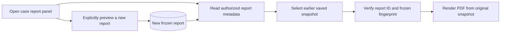

# Saved payment report history

Open **Export PDF** from the payment case, saved-case list or investigation workbench. **Saved reports** lists earlier previews with the original author, preparation time, format, selected evidence version, selected questions and reviewer status at the time the snapshot was saved. Expand a question count to inspect the selection. Ten reports load at a time; use **Load more saved reports** or **Refresh saved reports**.

**Download PDF** on a saved report uses its existing report ID and fingerprint. It does not create a new preview, change the report selection, substitute current evidence or regenerate a model answer. The PDF renderer renders the verified frozen JSON snapshot; byte-identical PDFs across future renderer changes are not guaranteed. Preparing a new preview is the explicit action for including later case changes. Historical reports with no format field retain the original Detailed presentation, and reports saved before case numbering retain their original snapshot contents.

## API

`GET /api/payment-cases/{caseId}/reports?limit=10&cursor=RPT-example`

- Authentication and current tenant, bank/branch and case access are checked. Internal case IDs and authorized case-number aliases are supported.
- `limit` defaults to 10 and accepts 1–25. Omit `cursor` on the first page. Continue with `nextCursor` until it is null.
- Pages use preparation time descending and report ID descending for ties. Timestamp comparison handles different ISO fractional precision. The cursor must belong to the same scoped case; it cannot be used to inspect another case.
- The response contains `schemaVersion: payment-case-report-history-v1`, canonical `caseId`, `items` and nullable `nextCursor`.
- Each item contains `reportId`, `reportHash`, `generatedAt`, `generatedBy`, nullable frozen `caseNumber`, `reportMode`, `includeEvidenceRows`, `reviewStatus`, nullable evidence `{id,version,sourceKind}` and investigations `{id,question,status,evidenceVersion}`.
- Full answers, cited source bodies, evidence rows, management notes and conclusion prose are excluded from history lists. One bounded frozen bundle is integrity-checked at a time while deriving metadata; no metadata is copied from current case records.
- Readable archived cases retain history and downloads. Deleted or no-longer-authorized cases return not found. List access does not grant case write permission.
- Responses are not cached. Listing is GET-only and creates no report, bank call, model call or PDF render.

The existing `POST /api/payment-cases/{caseId}/report.pdf` downloads a selected history entry using `{reportId,reportHash}` with session/CSRF protection and the existing render limits. A mismatched fingerprint or altered saved bundle fails verification.

Independent reviewer conclusions may now bind to selected evidence with an empty question set. Such a conclusion appears as Recorded only in a report with that exact evidence fingerprint and empty question selection; adding a question does not implicitly extend that review.

Automated coverage includes bounded/keyset pages, fractional-time ordering, legacy format handling, metadata minimization, frozen snapshot retrieval after current-case changes, hash validation, scope/alias checks, archived reads and deleted access rejection. Browser-component tests cover history refresh/pagination, isolated selection state, mismatched-history rejection and original ID/hash downloads without preview creation. This feature does not implement report retention or binary PDF storage.
