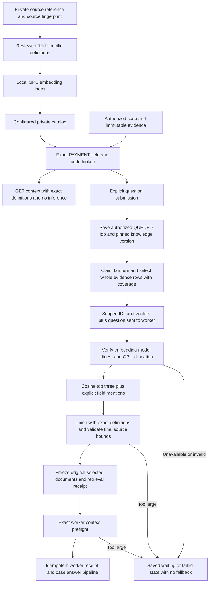

# Private status knowledge for case investigations

An optional private status catalog supplies field-specific reference definitions to saved Payment case investigations. It supplements the selected payment evidence and general tenant guidance. The existing local Qwen3 8B answer model, GPU generation settings, original `/uat/answer` baseline and historical answers remain unchanged. Building an embedding index and retrieving definitions does **not** train or fine-tune model weights.

When `poi.case-investigation.knowledge-index-file` is configured, the [unified case knowledge pipeline](CASE_KNOWLEDGE.md) supersedes the status-only semantic selection described below. It uses this catalog as the source of exact definitions and the overview, embeds all eligible knowledge alongside general guidance, and performs only one unified semantic search. The Knowledge library displays these same current source definitions and their index freshness. The status-only path remains available when unified indexing is disabled.

The catalog is an operator-configured local file. Source workbooks, extracted definitions, vectors and index-generation receipts stay in ignored private runtime storage. They are not public fixtures, payment evidence, a shared global knowledge store or data automatically learned from new transactions. The Knowledge library UI does not currently edit or approve this catalog.

## Scope and selection

Java first authorizes the saved case and evidence version using the existing tenant and bank/branch rules. Catalog eligibility then requires its configured tenant, evidence schema `fcr-case-evidence-v1` and table `PM_NEFT_TXN_LOG`. Entries define only `CODSTATUS`, `ACCTSTATUS` or `MSGSTATUS`. They do not automatically define similarly valued HOST/HISTORY fields, `N10_STATUS`, status lookup tuples or a payment's final outcome.

Catalog scope is tenant/schema/table/field based. It is not a bank/product/release approval registry. The applicability of the reference to a deployed bank release still needs source review and must be stated in the catalog overview.

| Action | Reference selection | Model work |
| --- | --- | --- |
| Read investigation context | Overview and exact field/code definitions observed in PAYMENT rows from `PM_NEFT_TXN_LOG` | None |
| Check readiness | Local source bounds, exact definitions and current knowledge/index metadata | None; model availability and exact context remain unchecked |
| Submit a new question | Save the authorized question first; the dispatcher later selects exact observed definitions, named field/code definitions and up to three semantic matches | At most one scoped query embedding on a cache miss during preparation, then the saved answer job |
| Read a saved answer or replay an existing idempotent submission | Previously frozen documents and answer | None |

Exact lookup preserves source text. Null, blank, unknown and differently spelled codes do not acquire another code's definition; a known value is not inferred from a nearby numeric value. A question may retrieve a definition that is absent from the payment's rows. That definition remains knowledge, not an assertion that the payment had that status. A similarity score is a retrieval score, not factual confidence.



## Configuration and index lifecycle

`poi.case-investigation.status-catalog-file` is optional and defaults to blank, which disables status-catalog retrieval while preserving the existing case workflow. Spring deployments may set `POI_CASE_INVESTIGATION_STATUS_CATALOG_FILE` to the absolute private catalog path. The existing `poi.case-investigation.guidance-file` independently supplies general tenant guidance.

The catalog has this structure, with actual definitions and vectors held privately:

```text
schemaVersion: fcr-status-knowledge-v1
tenantId: authorized tenant
evidenceSchema: fcr-case-evidence-v1
table: PM_NEFT_TXN_LOG
sourceSha256: source file SHA-256
embedding: {model, digest, dimensions}
overview: standard knowledge document
entries: [{field, code, label, document, vector}]
```

The supported embedding model is `qwen3-embedding:0.6b`, with 1,024 dimensions and the exact installed model digest. A digest may be lowercase 64-character hex with an optional `sha256:` prefix. The catalog is bounded to 2 MiB and 100 entries. Entry field/code pairs and document IDs must be unique; vectors must have the expected dimensions, finite components within `[-1,1]` and nonzero length. Standard knowledge documents retain their source file, sheet/range or locator. Invalid or unreadable configured catalogs fail visibly.

The private index lifecycle is explicit:

1. Preserve the source and fingerprint it. Review field names, labels, source ranges, applicability and any conflicts with older guidance.
2. Create compact field-specific knowledge documents and an overview that states source provenance and applicability limits. Reference definitions remain separate from payment observations.
3. Generate document vectors locally using the pinned embedding model and record the source/model fingerprints and build receipt. Keep the vectors and source copies private.
4. Validate the candidate catalog, selection behavior and complete case prompt budget before pointing the API at it. Preserve a prior catalog copy for rollback.
5. Rebuild when the reference source, chunking or embedding model changes. Never silently combine vectors from different embedding models. New questions use the current selection; saved investigations retain their original sources.

The request path does not rebuild the index, pull models, learn from saved answers or call the bank. It uses precomputed document vectors and creates only a question embedding on a cache miss. A bounded, model-digest-keyed cache can reuse a previously GPU-verified exact query vector; each request reranks its supplied index. A configured loopback HTTP Ollama address is required for this search; redirects and proxy inheritance are disabled. The worker checks the installed digest on every request. On a cache miss it requests GPU execution, verifies a positive GPU allocation and unloads the embedding model after the attempt; it caches only a successfully verified vector. Cosine ranking is recomputed for the current supplied index on hits and misses. This verification is an execution receipt, not an accuracy guarantee or a claim that every operation occurs exclusively on GPU.

## Submission timing and failure behavior

The explicit investigation POST authorizes and saves a `QUEUED` job before semantic selection, returning HTTP 202. The persistent dispatcher performs retrieval during `PREPARING`, freezes the original selected input and canonical hash, then performs exact worker context preflight before submission. The [durable job contract](CASE_JOBS.md) defines the 32-job global limit, four-job limit per tenant/actor, fair turns, cancellation and restart behavior. The separate **Check readiness** action uses local saved evidence and knowledge metadata; it performs no embedding or answer generation.

The internal search transport remains bounded to 150 seconds. Worker search has a default 60-second deadline, configurable with `POI_CASE_KNOWLEDGE_TIMEOUT_SECONDS` from 1 to 120 seconds, plus a bounded five-second unload attempt and up to one second waiting for the shared inference lock. These constrain preparation calls, not the investigation POST or total completion time. Selecting a case, evidence version or suggested question does not automatically embed a question or start an answer.

Temporary worker unavailability retains the saved question in `WAITING` under the durable job policy; invalid source, digest, GPU or search results remain visible failures. There is no implicit CPU/lexical substitute or replacement answer. After the worker input is frozen, transport retries use the same job identity and input. API restart reconnects to that receipt; an expired worker inference lease fails without automatic regeneration.

Saved evidence remains complete. A new question uses the [whole-row selector](CASE_EVIDENCE_CAPACITY.md), preserving original row IDs and values while recording selected and omitted coverage. All rows are supplied when they fit; larger versions retain their omitted rows in the source browser. Mandatory sources that cannot fit fail visibly. The selected worker bundle remains limited to 100 source documents and 50,000 source characters, with an independent complete-prompt check after freezing; these limits do not cap the saved evidence or knowledge inventory.


## Frozen provenance and preservation

Java unions the selected original knowledge documents with whole original evidence rows and their explicit selection coverage. New question inputs include a compact knowledge document `FCR-ENUM-RETRIEVAL`, containing the source fingerprint, embedding model/digest, GPU receipt, exact-observation document IDs, explicit-question document IDs and semantic IDs/scores. The catalog overview supplies the shared interpretation limits.

Those selected documents and the retrieval receipt enter the existing `guidanceHash` and frozen `inputHash`. Returned citations must preserve the supplied documents exactly. The receipt records the selected reference material; it does not freeze the entire vector index or prove a status interpretation. Old jobs and answers are never rebuilt from a newer catalog.

The durable `/case/jobs/submit` worker runs the same case answer engine, retaining every document in the frozen selected bundle and using BM25 to order supplied guidance. The legacy synchronous `/case/answer` route remains separate from the managed queue. Its `lexical-ranked-all-supplied` answer receipt describes that later stage; the separate frozen status-retrieval document identifies the preceding semantic selection. `model.actualCalls` continues to count answer-generation attempts, including the existing single possible correction. It does not include the earlier embedding request or its duration.

See [CASE_RAG](CASE_RAG.md) for answer validation and its limits, and [API_CONTRACT](API_CONTRACT.md) for the authenticated internal search interface. Current validation/deployment receipts are recorded separately in [STATUS](STATUS.md).
