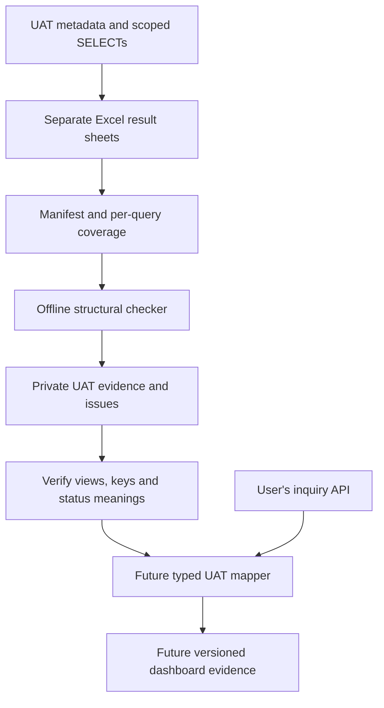

# UAT Excel and inquiry package handoff

Prepared 13 September 2026. The user is connecting to UAT and building a FLEXCUBE inquiry API in parallel. This milestone prepares read-only queries, an Excel template and an offline structural checker. It adds no Oracle connection or UAT application endpoint.

## Deliverables

- `runtime/obpm-uat/sql/00_verify_metadata.sql`: environment/metadata checks and numeric-format probes.
- Eleven SELECT worksheets beside it: originating payment, host subsequences/history, composite status mapping, core ECA master/detail/errors, accounting reference bridge/handoff and daily/historical ledger entries.
- `outputs/obpm-uat-handoff/NEFT_UAT_Export_Template.xlsx`: eleven source tabs plus Manifest, Coverage, Readme and Sources. No transaction records are prefilled.
- `tools/validate_uat_extract.py`: Python standard-library-only XLSX/CSV checker. It has no database, HTTP, model or application-import path.
- `runtime/obpm-uat/export-contract.json`: exact native headers, types, source selectors and supported within-group relationships.
- `runtime/obpm-uat/api/`: original FLEXCUBE package draft and interface notes. The user subsequently reported running all four functions and supplied their exports; Codex has not independently executed Oracle compilation or API integration.

User-provided `dbdata/` and local `runtime/` files are excluded from Git. Save populated workbooks and staging output under `runtime/obpm-uat/private/`. Exclusion from version control is not encryption or a redaction guarantee.

## Metadata received

The user's first five queries produced six files, including separate constraints and unique indexes. Their column export confirms all 159 selected native FCR/FCUBS columns and the planned data types. It does not establish a cross-product reference mapping or successful transaction query.

The revised query 6 returned 2,377 column rows for 83 OBPM objects: 63 views and 20 tables. Payment, queue and ECA retry/request/response columns are now visible. Several objects with `TB` in their names are views; `ZB` is not proof of a history table. Underlying dependencies, keys, view filtering and current-record semantics still require verification.

The metadata shows numeric references and character representations in inquiry views, source amounts with three decimal places and high-precision exchange rates. Keep source values unchanged. Do not round them to fit the demo's INR-only contract.

The supplied E062 example defines a record type, typed REF CURSOR, IN OUT parameters and a function returning NUMBER. Its current query returns hardcoded demo rows. It establishes interface conventions, not a completed NEFT source mapping.

The user subsequently reported PLS-00302 and requested removal of the hardcoded schema prefix. The draft now uses local table-column type anchors consistently across spec/body/helper and unqualified package/table names. The four SQL cursor blocks differ only by removing the owner prefix. Compile-context diagnostics are beside the package; successful Oracle compilation and intended-source resolution by the API caller remain unverified.

## First function exports reviewed, 13 September 2026

The user subsequently reported executing the four functions for one UAT payment while API redeployment was pending. The payment/host/history workbooks contain one, one and two rows respectively, with matching source counts, references and amounts. The status workbook contains headers only; successful zero-row lookup completion still needs the function result/fetch evidence. The report and exact-value source snapshot are retained privately under `runtime/obpm-uat/private/`, without changing the supplied workbooks or creating application fixtures.

The raw exports have a display ordinal in column A and an empty Sheet2. Real headers start in B. Manual inspection distinguishes those presentation cells; it does not claim the files passed the strict staging validator, and Manifest/Coverage is still absent. All populated values are text, preserving the long native reference.

Local source review found that the recorded message status can be written both before a queue write and in a custom OBPM SPS success-response path. Therefore an observed status change cannot establish the specific path, successful dispatch, a queue hold or the final payment outcome. The next useful evidence is the correlated SPS response and returned OBPM transaction identifier, then native OBPM status, confirmation and accounting records. Source correspondence with the deployed version remains unverified. No application import or model execution was performed for this offline review.

## Export sequence

1. Run the separate query-7 dependency/key worksheet for the remaining OBPM mapping. Keep its result sets separate. It reads metadata only.
2. Choose one payment and record reference namespaces. The FCR sheets use the originating host reference. Core ECA and incoming accounting references have separate selectors and require an established handoff correlation.
3. Confirm the source timezone and Gregorian session calendar. Database, session and laptop timezone settings alone do not establish the meaning of existing Oracle DATE values.
4. Execute the SELECT worksheets for the systems involved in this payment. Supply exact reference and branch/source binds, fetch all rows and retain every result group separately.
5. Import results as text into the matching workbook tab, preserving the row-1 headers. Numeric Excel cells are rejected: formatting a rounded ID as text cannot restore it. Source DATE strings have no appended UTC marker.
6. Complete Manifest and Coverage. COMPLETE requires the query scope, observation time and all rows fetched/exported. Other statuses require a reason. A completed empty query is distinct from one not run; record zero only after verifying completion.
7. Save the populated copy privately and run the checker. Use a new output directory for each execution so an old successful staging file cannot be mistaken for the latest result.
8. Reconcile source references, dates, status codes and filtering before adding a typed UAT application mapper. The bank-side API can use the same fields in parallel.

```powershell
python tools/validate_uat_extract.py `
  runtime/obpm-uat/private/NEFT_UAT_001.xlsx `
  --output-dir runtime/obpm-uat/private/check-001 `
  --stage
```

Python 3.10+ suffices. Alternatively supply a directory of UTF-8 CSV files, named for each exact data/Manifest/Coverage sheet. Excel's text-import workflow preserves IDs better than opening CSV directly.

Exit codes: 0 structurally valid; 2 validation issues; 1 unreadable input/configuration/output paths. Reports contain locations and codes, not transaction values. With `--stage`, valid input additionally creates private `native-evidence.json`, retaining classification UAT and exact source values. It always has `readyForDashboard: false` in this milestone.

## Flow and limits



Separate SELECTs can observe different database states. Their timestamps do not create a common snapshot. Account fields and raw message/error payloads are omitted, limiting account-specific ECA error/detail and accounting-role correlation. Multiple accounting-reference matches and daily/history overlap must remain visible rather than being joined or summed away.

The runtime still accepts the documented synthetic ECA contract. Changing UAT classification, dropping unsupported records or changing only the mock URL does not implement UAT integration. Structural validation does not prove payment outcomes, authenticity, redaction or bank-wide coverage. Timezone text is a declaration; the checker does not verify its database semantics or normalize source dates.

## Executed checks

- 29 original-fixture tests passed: long IDs, numeric-cell damage, exact signed/fractional/exponent money, formulas/errors, invalid dates, truncation, missing coverage, duplicate verified keys and incomplete-parent linkage.
- The untouched template correctly failed as an extraction with five issues: missing deployment, timezone, payment reference and export timestamp, plus no transaction rows.
- An original record added only in memory to the actual template passed its full export contract with exact three-decimal source money preserved and dashboard readiness still false. The workbook file was not modified.
- All 15 workbook sheets were visually reviewed across 41 rendered sections. Saved-file checks verified headers, formats, empty source rows, coverage defaults and frozen panes. The exporter returned a nonzero exit after saving; independent saved-file checks passed and the anomaly is retained locally.
- SQL columns/types were checked against supplied metadata. No UAT transaction SELECT, package compilation, API integration or new model invocation was performed by Codex.

Detailed local notes are under `runtime/obpm-uat/`, including the independent checklist, SQL mapping notes, payment/queue findings and workbook receipts. The supplied Excel files remain unchanged.

The [dated validation summary](validation/uat-preparation-2026-09-13.json) records these results and the remaining work.
