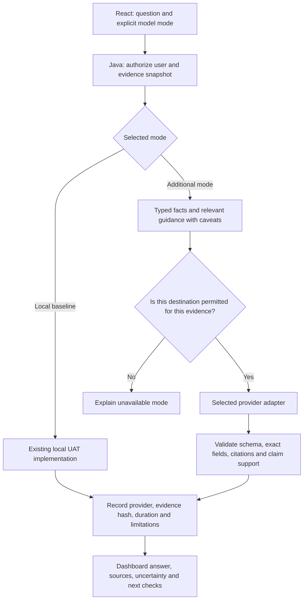

# Inference options for Payment Operations Investigator

**Subsequent implementation:** the user later authorized the isolated Intel GPU experiment. It achieved a measured 101.750-second full request versus the historical 640.306-second CPU response; factual review still failed. See [the implementation and benchmark](../validation/native-gpu-2026-09-13.md) and [separate setup](../NATIVE_GPU_SETUP.md). References to deferred runtime work below describe this earlier research stage.

## Decision and scope

**Preserve the current local Qwen model and add a separate model mode when integration is requested.** The user explicitly wants the existing approximately ten-minute implementation available for demonstrations, with its optimization deferred. This report changes no application code, model configuration, running service or provider connection.

Research checked **13 September 2026**. It compares OCI Generative AI, internal Oracle access, the user's existing GPT-6 Astra access, other hosted inference, and acceleration on the current laptop. Sources are official product documentation, original model/project documentation and the project's recorded measurements. Search coverage included model availability, regional deployment, billing units, authentication, structured output, retention and Windows Intel acceleration. Account entitlements and actual alternative-provider latency remain unverified.

Recommended order:

1. Retain **Local baseline — Qwen3 8B** for the existing private demonstration, including its evidence and limitations.
2. Prepare a **separate hosted mode** and compare a small number of candidates using original synthetic payment evidence. For an Oracle-focused portfolio, OCI is the most relevant first integration to evaluate.
3. Use **GPT-6 Astra in this chat for development and review**. Website inference requires an appropriate programmatic access route; the user's current access is through Codex/ChatGPT.
4. Keep **local GPU acceleration** as a later independent experiment, following the user's latest instruction.

This ordering is an engineering recommendation, not a measured ranking of model accuracy or speed.

## What is taking ten minutes

The existing [validation receipt](../validation/uat-qa-timeout-fix-2026-09-13.json) records one cold `qwen3:8b` response through Ollama. The current runtime uses CPU inference in a Rancher/WSL container with four inference threads.

| Measured component | Time | Meaning |
|---|---:|---|
| Process 6,474 input tokens | 415.8 seconds | Approximately 65% of the total |
| Generate 460 output tokens | 212.2 seconds | Approximately 33% of the total |
| Remaining measured overhead | 12.3 seconds | Not separately attributed |
| Total worker/provider duration | **640.3 seconds** | Approximately 10 minutes 40 seconds |

There was **one model call**, not repeated agent deliberation. The configured 32K context is capacity; the actual input was about 6.5K tokens. Every question currently includes nine evidence documents and five guidance notes; ranking changes their order without excluding any.

Longer timeouts allowed this answer to complete. They did not accelerate inference. Even perfect reuse of the input computation would leave approximately 212 seconds of generation at the observed rate and length. Reducing API/UI overhead alone cannot remove the main delay.

The same receipt records **failed factual review**: incorrect field naming, a status value assigned to the wrong field, and an inadequate direct answer to the acceptance question. Successful generation is valid demonstration evidence; verified payment analysis remains a separate requirement. Preserve both findings when comparing alternatives.

## Options worth considering

| Route | Role in this project | Main constraint | Priority |
|---|---|---|---|
| OCI on-demand Generative AI | Additional hosted inference behind the existing Python service | Model/region availability, account access and data-processing terms | First Oracle integration candidate |
| Approved internal Oracle inference gateway | Potential enterprise route if the user has service entitlement | No usable endpoint, terms or entitlement verified | Investigate only from approved API documentation |
| OpenAI API, including Astra | Additional reasoning/review mode | Separate API access and usage billing | Conditional on access and budget |
| Codex SDK/App Server | Trusted local or internal agent integration | Execution permissions and app entitlements; unsuitable as an exposed public agent runner | Optional local prototype |
| Google Gemini or Groq API | Low-cost candidates for a synthetic speed/quality comparison | Model-specific limits and external processing | Shortlist alternatives |
| Azure Foundry or Amazon Bedrock | Enterprise deployment in an existing approved cloud | Account, region, model and networking configuration | Useful where already adopted |
| Native Windows Ollama using Intel GPU | Later local acceleration experiment | Driver/backend discovery and actual GPU offload | Deferred by user |
| llama.cpp Vulkan/SYCL or OpenVINO | Alternative local runtimes if Ollama acceleration is insufficient | New adapter, model/schema validation and setup | Deferred fallback |
| Private GPU server or cloud GPU VM | Self-hosted inference with controlled deployment | Hourly capacity cost, patching and operations | Later, if demand justifies it |
| Smaller model and prompt/cache changes | Improve the computational workload | Can reduce evidence quality if applied carelessly | Separate future experiment |

The following sections provide evidence and limitations for these options. This covers the practical classes of solution rather than claiming to enumerate every vendor.

## Oracle: which services help

### OCI Generative AI inference

Oracle's managed service offers foundation models from several providers. Buying an Oracle-hosted model does not supply knowledge of the bank's custom NEFT implementation; our evidence retrieval, field definitions and source citations remain necessary. [Oracle model catalogue](https://docs.oracle.com/en-us/iaas/Content/generative-ai/pretrained-models.htm)

| Candidate | Verified regional consideration | Proposed use |
|---|---|---|
| Cohere Command A | On-demand available in Hyderabad | First OCI-hosted candidate where India deployment is needed |
| OpenAI gpt-oss-20b / 120b | On-demand in Osaka, Frankfurt and Chicago; Hyderabad requires dedicated capacity | Low-cost synthetic comparison where those regions are suitable |
| Gemini 2.5 Flash | Hyderabad endpoint available, but calls Google externally | Candidate only after checking the external processing arrangement |
| Gemini 2.5 Flash-Lite | Not on-demand in Hyderabad in the checked matrix | Inexpensive candidate in a supported region |

Mumbai is absent from the checked model-region matrix. Endpoint location is not sufficient proof of where externally hosted models process data. Oracle specifically describes external Google processing for Gemini; do not apply a blanket India-only or OCI-only claim to it. [Region matrix](https://docs.oracle.com/en-us/iaas/Content/generative-ai/model-endpoint-regions.htm), [Gemini Flash service details](https://docs.oracle.com/en-us/iaas/Content/generative-ai/google-gemini-2-5-flash.htm), [data handling](https://docs.oracle.com/en-us/iaas/Content/generative-ai/data-handling.htm)

**Integration approach:** add an OCI adapter behind the current Python answer service, retaining React, Java authorization, snapshots and answer validation. Current LangChain documentation uses `langchain-oci` and `ChatOCIGenAI`. Configure the model, regional endpoint, compartment and OCI authentication explicitly. Structured output and authentication options vary by model; an OpenAI-style endpoint does not make every model interchangeable. [LangChain OCI integration](https://docs.langchain.com/oss/python/integrations/chat/oci_generative_ai), [OCI API authentication options](https://docs.oracle.com/en-us/iaas/Content/generative-ai/api-keys.htm)

Use on-demand for the first comparison. A dedicated cluster adds capacity commitments and operational decisions before we have measured demand. Avoid copying old Command R/R+ tutorials without checking retirement dates; Oracle lists July 2026 retirement for the older August 2024 models. [On-demand service](https://docs.oracle.com/en-us/iaas/Content/generative-ai/pay-on-demand.htm), [model retirement schedule](https://docs.oracle.com/en-us/iaas/Content/generative-ai/deprecating-on-demand.htm)

### Internal Oracle employee tools

**No internal Oracle model-serving endpoint or entitlement has been established for this project.** Access to an employee chat/search interface, Oracle employment, or an internal source browser does not establish an API the website can call.

The useful next evidence would be approved documentation naming the service endpoint, authentication method, allowed caller applications, model IDs, quotas, logging/retention and permitted data classification. No credentials are needed for that documentation review. A service with approved bank/UAT processing could be a strong choice; its existence, cost and performance must remain open questions until verified.

This research did not query restricted Oracle employee search tools or send the bank exports to an external model.

### OCI Agents, Select AI and private GPU hosting

**OCI Generative AI Agents** supplies managed RAG and tool orchestration. It could call a future inquiry API, but migrating orchestration is more work than adding inference, and adds no demonstrated speed guarantee. Its checked region list differs from the model service and does not list an India region. [Agents overview](https://docs.oracle.com/en-us/iaas/Content/generative-ai-agents/overview.htm)

**Oracle Select AI** provides database-integrated natural-language querying, RAG and model calls through supported database services. It still needs an inference provider. Its availability must be checked against the actual database platform; OBPM 14.7 alone does not establish support. Since this project will receive data through an inquiry API, Select AI is not a prerequisite. [Select AI overview](https://docs.oracle.com/en/database/oracle/oracle-database/26/selai/select-ai-about.html)

**Self-hosting on a private GPU server** is another architecture option: retain the inference API but operate the model runtime ourselves. This can suit sustained workloads or an approved private environment. For this portfolio's current traffic, it introduces capacity expense and maintenance before proving an advantage over managed on-demand inference. No VM shape, price or performance has been selected or verified here.

## What the user's Astra access provides

The user confirmed GPT-6 Astra Ultra access **inside Codex and ChatGPT**, including this chat. OpenAI documents subscription sign-in and API-key sign-in as distinct access paths; API-key usage is billed through the OpenAI Platform account. Current app access does not establish an API key or API budget for the website. [Authentication and billing paths](https://learn.chatgpt.com/docs/auth)

The documented API model is `gpt-6-astra`. It supports streaming and structured outputs. Its listed reasoning efforts are `low`, `medium`, `high`, `xhigh` and `max`; this research does not establish `ultra` as an API parameter. If API access is later supplied, compare lower reasoning effort for short evidence questions and greater effort for difficult reviews. Maximum reasoning is not automatically the best latency choice. [Astra model reference](https://developers.openai.com/api/docs/models/gpt-6-astra)

There are two qualified alternatives to ordinary inference APIs:

- **Codex SDK/App Server** supports programmatic local agents and custom clients. It can be considered for a trusted local/internal prototype with suitable entitlements and constrained permissions. It is not permission to expose a Codex process, filesystem tools or subscription credentials to arbitrary website visitors. General API inference is the cleaner serving boundary for the portfolio web application. [Codex SDK](https://learn.chatgpt.com/docs/codex-sdk), [Codex authentication guidance](https://learn.chatgpt.com/docs/auth)
- **Workspace Agents API** can trigger a published agent using an admin-enabled scoped token. The checked documentation says the generated response cannot currently be retrieved through that API, although run status can be polled. It therefore does not directly solve returning answer text to our dashboard. The user's workspace eligibility is also unverified. [Trigger API](https://developers.openai.com/workspace-agents/trigger-runs), [token requirements](https://developers.openai.com/workspace-agents/authentication)

Astra remains useful here for building the application, designing synthetic evaluations and reviewing implementation. That is separate from which runtime answers questions on the website.

## Other hosted services

**Google Gemini:** Gemini 3.1 Flash-Lite is a documented stable model; Gemini 2.5 Flash/Lite provide further comparison points. Choose based on our measured structured-answer quality, not the name alone. Google's unpaid API terms restrict sensitive/confidential inputs; paid and enterprise routes have different handling terms. Use newly created synthetic evidence for an initial comparison. [Model documentation](https://ai.google.dev/gemini-api/docs/models/gemini-3.1-flash-lite), [API terms](https://ai.google.dev/gemini-api/terms)

**Groq:** its production gpt-oss-20b/120b offerings support strict structured output. The documented structured-output mode currently cannot be combined with streaming or tool use; our adapter must respect that contract. Published generation rates are vendor measurements, not our end-to-end latency. The free tier's listed 8K tokens/minute for these models is tight for a roughly 6.5K-token request. [Models](https://console.groq.com/docs/models), [structured output](https://console.groq.com/docs/structured-outputs), [limits](https://console.groq.com/docs/rate-limits)

**Azure Foundry:** useful if the organization already has an approved Azure model deployment and private networking. Model seller, Global/Data Zone/regional deployment and retention settings matter. This research did not verify account-specific model access or a price. [Azure model data handling](https://learn.microsoft.com/en-us/azure/foundry/responsible-ai/openai/data-privacy), [private networking](https://learn.microsoft.com/en-us/azure/foundry/how-to/configure-private-link)

**Amazon Bedrock:** another enterprise inference route with private endpoint options and selected latency-optimized offerings. Cross-region routing and model-specific terms need inspection. Its structured-output documentation warns that compiling a new schema can take minutes, with subsequent reuse benefiting from caching; cold and warm runs therefore matter. [Latency options](https://docs.aws.amazon.com/bedrock/latest/userguide/latency-optimized-inference.html), [structured output](https://docs.aws.amazon.com/bedrock/latest/userguide/structured-output.html), [private endpoints](https://docs.aws.amazon.com/bedrock/latest/userguide/vpc-interface-endpoints.html)

Data settings are not interchangeable between services. For example, OpenAI API data is not used for training by default, but retention controls remain endpoint/account dependent; Groq also documents exceptions and optional retention controls. Selecting a model requires identifying the actual destination and applicable settings. [OpenAI API data controls](https://developers.openai.com/api/docs/guides/your-data), [Groq data controls](https://console.groq.com/docs/your-data)

## Illustrative inference costs

These are **USD list-price calculations**, checked on the research date, for **6,500 uncached input tokens and 500 total billable output tokens** per answer. Billable output must include reasoning tokens where charged: 500 visible answer tokens alone is not this assumption. Different tokenizers will produce different actual counts. These calculations exclude retries, tools, hosting, storage, network charges, taxes and negotiated pricing; they are not invoices or latency measurements.

| Provider/model | Input / output per 1M tokens | One example answer | 1,000 example answers |
|---|---:|---:|---:|
| OCI gpt-oss-20b | $0.07 / $0.30 | $0.000605 | $0.605 |
| OCI gpt-oss-120b | $0.15 / $0.60 | $0.001275 | $1.275 |
| OCI Gemini 2.5 Flash-Lite | $0.10 / $0.40 | $0.000850 | $0.850 |
| OCI Gemini 2.5 Flash | $0.30 / $2.50 | $0.003200 | $3.200 |
| Groq gpt-oss-20b | $0.075 / $0.30 | $0.0006375 | $0.6375 |
| Google Gemini 3.1 Flash-Lite | $0.25 / $1.50 | $0.002375 | $2.375 |
| OpenAI GPT-6 Astra, Standard | $10 / $50 | $0.090000 | $90.000 |

Sources: [Oracle global price list, printed pages 9, 11 and 13](https://www.oracle.com/middleeast-ar/a/ocom/docs/corporate/pricing/oracle-paas-and-iaas-global-price-list.pdf), [Groq prices](https://console.groq.com/docs/models), [Google pricing](https://ai.google.dev/gemini-api/docs/pricing), [Astra pricing](https://developers.openai.com/api/docs/models/gpt-6-astra).

**Cohere uses different units through OCI:** the checked Large Cohere rate is $0.0156 per 10,000 character transactions. At an assumed 30,000 total input-plus-output characters, that is **$0.0468 per answer, or $46.80 per 1,000**. Do not treat characters as tokens or assume a fixed conversion for our actual prompt. Oracle defines its billing transaction unit in the [on-demand documentation](https://docs.oracle.com/en-us/iaas/Content/generative-ai/pay-on-demand.htm).

Oracle's numeric prices were read from PDF text extraction; attempted screenshot retrieval was unavailable. Recheck the selected regional SKU in the tenancy before provisioning. The prices establish plausible cost differences, not the best quality-per-dollar choice. Astra Fast mode lists twice the applicable Standard rates; no Fast-mode latency was measured here. [Astra pricing details](https://developers.openai.com/api/docs/models/gpt-6-astra)

## Deferred local acceleration

The laptop has a Core Ultra 7 268V, integrated Intel Arc 140V and about 32 GB system RAM. Graphics memory is shared; a driver-reported 16 GB label does not establish a dedicated 16 GB GPU. Actual inference-device visibility inside the current container remains the relevant issue.

The first later experiment should be **native Windows Ollama with Vulkan**, isolated from the baseline service. Ollama v0.34.0 documents Vulkan enabled by default when that backend is installed. Detection, driver compatibility, offloaded layers and performance must still be measured. Moving the same CPU-only workload out of Docker is not itself a proven speed improvement. [Versioned Ollama hardware documentation](https://github.com/ollama/ollama/blob/v0.34.0/docs/gpu.mdx)

If needed, compare **llama.cpp Vulkan/SYCL**; its SYCL documentation explicitly lists Lunar Lake integrated Arc. **OpenVINO GPU** is another candidate. **NPU inference** requires compatible model export, context and compilation settings, so it is a later experiment for this long evidence prompt. Avoid old IPEX-LLM recipes: Intel archived that project and reports known security issues. [SYCL support](https://github.com/ggml-org/llama.cpp/blob/master/docs/backend/SYCL.md), [OpenVINO NPU guidance](https://docs.openvino.ai/2026/openvino-workflow-generative/inference-with-genai/inference-with-genai-on-npu.html), [IPEX-LLM status](https://github.com/intel/ipex-llm)

These experiments will use separate configurations. The current baseline's model, timeouts, context and keep-alive remain preserved.

## Proposed application flow

This is a future design, not an implemented provider switch.

The baseline keeps its current behavior and experimental warning. New validation can report baseline findings externally without silently rewriting its generated text. Future modes should retain provider identity, model version, source snapshot/hash, timing, token usage where available and validation results. A failure must not silently switch from local to cloud, or present a saved answer as fresh generation.

Improvements to investigate **only in a new mode or a later explicitly scoped baseline optimization**:

- **Answer exact data questions from typed evidence.** Amounts, timestamps and field values should be copied/calculated by code; the model generates the explanation. Values remain dynamic, not hardcoded payment answers.
- **Retrieve relevant evidence with its dependencies.** Include definitions, conflicting records and uncertainty notes for every cited field. Dropping caveats to save tokens can create faster but wrong conclusions.
- **Reduce repeated serialization and unnecessary prose.** Retain complete originals for inspection, while sending a compact faithful representation. A concise output instruction is preferable to a cap that truncates JSON.
- **Cache safely.** Key reused answers by tenant/access scope, snapshot hash, question, model and prompt/schema version; label them as cached. Provider prefix caching is a separate optimization.
- **Improve waiting behavior.** Streaming or a resumable background job can improve perceived responsiveness, but does not remove computation. Display validated claims only; partial JSON is not a verified answer.
- **Avoid extra model calls without evidence of benefit.** More agents, sequential model critics or unconditional retries can add cost and latency. Fine-tuning or changing vector databases is not an established solution to this CPU inference bottleneck.

## Implementation and evaluation sequence

1. **Preserve the demonstration baseline.** Record code/configuration hashes and its existing measurement and failed factual review. Keep its selectable route when new modes are implemented.
2. **Create original synthetic evaluation cases.** Include confirmed acceptance, unknown acceptance, rejection, conflicting statuses, absent history, returns and missing beneficiary-credit evidence. Change references, dates, amounts and statuses across cases. Expected outcomes must be held outside model context.
3. **Build one additional adapter contract.** Return generated claims, citations, missing evidence, provider identity and timings. Keep credentials server-side. Start with synthetic fixtures and retain the existing React/Java stack.
4. **Benchmark a small shortlist.** First OCI Command A for an Oracle-hosted Hyderabad candidate; optionally compare gpt-oss-20b or Gemini Flash-Lite in permitted regions. Astra becomes an additional candidate if suitable programmatic access and budget are available.
5. **Measure quality and latency together.** Use at least 20 distinct cases for an initial smoke evaluation, with cold/warm repeats and concurrency 1 and 3 where quotas permit. Record p50/p95 total time, time to first usable content, schema failures, citation support, exact-field correctness, outcome polarity, appropriate abstention and actual billed usage. Twenty cases is a screening set, not production proof.
6. **Use explicit targets.** Proposed initial targets are p50 at most 10 seconds and p95 at most 30 seconds for a concise hosted answer. These are goals, not promised performance. Require zero unsupported definitive payment outcomes in the screening set; inspect failures before promoting any mode.
7. **Add dashboard comparison after evaluation.** Show Local baseline and the validated additional mode distinctly. Use the same evidence and question for fair comparisons, and label when prompt, output length or model differs. Do not run all providers on each normal user question.
8. **Connect actual UAT data only to an explicitly authorized destination.** Existing authorization covers the private local website/Ollama workflow. Initial hosted tests use synthetic data; no external authorization is inferred from Oracle employment or ChatGPT access.
9. **Return to local acceleration later.** Run an isolated Intel GPU test when requested, preserving the original baseline for comparison.

## Evidence limits and supporting notes

No alternative model was called, no service was purchased, and no private UAT records were uploaded during this research. Official availability does not prove the user's account has quota. Provider benchmarks do not establish our first-token time, end-to-end latency or payment accuracy. The result is a concrete shortlist and implementation/evaluation plan, with runtime changes deferred.

Supporting source inventories and technical details:

- [OCI inference research](oci-inference-options-notes.md)
- [Hosted alternatives research](hosted-inference-options-notes.md)
- [Local acceleration research](local-inference-options-notes.md)
- [Existing UAT model design](../UAT_MODEL_QA.md)
- [Measured baseline and semantic review](../validation/uat-qa-timeout-fix-2026-09-13.md)

External sources are linked beside the claims they support; all were checked on 13 September 2026. Performance targets, prioritization and the proposed application flow are recommendations derived from the project evidence, not vendor promises.
