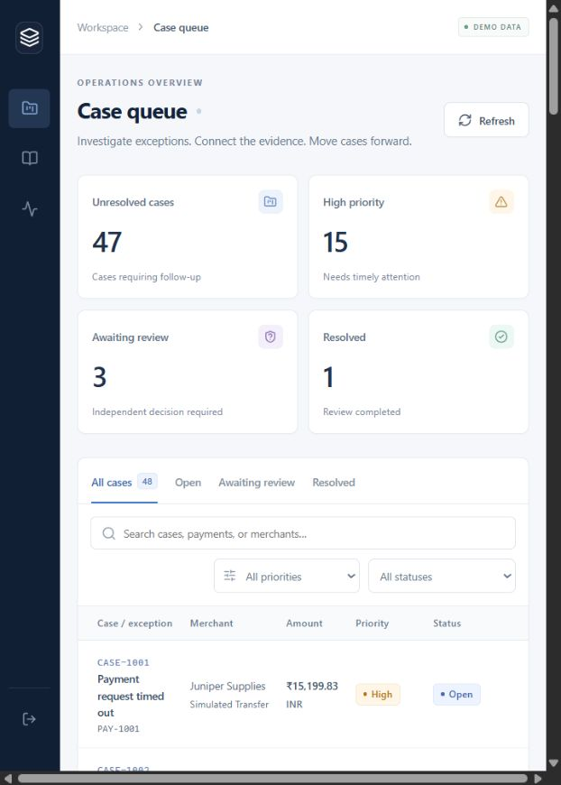
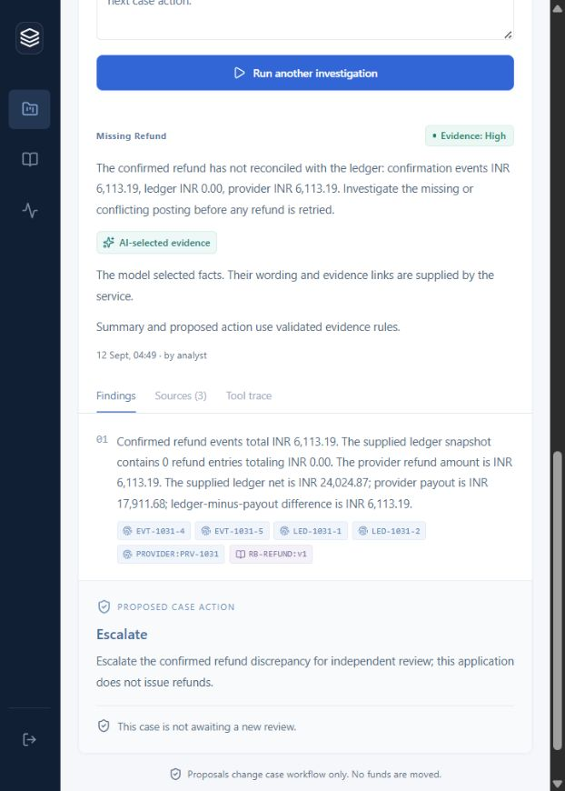

# Actual application captures

Captured from the running React application on 12 September 2026 with the CUA browser API. These are unedited captures of synthetic records, not design mockups. The narrow Codex browser panel determines the image size; desktop and mobile inspection limits are recorded in the [browser receipt](../validation/frontend-browser-v6b.json).

## Case queue

The authenticated Northstar workspace after the final cached startup. Counts reflect retained demonstration history and will change as cases are reviewed. The table scrolls horizontally in the narrow panel.

## Reviewed refund investigation

CASE-1031 shows the model-selected facts, service wording, exact evidence links and the independently approved escalation. The saved result used actual local chat inference and hybrid retrieval; its [execution report](../validation/live-hybrid-java-v6b.json) and [browser review](../validation/frontend-browser-v6b.json) identify the precise investigation. The mode control above a saved result configures the next request and does not relabel historical evidence.

