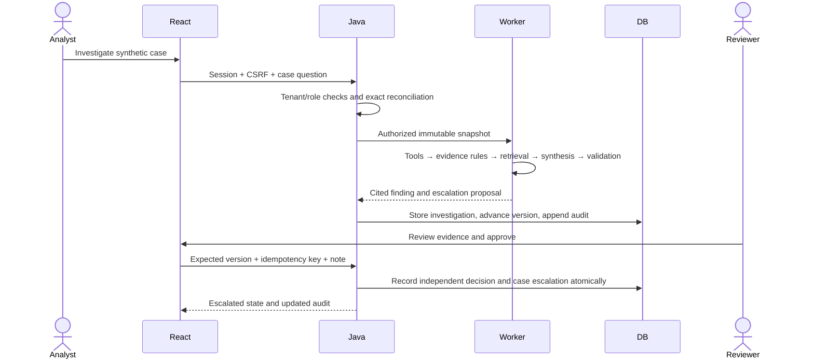

# Foundation validation — 12 September 2026

## Scope
First integrated local development milestone. This records observed execution, not a production release or complete seven-day delivery.

| Layer | Executed check | Result |
| --- | --- | --- |
| Data | tools/generate_data.py and --check | 60 cases / 15 runbook versions; exact regeneration and money invariants pass |
| Worker | pytest using workspace temporary directory | 31 tests passed at initial integration; subsequent pgvector work requires its own evidence |
| Java | Maven integration and money tests | 18 passed at initial integration; additional hardening is in progress |
| React | npm run build; npm test | Build passes; 10 tests passed |
| Real HTTP | tools/acceptance.py --mode replay | 17 checks passed against running Java and worker |
| Replay benchmark | tools/evaluate.py --split test --mode replay | 30/30 expected outcomes/actions; 0 model calls |
| Browser | In-app Chromium, default 1280 × 720 | Analyst → investigation → citation → independent reviewer → escalation → audit passed |

## Browser scenario
1. Signed in as the Northstar analyst through the React login form.
2. Searched for CASE-1031 and opened its payment timeline.
3. Ran a replay investigation through React → Java → Python. Case changed to AWAITING_REVIEW.
4. Opened RB-REFUND:v1 from the finding. The saved source excerpt and version were visible.
5. Signed out and signed in as the independent Northstar reviewer.
6. Entered a review note and approved the stored escalation proposal.
7. Observed case status ESCALATED and an audit record with the reviewer identity and note.

Case: CASE-1031. Stored investigation: INV-a07775e3-0234-4e5a-9641-d361d5cbb8c8. These are synthetic workflow mutations. No financial transaction occurred.

## Issues found and disposition
- Java host networking failed during selector initialization. A scoped per-process JVM property forces the supported TCP fallback. Startup and tests succeeded without changing machine configuration.
- Initial browser attempt preceded Vite startup and returned connection refused. Retested in a fresh local tab after startup; the application journey passed.
- Small secondary UI text and repetitive implementation warnings reduced readability. Frontend is increasing contrast/font sizes and moving provenance to tool details.
- Confidence was visually ambiguous with priority. Updated to an explicit Evidence: High label.
- Refund prose exposed raw minor-unit amounts and cited a request ahead of confirmation. Worker refinement is underway; new results must be separately validated. Stored old investigations remain immutable.
- API audit/export, maker-checker, stale version and idempotency controls passed real HTTP acceptance. Additional JSON-safe amount bounds and proposal validation are being tested before restart.

## Interpretation
The 30 held-out rows vary amounts and identifiers within six defined templates. They demonstrate deterministic workflow consistency and retrieval applicability, not generalization to unseen banking systems. Valid identifiers do not by themselves prove that generated prose is entailed by its cited sources. No successful local-model inference or pgvector retrieval is claimed in this milestone.

## Actual flow

