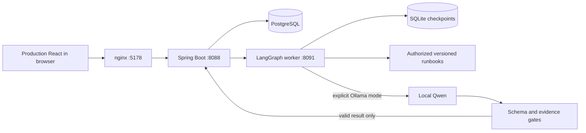

# Container integration and evaluation — 12 September 2026

This is a historical integration milestone, with later corrections appended below. Component counts and the word "final" describe the revision at that stage. Use [current delivery status](../STATUS.md) and the source-hashed validation receipts for the current release.

## Executed checks

The final Java, worker and React sources built as Docker images. The application runs in its dedicated Compose project with PostgreSQL and persisted worker checkpoints. PostgreSQL and worker health checks passed, and nginx serves the production React assets on port 5178. The unrelated AutoPay Guard stack was preserved.

| Check | Observed result | Evidence |
| --- | --- | --- |
| Java suite | 23 passed | API validation and Surefire reports |
| Worker suite | 50 passed, including real restricted-role PostgreSQL and actual Ollama adapter encoding | Worker README and pytest report |
| React suite/build | 18 passed; production build succeeded | Frontend README and build output |
| Production proxy acceptance | 17/17 passed against React/nginx → Java → worker → PostgreSQL | acceptance-compose-replay.json |
| Native bounded reads/controls | 16 checks, 40 authenticated reads at up to four clients; 73 total response IDs verified | reliability-native.json |
| Paired baseline comparison | Identical 30/30 decisions; expected policy in top three 30/30 and first 25/30; 60 repeat hashes match | baselines-test.json |
| Original dataset regeneration | 60 cases, 15 versions; exact content check passed | Generator --check output |
| OpenAPI coverage | 14 paths, 15 operations, 43 schemas; all 144 references resolved | validate-openapi.py output |

No remote CI run has occurred. Local tests, containers and browser checks do not establish production readiness or real-world AI accuracy.

## Browser observations after container transition

The old development session expired after the Java process was replaced. Refreshing the case returned the user to login, and signing in again recovered access. A fresh in-app browser tab loaded the production React build through nginx, accepted the analyst login, and displayed the 48 authorized Northstar cases with dashboard counts and recorded PostgreSQL decisions.

The complete refund journey then passed again in the production build: searched CASE-1031, ran replay, inspected RB-REFUND:v1, observed exact INR 6,113.19 and both request/confirmation evidence links, signed out, signed in as the independent reviewer, and approved escalation with an evidence-specific note. The case became ESCALATED; the audit identified the reviewer and recorded the note. PostgreSQL investigation ID: INV-3090c43f-e41b-4737-b021-2ceeac8e5c53. This is a synthetic case-workflow change; no financial operation occurred.

The native Node and Python processes initially resisted a normal Windows stop call. Their exact command lines and tracking PIDs were verified, then those two processes were force-stopped. Docker exclusively owns the project's published ports after transition. Native H2 data and old immutable investigations remain on disk; the Compose app uses its separate PostgreSQL store.

## Live-model validation remains separate

A historical Qwen development probe completed after checkpoint recovery, but synthesis took 545.62 seconds. Review exposed a missing declared evidence link; the current validator rejects that case. Compact context, explicit nonstreaming requests, bounded output and stronger reference validation were subsequently tested.

The first fresh compact-model acceptance through nginx/Java failed explicitly: worker returned 422, Java returned 503 WORKER_UNAVAILABLE with request ID 2c15234e-4da3-4774-bfa0-e2d915e57a11. Both model calls completed: selection took 94.52 seconds and synthesis 103.15 seconds. Checkpoint inspection found an established outcome with empty findings and insufficient confidence. Final evidence validation rejected it before storing an investigation. Conditional provider schema and confidence validation are being strengthened. This is not a passed live acceptance result or an implicit replay substitution. Preserve the failed run log and consult STATUS.md for subsequent attempts.

## Pending at this record

Controlled worker/database outage recovery passed seven checks in 58.735 seconds; see faults-compose.json. The worker failure caused no case transition or stored investigation and produced exactly one new failure audit. Worker and database restart restored readiness; exact case, investigation and failure-audit bodies survived. Final recovery verified both dependencies with no pending recovery or errors. Observed stop-attempt-to-readiness intervals were 16.297 seconds for the worker and 39.171 seconds for PostgreSQL, including intentional test work; these are not production recovery objectives.

Independent review exposed a payout-discrepancy resolution gap. Three new real HTTP adversarial cases failed against the older image, as recorded in adversarial-payout-before-fix.json. Both Java and worker guards were fixed. The final Java Docker build passed 29 tests, including worker-identity and nested-evaluation-key import checks; worker tests passed 67. Rebuilt images are active. Expanded adversarial HTTP checks pass 13/13, real nginx acceptance passes 17/17, and frozen replay evaluation remains 30/30. The local source comparison was rerun with 60 matching repeat hashes; no change was tuned against the five policy-ranking misses.

Fresh-volume rehearsal then passed 17/17 against a separate generated Compose project, including PostgreSQL initialization, restricted vector-role bootstrap, worker startup, production React entry point and independent review through nginx. The manifest records 40.122 seconds overall and verifies no remaining rehearsal containers or volumes after cleanup. See rehearsal-compose.json and acceptance-clean-compose.json. The main project's records were retained. This was built source with fresh data volumes, not a remote clone.

Successful final live-model acceptance, combined live-model/hybrid integration, and final source packaging still require their own execution evidence.

