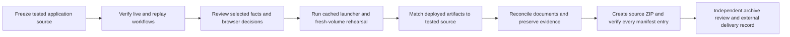

# Local portfolio release milestone — 12 September 2026

The application implements the seven-day plan's local portfolio scope: React investigation/review UI, Java payment-case authority, typed LangChain tools and LangGraph execution, versioned RAG, original data, reliability checks and documented flows. Milestones finished within the delivery window; no seven-day uptime or production deployment is claimed.

## Final design and evidence

The current model returns scoped tool names and one or two fact IDs. Authorized operational observations become a service-owned catalog; selected sentences and their links are rendered verbatim. Rules own diagnosis and proposed case action. The UI distinguishes these origins. This narrower contract followed preserved free-prose timing/action errors; it still requires reviewing selection coverage, catalog correctness and source quality.

Current component results are 35 Java, 198 worker and 34 React tests. V6b actual HTTP workflow passes 17 checks, adversarial probes 16, and deterministic evaluation 30 template variants with zero model calls. Live Java acceptance also passes 17 checks with four chat calls across two investigations. The six-family development run accepts six results using eleven calls: five fact selections and one explicit planner-only response. All five selected findings include the available distinguishing observation; this small Codex-reviewed sample is not an accuracy study.

Combined Java/hybrid execution retrieves the refund policy using real embeddings and persistent pgvector, then saves the exact selected refund/settlement facts. Provider logs show two successful chat requests and one embedding request in the serial probe window. Logs do not carry a shared distributed request ID, and chat metrics exclude embedding requests.

The browser's reviewer approved `INV-938271e8-198e-4721-b883-80fd8c33c17f` with decision `DEC-732f8275-7690-4d5e-8ef2-a5b363944181`. CASE-1031 became ESCALATED at version 5. The exported investigation, events, ledger, webhooks and provider snapshot remained unchanged. Actual screenshots and 14 browser observations are saved separately.

The full cached-model launcher passed in 21.181 seconds. The final uniquely scoped fresh-volume rehearsal passed 17 checks in 27.11 seconds, including disposable container/volume removal and absence verification. These are local cached timings, not first-install, clone or capacity claims. Final runtime uses the checked-in lexical/4B default. All 45 recorded source hashes match; the running Java jar matches the tested build byte for byte, ten running worker modules match, and the served JavaScript matches the tested production bundle. Whole-image equivalence could not be asserted because an older manifest identifier was no longer locally resolvable.

## Delivery and boundaries

The [evidence index](README.md) links each measurement. [Status](../STATUS.md), [setup](../SETUP.md), [demo](../DEMO.md), [architecture](../ARCHITECTURE.md), [screenshots](../screenshots/README.md) and [portfolio claims](../PORTFOLIO.md) form the walkthrough pack. The original final ZIP and signoff are historical records now preserved in `docs/validation/package-history/latest-release.json`. The user subsequently requested one editable project folder; redundant packages were removed after confirming that all 238 archived files matched the source. [Source-folder delivery](source-folder-delivery.json) identifies the VS Code entry point and later editor/documentation additions. The flow above records the original packaging milestone, not a requirement to keep ZIP copies. Runtime databases, sessions, dependencies, downloaded model weights and build products are excluded; operational data and policies are original synthetic fixtures.

Known limits remain explicit: one simulated provider/INR, local demo authentication, serialized worker execution, transport rather than cancellation guarantees, policy-ranking misses, synthetic template evaluation, and Codex-assisted review. No public CI run, real payment integration, cloud deployment, independent human benchmark or hiring guarantee is claimed. Future work can add production identity, a durable job queue and representative independent evaluation without weakening the demonstrated boundaries.
