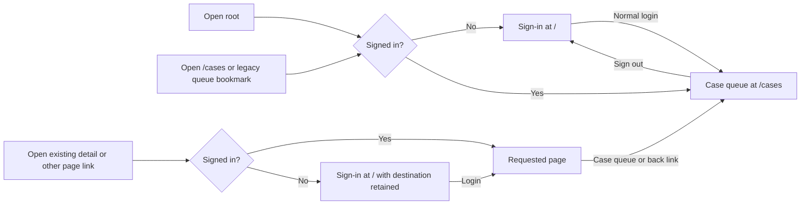

# Case queue URL — 14 September 2026

Historical intermediate routing: the later [clean-page migration](clean-page-urls-2026-09-14.md) extends clean paths to every page and renames Evidence Q&A to `/evidences`. The hash-route descriptions and executed checks below record this earlier queue-only increment.

The user selected `/cases` for Case queue, superseding the earlier root-as-queue preference. Sign-in remains at `/`; normal login and authenticated root visits now open `/cases`. Successful sign-out returns to `/` and clears the previous destination. The brand, sidebar and case-detail return links use `/cases` and retain normal modified-click/new-tab behavior.

Existing queue bookmarks (`#/`, `#/cases`, `#/cases/`, `#/payment-cases`, `#/payment-cases/`) normalize to `/cases`. Other internal hash links remain supported under the root path, including saved payment details, demo details, Evidence Q&A, knowledge and system pages. Navigation from `/cases` removes the queue prefix when opening those hash destinations. The destination is retained in memory through sign-in; reloading sign-in intentionally starts a fresh root visit as before.

Native TypeScript and production build passed. The deployed asset is `index-Qa_jMSXr.js`; stylesheet `index-BcFIQcDS.css` is unchanged. An HTTP request to `/cases` returned 200 with the application HTML, confirming the local Vite server's SPA fallback. Other deployment servers must also serve the SPA entry for this path.

Browser checks on the deployed Edge tab confirmed authenticated root-to-`/cases`, successful sign-out to `/`, normal login to `/cases`, opening a saved payment with its existing root hash URL, returning through its `/cases` link and reloading the queue at `/cases`. Seven cases remained visible. No case/evidence/model mutation, bank request or inference was required.

The focused command `vitest run src/App.routing.test.tsx src/PaymentDiscovery.test.tsx` passed **41 tests**: 21 routing checks and 20 existing discovery checks. Coverage includes canonical queue aliases, direct queue reload, private/demo/knowledge destination restoration, other hash links from `/cases`, Back/Forward, successful/failed logout and session-expiry restoration. These checks concern navigation, not model answer quality. The old [root home receipt](root-home-2026-09-13.md) remains historical evidence for its earlier requested behavior.
