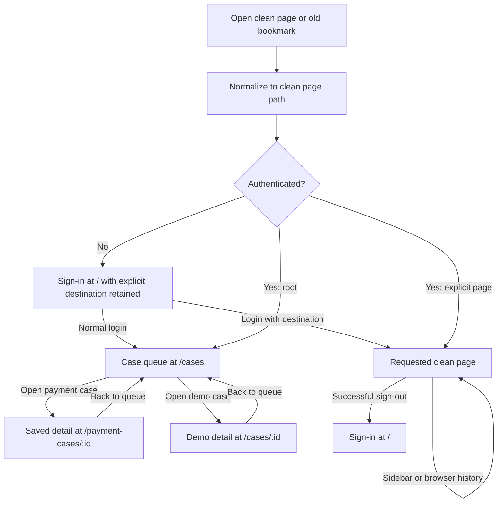

# Clean page URLs — 14 September 2026

The requested frontend change removes hash fragments from every generated page URL and renames the Evidence Q&A path to `/evidences`. The route map and documentation are updated. All 191 frontend tests, both TypeScript checks, the native build and seven deployed direct-HTTP route checks passed. Browser interaction, refresh and an existing legacy evidence bookmark were also verified.

## Current route map

| Page | Clean path | Main local link |
| --- | --- | --- |
| Sign-in; successful logout destination | `/` | [Sign in](http://127.0.0.1:5178/) |
| Case queue | `/cases` | [Case queue](http://127.0.0.1:5178/cases) |
| Original demo case detail | `/cases/:id` | Open a Demo case from the queue |
| Saved payment case and investigations | `/payment-cases/:id` | Open a saved Payment case from the queue |
| Evidence Q&A | `/evidences` | [Evidence Q&A](http://127.0.0.1:5178/evidences) |
| Knowledge | `/knowledge` | [Knowledge](http://127.0.0.1:5178/knowledge) |
| System | `/system` | [System](http://127.0.0.1:5178/system) |

`:id` denotes the existing saved case identifier; it is not a literal link. The preserved CPU frontend uses the same paths on port 5180 when explicitly started. GPU remains the default on port 5178. The historical experimental port 5179 is not a current startup destination.

Normal login and authenticated visits to `/` open `/cases`. Successful logout returns to `/`. An explicitly opened internal page is retained during sign-in and restored after authentication. Browser links, Back/Forward and direct reloads must use the clean paths.

Old hash bookmarks remain migration inputs: queue hashes normalize to `/cases`, detail hashes normalize to their corresponding clean detail paths, and the former `#/uat-evidence` and `/uat-evidence` paths normalize to `/evidences`. The application generates current page links without `#`. Historical validation prose and recorded JSON receipts retain their original URLs as evidence of earlier behavior; current clickable launch links use the new paths.

## Direct-load server requirement

With path routing, refreshing `/payment-cases/:id` sends that path to the web server. Every recognized frontend page path must serve the SPA entry HTML so React can resolve the page and restore authentication. Returning a server 404 breaks refresh, bookmarks and links opened in a new tab even if navigation within an already loaded page works.

The checked-in nginx configuration already uses `try_files $uri $uri/ /index.html` for frontend requests. Its `/api/` and `/api/uat/` proxy locations remain separate. Vite development/preview also needs its SPA fallback; confirm it with actual direct requests after deployment. A future host must retain this fallback and must not rewrite API responses to HTML.

This is a frontend page change. `/api/uat` retains its existing HTTP contract, and the model scripts, prompts, baseline configuration, private evidence and generated answers are not renamed by this migration. No bank call or model execution is required to verify page routing.

## Executed checks

- The full frontend suite passed **191 of 191 tests across 11 files**.
- Main and native frontend TypeScript checks passed; the native Vite production build passed.
- The deployed script is `index-CpHpMgZ3.js`; stylesheet `index-BcFIQcDS.css` is unchanged.
- Direct HTTP GET returned **200 with the current application HTML** for `/cases`, `/evidences`, `/knowledge`, `/system`, `/payment-cases/FCR-route-check`, `/cases/CASE-route-check` and `/uat-evidence`.

The two illustrative case IDs test SPA delivery only; they do not prove those case records exist or are authorized. Serving HTML for the old `/uat-evidence` path allows React to apply the migration; browser normalization is a separate check.

## Browser verification

- The deployed Edge sidebar exposes `/cases`, `/evidences`, `/knowledge` and `/system` links. Each opens the corresponding page without a hash.
- Full refreshes of `/evidences`, `/knowledge`, `/system` and the user's existing `/payment-cases/:id` displayed the expected authenticated pages and retained their clean addresses. Queue navigation also rendered the existing seven-case workspace.
- A previously open `/#/uat-evidence` tab was reloaded. It displayed Evidence Q&A at `/evidences`, preserving the existing stored evidence and answers.
- The clean demo-detail route, direct-page authentication restoration, session expiry, logout, Back/Forward and modifier/new-tab link behavior passed the frontend routing suite. They are not claimed as separate live-browser checks in this increment.
- API contracts are unchanged. No model execution, evidence save, new case or bank request was initiated during these navigation checks.

The earlier [queue-only migration](case-queue-url-2026-09-14.md) and [root-home repair](root-home-2026-09-13.md) remain historical records.
