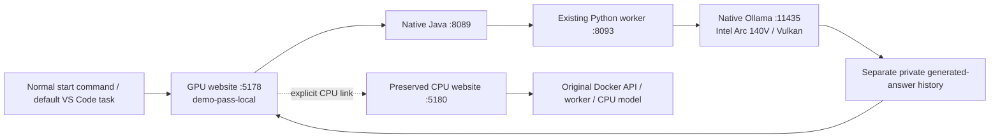

# GPU default and login repair

The user reported a failed login and requested GPU inference as the default. The previous split exposed two different demo passwords while the original login form displayed `demo-pass-local`. The native runtime is the default at [the GPU evidence page](http://127.0.0.1:5178/evidences), using **Analyst · Northstar / demo-pass-local**. The old experimental password is obsolete. The original CPU website remains available at [the CPU evidence page](http://127.0.0.1:5180/evidences). These links use the current clean paths; measurements below describe the 13 September deployment, before the [page-route migration](clean-page-urls-2026-09-14.md).

## Implementation

- `tools/start.ps1` selects GPU by default, including the existing `-WithAI` invocation. `-Mode CPU -WithAI` explicitly selects the preserved CPU demo. The VS Code default start task uses the same launcher. GPU preparation is checked before moving the CPU website.
- `compose.override.yaml` replaces only the Docker web port. The scoped migration validates the project's container labels, checkout and current loopback binding, then recreates only its web container with the existing image. It does not rebuild or restart the five backend containers.
- Native startup uses web 5178 → Java API 8089 → Python worker 8093 → Ollama 11435. Its demo password now agrees with the visible login hint. The GPU banner links to the CPU demonstration at 5180.
- Lifecycle helpers recognize the former 5179 receipt only for verified shutdown or stale-receipt archival. They reject reuse of a live former layout and refuse unrelated port owners. Default stop targets GPU; `-Mode CPU` or `-Mode All` is explicit.
- Original Qwen weights, prompts, retrieval/validation code, CPU model configuration, baseline private records and the separate GPU answer store are retained. The nine protected baseline source/configuration hashes still match their pre-experiment values. CPU web container image is unchanged; its ID changed only for the port mapping. All five backend container IDs and image names match the pre-migration snapshot.

## Executed checks

The native frontend passed TypeScript and production build checks. All **47 lifecycle guards** passed in PowerShell 7.6.5 and Windows PowerShell 5.1. The root startup scripts parsed successfully; actual standard startup migrated only the CPU web binding and returned the GPU main URL as ready.

After the final preflight changes, `tools/start.ps1 -WithAI` returned `already-running` for the verified GPU stack and reported the main 5178 URL, confirming compatibility with the former launch command. [The sanitized runtime receipt](gpu-default-2026-09-13.json) records the final mode, ports, source/container preservation and model timing.

[Actual HTTP authentication checks](gpu-default-auth-2026-09-13.json) passed **30 checks over 18 requests**, with zero model calls. They confirmed the obsolete password fails, the displayed password works at both websites, both cookies coexist, cross-profile CSRF is rejected, and logging out of either website leaves the other session authenticated. These cookie-isolation checks apply through the websites' proxies; the GPU proxy rewrites the copied Java API's legacy logout cookie name. They do not claim equivalent behavior for browser requests directly to port 8089.

The existing in-app browser main tab was reloaded, signed in using the displayed password, and used to submit the same full evidence question. It returned a newly generated answer after **125.214 seconds of reported model-generation time**, with **one actual model call, 6,474 input tokens and 475 output tokens**. This is a new real response through main port 5178, not a saved-answer replay. The input hash and generated semantic content match the previously reviewed GPU response. Native inference logs again identify Intel Arc 140V/Vulkan and **37/37 offloaded layers**. The model status endpoint was empty after completion, confirming memory was released.

The user's existing Edge tab initially still showed the old failed-login page. Reloading displayed the new GPU title and matching password hint; sign-in succeeded, and the tab was opened to UAT Evidence Q&A. The original failed login state was not treated as evidence that GPU inference itself failed.

## Remaining limitations

The generated content is identical to the previously reviewed GPU answer, including its field-attribution and reference-correlation mistakes. The experimental warning remains visible; this routing/login repair does not improve factual accuracy. See [the semantic review](native-gpu-semantic-review-2026-09-13.json). Timings vary with machine load and question size; the earlier 109.101-second website run and this 125.214-second run are individual observations, not a latency guarantee. No cloud inference or real payment action was used.

Follow [current startup and setup instructions](../NATIVE_GPU_SETUP.md). Earlier validation receipts retain their historical ports/password context; use this milestone for the current default.
