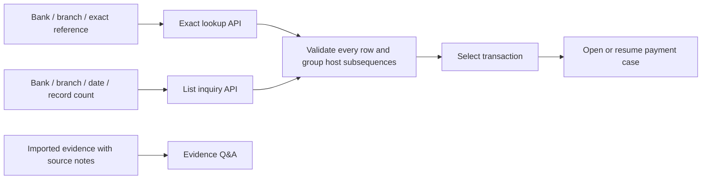

# Exact reference lookup and environment-neutral evidence labels

Validated and deployed locally on 14 September 2026 (Asia/Kolkata).

## Delivered behavior

- **Reference / UTR** calls `POST /api/payment-discovery/lookup` with exactly `orgBank`, `orgBranch`, `referenceType`, and `reference`. Inquiry date and Maximum records are absent. Button: **Find transaction**.
- **Inquiry API** calls `POST /api/payment-discovery/search` with exactly `orgBank`, `orgBranch`, `inquiryDate`, and `recordCount`. Button: **Find transactions**. Excel's button is **Read Excel records**.
- Exact results expose `NOT_FOUND`, `EXACT_MATCH`, or `AMBIGUOUS`. Host subsequences stay grouped by payment; ambiguous UTRs require explicit selection. The service rejects mismatched, out-of-scope or incomplete upstream results before saving candidates. It never substitutes cached/uploaded data for an API response.
- **Evidence Q&A** replaces the UAT-specific sidebar, breadcrumb and page title. Generic badges say **Imported evidence** / **Imported**; private discovery classifications display **Private evidence**. Actual source notes remain visible. Existing internal classifications, routes and saved data remain compatible.
- The bank adapter uses the same fixed endpoint with the two documented request shapes. Both API operations are disabled in DISABLED mode; Excel remains available. The local runtime remains MOCK.

The case-to-detailed-evidence bridge remains a separate future increment; this flow does not claim that discovery metadata is a complete investigation.

## Executed validation

- Docker Maven build: **134 tests passed**, zero failures/errors/skips. Includes **41 discovery tests** (15 service, 8 client, 5 controller, 13 workbook). All **42** current API source/resource/test files matched the extracted build source.
- Frontend owner verified **37** focused PaymentDiscovery/routing/OBPM tests and both TypeScript configurations. Root verified **21 Evidence Q&A tests**, all passing. Existing jsdom `window.scrollTo` diagnostic is nonfatal. Native Vite production build completed.
- Live HTTP acceptance: **8 scenario groups passed in 2.457 seconds**, including authentication/CSRF/tenant and bank restrictions, exact-vs-list contracts, historical references, shared UTRs, long text IDs, grouped host rows, Excel import, idempotent/concurrent case reuse and absence of a local fallback. [Machine-readable HTTP result](reference-lookup-http-2026-09-14.json).
- Browser: root login succeeded; Reference has bank/branch/type/value only; historical mock reference `020260107135200000000000001` returned one payment with two host subsequences for 7 January 2026. Shared mock UTR returned two unselected payments with the ambiguity explanation. Inquiry API with count 2 returned two selectable payments and a truncation notice. Sidebar/title/badges use neutral evidence wording; source-supplied export limitations remain present. No model question was submitted.
- Preserved seven original model/runtime source files by SHA-256 comparison against the prior preservation receipt. No CPU baseline or inference configuration changes.

## Deployment correspondence

Build image: `poi-reference-lookup-build:20260914`.

Deployed JAR SHA-256: `eadf6e29bb03bde8e5ecf5105d614c832a905594bc95c25a4f334922a17750f6`.

Served frontend asset: `index-DCI_MQf0.js`.

The tested JAR was copied to `runtime/native-ollama/artifacts/api.jar`, staged frontend assets to `runtime/native-gpu/web-dist`, and only verified native demo services were restarted. Previous artifacts are retained under `runtime/reference-lookup-validation/before-deploy`. Build logs, Surefire reports, source correspondence, and the evidence-page test receipt are under `runtime/reference-lookup-validation`. [Component receipt](reference-lookup-components-2026-09-14.json).

## Limits and follow-up

- The supplied bank endpoint remains a dummy; no bank/API credentials, bank connection, Oracle execution or new model inference was used. The proposed upstream contract still needs implementation/verification in the bank service. SQL worksheet `runtime/obpm-uat/sql/14_payment_reference_lookup.sql` is an unexecuted read-only draft.
- Neutral display labels do not automatically configure multiple source environments. Deployment configuration and source provenance must identify the actual connected source; existing stored classifications/legacy URLs were not migrated.
- `NOT_FOUND` stores an empty batch receipt but currently omits the lookup selectors from that saved receipt. A follow-up can retain the validated request privately for richer lookup auditing. The current empty result neither deletes prior records nor establishes that a payment does not exist outside the selected source/scope.
