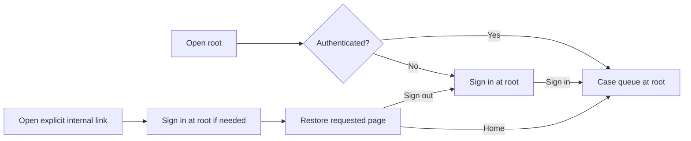

# Root home URL repair — 13 September 2026

Historical behavior: the user's 14 September preferences moved the signed-in queue to `/cases`, then removed hash routing from every page and renamed Evidence Q&A to `/evidences`. Root sign-in and explicit deep links remain supported. See the [current clean-page migration](clean-page-urls-2026-09-14.md); the checks below describe the earlier root-as-queue behavior.

The native web entry no longer redirects an empty hash to UAT. The shared React app uses `/` for home and sign-in; `#/cases`, `#/cases/` and `#/` are accepted legacy home aliases. Payment detail, UAT, knowledge and system links remain internal hash routes. Home links support normal browser link behavior, with ordinary clicks handled without a full reload.

An unauthenticated explicit deep link is retained in memory while the address displays `/`, then restored after successful sign-in. Refreshing the login screen intentionally starts a fresh root visit. Successful sign-out clears the pending destination; failed sign-out retains the page unless the API reports an expired session. Session expiry returns to root sign-in and can resume the prior page after reauthentication.

Validation:

- `vitest run src/App.routing.test.tsx src/App.test.tsx`: 29 tests passed, including eight routing tests covering fresh root login, legacy aliases, payment deep links, Back/Forward, logout success/failure and session expiry.
- Native frontend TypeScript check and Vite production build passed. Served script: `index-BgY-Rfpk.js`; stylesheet remains `index-CCdnAJrI.css`.
- Existing in-app browser on port 5178: successful sign-out showed root login; opening the old UAT URL while signed out also showed root login; signing in restored UAT; Case queue opened `/`; `#/cases` normalized to `/`; reloading root retained the queue. Left the tab on the root homepage.
- Updated startup output and current setup guides to use the root entry URL.

No new inference calls, model changes, backend restarts, real payment operations or exports were needed. This validates navigation, not payment-answer accuracy.
