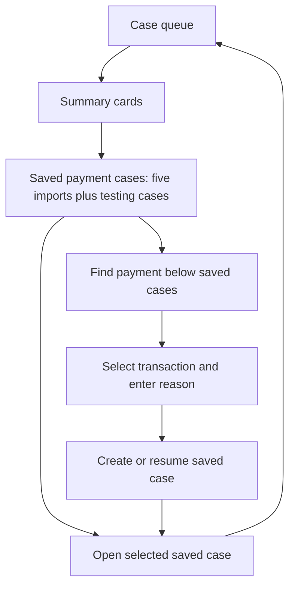

# Saved-case queue visibility and reduction

**Later layout correction, 14 September 2026:** the user requested Saved payment cases below Find payment. The current order is summary cards, Find payment, Saved payment cases. The six retained records are unchanged; the focused ordering assertion was updated accordingly. The above-form placement and browser checks below describe the initial change before this correction.

The user requested five supplied payment records plus cases created during testing. The local private queue now retains the first five rows of the supplied list and the user's existing test case. Fifteen other imported cases and their corresponding idempotency commands were archived after a closed-database backup. This is a one-time data cleanup, not a list limit: future testing cases remain visible.

Saved payment cases now appears immediately below the summary cards, before Find payment. Previously, the inquiry form and its results pushed saved cases below the fold. The existing newest-first ordering places the user's test case first. The save and detail routes remain unchanged.

Validation: 20 focused PaymentDiscovery tests passed, including a six-case fixture asserting every saved row is visible and the list precedes the form. Main and native frontend TypeScript checks and the native production build passed. Private archive and HTTP verification receipts are kept under ignored `runtime/private-payment-trim-20260914/`; they contain the retained/archived identities and exact-record preservation checks. The original Demo cases dataset and other tenant were preserved. No bank, Oracle DB or model inference was invoked.

After deployment, authenticated HTTP checks confirmed six retained records exactly match their pre-cleanup values, all 15 archived detail URLs return 404, dashboard counts match, and the other tenant cannot read the six retained cases. Browser verification confirmed the root queue shows six cases, the testing case is first, and Saved payment cases precedes Find payment. The existing test-case detail also reopened successfully after signing in.

The five imports are discovery metadata only. This change does not attach detailed inquiry evidence or make the MOCK inquiry source query imported cases. The existing GPU and CPU implementations are unchanged.
