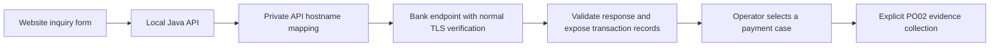

# Local hostname mapping and live inquiry checks — 15 September 2026

The user authorized trying a local certificate-matching hostname for the supplied PO01 and PO02 endpoints. A one-request `curl --resolve` test of the proposed alias returned HTTP 200 from PO02 with certificate verification result 0. The server accepts the alias through TLS/SNI and HTTP routing.

Windows denied writing its system hosts file. A pre-attempt backup and post-check SHA-256 comparison confirm that the Windows file is unchanged. No administrator security setting or TLS verification setting was changed.

## Applied mapping

The native launcher now recognizes an optional ignored `runtime/native-ollama/private/api-hosts` file. When present, it adds `-Djdk.net.hosts.file=<absolute private path>` to the **API JVM only**. Current private contents map localhost (IPv4/IPv6) and the tested bank alias. Both native inquiry URLs use that alias. Service identity, explicit bank posting date, existing scopes and model/knowledge configuration remain unchanged.

The installed JDK17 source confirms that this property replaces JVM hostname resolution; it does not fall back to ordinary DNS. The current API's other dependencies use literal local IP addresses, and its database is local H2. Python/Ollama and Windows DNS are unaffected. Future API dependencies using hostnames require entries in this private file, or removal of this override and a normal resolvable bank hostname. Removing the private file and restarting returns the native API to ordinary DNS. This override is not activated for installations without the file or for the preserved Docker CPU profile.

Normal Java certificate-chain and HTTPS hostname verification remain enabled. The alias and real IP stay in private runtime configuration; no trust-all client or hostname-verification bypass was introduced.

## Observed live results

| Check | Result |
| --- | --- |
| PO01 date inquiry through website proxy/backend | HTTP 200, BANK_API, one actual matching payment |
| PO02 through production Java CaseEvidenceClient | Accepted in 406 ms; PAYMENT 1, HOST 1, HISTORY 3, STATUS 0 |
| PO02 source mapping and isolated case evidence validation | 22 omitted properties; 110 source-field positions preserved across five rows; immutable save/read/replay and citation projection passed in isolated in-memory storage |
| PO01 exact FCR lookup | Bank HTTP 200 with transactionStatus errorCode 3403 and replyCode 99; application correctly reports inquiry failure |
| PO01 exact UTR lookup | Same bank-side error; no successful records fabricated |

The exact-reference request shapes match the supplied documentation and local FLEXCUBE DTO. Direct bank checks reproduce the failure outside our frontend, with reply text `Called function has had a Fatal Error`. It is separate from the resolved TLS problem. The read-only source review does not prove what code/package is deployed; bank logs are required to identify the runtime cause. No D: source or database package was edited.

Read-only source review identified a concrete nullable-count defect in the bank discovery Java adapter: exact mode omits the Integer record count, while both its bind and debug calls select primitive-int overloads and can unbox null. This is consistent with the observed exact-only failure; deployed-source equivalence and the server exception trace remain unverified. A proposed correction for both calls is recorded privately in `runtime/uat-hostname-2026-09-15/EXACT_LOOKUP_REVIEW.md`, without modifying bank source or the database.

## Preservation and deployment

The existing API jar and frontend bundle were retained; only the native launcher and private connection/mapping configuration changed. All **47 existing offline native lifecycle guard checks passed**, plus API-only argument inspection, successful restart, live date/PO02 checks and post-restart resource comparisons.

All **10 cases, four saved evidence versions, eight investigations, management records, one original export snapshot and three original export answers** remained unchanged. Live PO01 validation creates discovery receipts as designed; no saved payment case, live evidence version or model job was created. PO02 persistence/projection checks used isolated in-memory storage. Model, guidance and embedding-index fingerprints stayed unchanged.

Private receipts: `runtime/uat-hostname-2026-09-15/frontend-receipt.json`, per-mode frontend/raw bank responses, `po02-20260915T175540Z-0945b6/receipt.json`, and before/after resource captures. Website result rendering was covered by the preceding 93 frontend tests; this increment verifies its deployed HTTP path, rather than claiming a new browser visual inspection.
