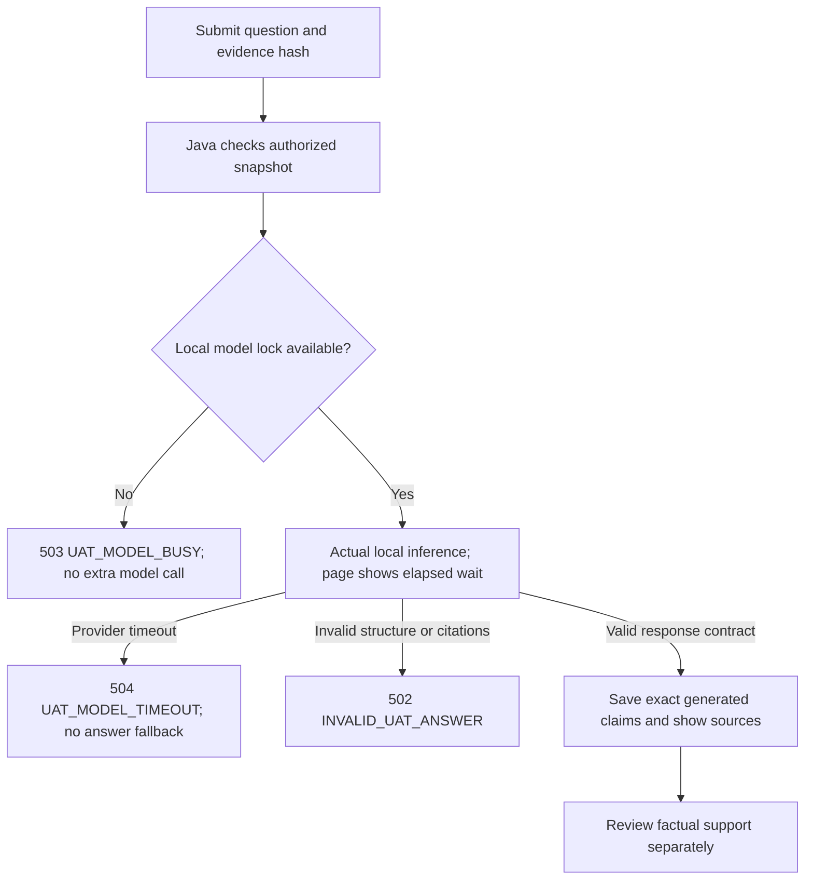

# UAT question timeout repair, 13 September 2026

The user reported that **“Did OBPM accept it?”** returned a generic worker error. Ollama logs show a cold 6,474-token input still being processed near the six-minute timeout: 6,144 tokens at 343.05 seconds, followed by request cancellation at 360 seconds. Additional worker 503 responses occurred during active inference; the old generic response did not distinguish model-lock contention from provider timeout or other unavailability.

## Repair

The optional UAT configuration now allows a 900-second provider read, with a dedicated Java deadline of 930 seconds and a 960-second nginx/Vite UAT proxy wait. Connection/write/pool waits remain separately bounded. The original case deadlines are unchanged. Ollama receives a 30-minute keep-alive request so nearby questions can reuse the loaded model; this does not cache answers or guarantee a fast response. The system prompt, output schema, lexical retrieval and all source documents are unchanged by this repair.

The worker identifies timeout and model-lock contention separately. Java exposes safe error messages for timeout, busy, provider unavailable and invalid output. React shows measured elapsed time while waiting, keeps the question after failure, and explains the error. It does not invent progress percentages or substitute a prepared answer.

## Component verification

- Final Java Docker build: **93 tests passed**, zero failures/errors/skips. This includes the original case regressions and distinct UAT error/deadline tests.
- Worker UAT/configuration/graph regression selection: **126 tests passed**. The bundled artifact Python lacked pytest; the project virtual environment's first default-temp run encountered permissions errors. The successful run used a project-local `--basetemp`. No provider call was made by these tests.
- React focused UAT suite: **21 tests passed**, including pending timer cleanup/reset and distinct errors; production build passed.
- Deployed worker configuration readback: UAT model `qwen3:8b`, UAT timeout 900 seconds, retention 1800 seconds, original case timeout 180 seconds. nginx configuration validation passed.

Build logs and full answer receipts remain in ignored runtime directories. These software checks do not establish model factual accuracy.

## Live retry

**Response delivery passed for one cold browser request; factual review failed.** The exact question was submitted through the deployed browser at approximately 10:20:49 UTC. Immediately before submission, `ollama ps` showed no loaded model, and provider logs confirm zero cached input tokens. The website displayed the elapsed wait at 3:52 and 7:22, retained the question, and showed the completed answer at 10:31:28 UTC. It also saved the answer in history. There was one model call and no automatic retry or fallback.

The `qwen3:8b` response used 6,474 input tokens, 460 output tokens and 640.306 seconds of worker-measured provider time: **10 minutes 40 seconds**. Ollama recorded 415.769 seconds for input processing and 212.236 seconds for token generation; these provider phase timings exclude some overhead included in the worker duration. This cold input alone exceeded the former six-minute deadline. After completion, the provider reported idle slots and the model retained for approximately another 28 minutes.

The saved request's 14 documents are exactly the same as the pre-repair source bundle. The canonical request hash, exact citation objects and joined model-claim composition were verified. This verifies source preservation and dynamic delivery, not claim correctness. The [machine-readable receipt](uat-qa-timeout-fix-2026-09-13.json) contains sanitized metrics and deployed source/image fingerprints.

Independent factual review found two concrete errors: a claim names `HOST.MSGSTATUS` even though the exported host column is `MSG_STAT`; an uncertainty statement assigns value11 to `TXN_STAT`, whose recorded value is2. Several other claims correctly report raw fields and their scoped source definitions, but the answer omits the supplied multiple-writer/SPS-response caveat and does not directly establish handoff acceptance. The suggested read-only checks are useful for downstream outcome but omit correlated SPS request/response metadata and the returned native OBPM transaction ID.

The supported conclusion is **OBPM acceptance is not established by these exports**. This does not establish rejection. The experimental warning remains visible. A longer wait resolves the demonstrated transport failure; it does not make this CPU model accurate or fast enough for an operational response-time target.

The earlier [factual failures](uat-qa-2026-09-13.md) remain valid limitations. Increasing transport waits does not fix hallucination or establish OBPM acceptance.
